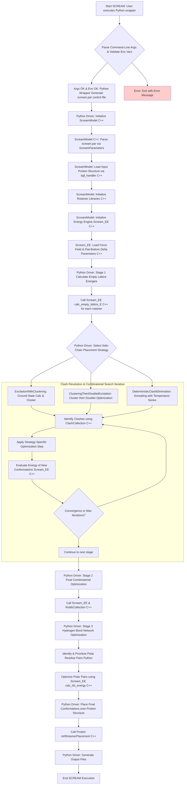

# SCREAM (Side-Chain Rotamer Excitation Analysis Method)

## Project Purpose and Primary Role

SCREAM is a molecular modeling software package designed to accurately predict protein side-chain placements. Its core scientific contribution, as detailed in the JCTC 2008 paper ([DOI: 10.1021/ct800196k](https://doi.org/10.1021/ct800196k) - "Flat-Bottom Strategy for Improved Accuracy in Protein Side-Chain Placements"), is the utilization of "flat-bottom" potentials for rotamer scoring. This strategy modifies the repulsive part of Van der Waals (VDW) and Hydrogen Bond (HB) potentials based on the coarseness of the rotamer library and specific atom types, allowing for greater tolerance in atomic contacts that arise from using discrete rotamer libraries. The project aims to improve the accuracy of computational protein structure prediction and design by providing a robust method for side-chain conformation determination.

The system architecture comprises a C++ core for computationally intensive tasks (energy evaluation, geometric operations, rotamer management) and a Python layer for high-level orchestration, parameter file generation, command-line interface, and advanced optimization algorithms.

## Key Architectural Components & Workflow

The SCREAM project can be broadly divided into the following interconnected components:

1.  **Parameter Management & Initialization:** Handles loading and providing access to all runtime configurations.
2.  **Molecular Structure Representation & I/O:** Defines and manages the atomic and molecular data structures, and handles reading/writing of structure files.
3.  **Rotamer Library Management & Generation:** Manages collections of side-chain conformations (rotamers), including their loading, generation, and organization.
4.  **Energy Calculation Engine:** Computes various energy terms (VDW, Coulomb, HB) incorporating the core flat-bottom strategy.
5.  **Side-Chain Placement & Optimization Algorithm:** The high-level logic that uses rotamers and energy calculations to find optimal side-chain conformations.
6.  **Utility and Helper Modules:** Provides mathematical, string processing, and other general-purpose tools.
7.  **Python Wrapper & Driver:** Orchestrates the overall workflow and provides a user interface.

## Inputs

### Primary User Inputs (via command-line wrappers like `scream_wrap.py` or `scream_multi.py`)

- **Input Molecular Structure File:** Typically a BGF (BioGraf) or PDB file specifying the protein backbone and any existing side chains or other molecules (`src/sc_bgf_handler.cpp`).
- **Rotamer Library Specification:** Defines which rotamer libraries to use (e.g., resolution, specific amino acid libraries) (`src/Rotlib.cpp`, `src/RotlibCollection.cpp`).
- **Force Field Parameter File:** Contains parameters for VDW, Coulomb, and HB interactions (e.g., a Dreiding-like parameter file) (`src/scream_E_functionals_*.cpp` series, `src/scream_rtf.cpp`).
- **Residue Mutation/Optimization List:** Specifies which residues' side chains are to be predicted or optimized (`src/MutInfo.cpp`).

### Internal Configuration & Data Files (paths typically managed by `scream_ctl_reader.cpp` based on environment variables and the main control file)

- **SCREAM Control File (`.ctl`):** The master configuration file parsed by `ScreamParameters` (`src/scream_ctl_reader.cpp`). It dictates all other file paths and algorithmic choices.
- **SCREAM Parameter Files (`.par`):** May include specific force field sections (VDW, HB, DIELCTRIC), delta parameters for the flat-bottom strategy.
  - `SCREAM_delta_Total_Min.par`: Contains µ and σ values for the flat-bottom potential, crucial for the core strategy (`src/scream_E_functionals_vdw.cpp`, `src/scream_E_functionals_hb.cpp`).
  - `SCREAM_EachAtomDeltaFileStub.par`: Per-atom delta values.
  - `SCREAM_PolarOptimizationExclusionsStub.par`: Residues to exclude from HB network optimization.
- **Rotamer Library Files (`.lib`):** Contain pre-calculated rotamer conformations (coordinates, energies, metadata) (`src/AARotamer.cpp`, `src/Rotlib.cpp`).
- **Rotamer Connectivity Files (`.cnn`):** Define how rotamers connect to the backbone and atom mappings (`src/RotConnInfo.cpp`, `src/Rotlib.cpp`).
- **Residue Topology Files (`.rtf`):** CHARMM-style files defining atom types, charges, and bond connectivity within residues (`src/scream_rtf.cpp`).
- **Charge Assignment Scheme:** Specified via environment variables (e.g., `SCREAM_NEW_CHG`) and used by `AARotamer.cpp`.

### Environment Variables (critical for locating files)

- `SCREAM_NEW`: Base directory for SCREAM installation.
- `SCREAM_NEW_LIB`: Directory for rotamer libraries.
- `SCREAM_NEW_CNN`: Directory for connectivity files.
- `SCREAM_NEW_RTF`: Directory for residue topology files.
- `SCREAM_NEW_CHG`: Specifies charge assignment scheme.

## Outputs

### Primary Outputs

- **Optimized Molecular Structure Files:** Typically BGF or PDB files containing the protein with predicted side-chain conformations (e.g., `best_N.bgf`) (`src/sc_bgf_handler.cpp`, `python/scream.py`).
- **Energy Analysis Files:**
  - Per-residue energy breakdowns (e.g., `Residue-E.txt`) (`python/scream.py`).
  - Energy evolution during optimization (e.g., `Anneal-Energies.txt`, `Evolution.dat`) (`python/scream.py`).
- **Timing Information:** Performance metrics for different calculation stages (e.g., `timing.txt`) (`python/timing.py`, `python/scream.py`).
- **Hydrogen Bond Optimization Report:** (e.g., `HBOptimization.txt`) (`python/scream.py`).

### Console Output (stdout/stderr)

- Progress indicators for various optimization stages.
- Environment variable validation messages.
- Clash identification and resolution status.
- Energy values and statistics.
- Error messages and warnings.

### Internal Data Structures (modified during execution)

- `Protein` object with updated atomic coordinates and side-chain conformations (`src/sc_Protein.cpp`).
- `RotlibCollection` with evaluated rotamer combinations and their energies (`src/RotlibCollection.cpp`).
- `Scream_EE` and its sub-components with calculated interaction energies (`src/scream_EE.cpp`).

## External Code Dependencies

### Standard C++ Library

- Extensive use of `<vector>`, `<map>`, `<string>`, `<iostream>`, `<fstream>`, `<cmath>` (or `<math.h>`), `<cstdlib>`, `<sstream>`, `<algorithm>`, `<iomanip>`, `<stdexcept>`, `<typeinfo>`, `<cassert>`.

### Python Standard Library

- `sys`, `os`, `re`, `random`, `math`.

## Core Logic/Algorithm Flowchart

