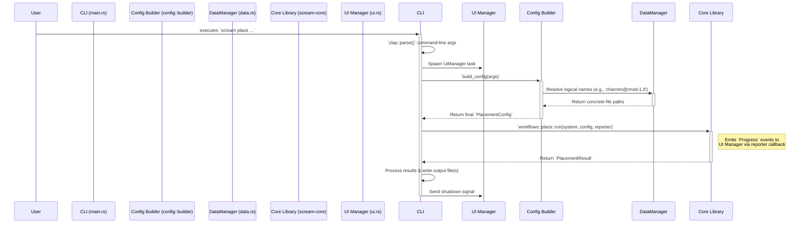
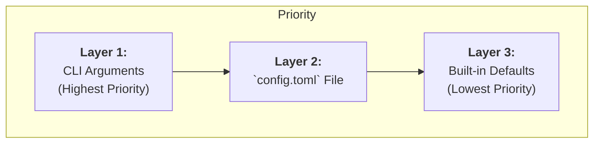
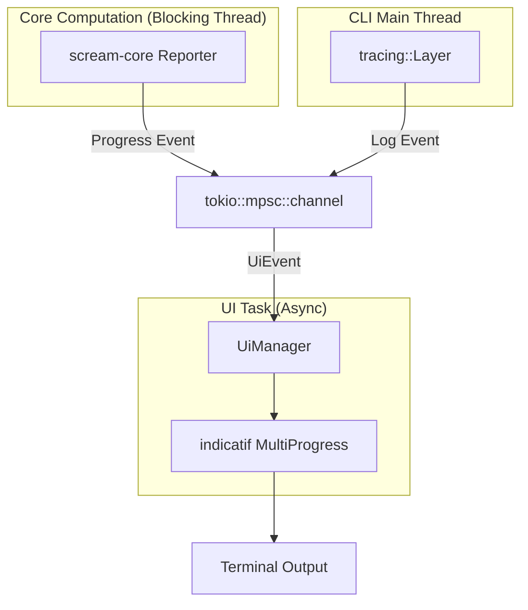

# `scream-cli` Developer Documentation

This document provides a comprehensive technical breakdown of the `scream-cli` crate. It details the flow of execution, configuration handling, data management, and the user interface system. It is intended for developers contributing to or extending the CLI's functionality.

For user-facing instructions on how to _use_ the CLI, see the [User Manual (`/docs/cli/USAGE.md`)](/docs/cli/USAGE.md).

**Table of Contents**

- [`scream-cli` Developer Documentation](#scream-cli-developer-documentation)
  - [1. Component Overview](#1-component-overview)
  - [2. Execution Flow of a `scream place` Command](#2-execution-flow-of-a-scream-place-command)
  - [3. The Layered Configuration System](#3-the-layered-configuration-system)
    - [3.1. The Three Layers of Configuration](#31-the-three-layers-of-configuration)
    - [3.2. The Build Process in `config::builder`](#32-the-build-process-in-configbuilder)
  - [4. Data Management with `DataManager`](#4-data-management-with-datamanager)
    - [4.1. Data Path Resolution](#41-data-path-resolution)
    - [4.2. Logical Name Resolution](#42-logical-name-resolution)
    - [4.3. Data Downloading](#43-data-downloading)
  - [5. User Interface (UI) and Logging](#5-user-interface-ui-and-logging)
    - [5.1. Decoupled Architecture with `tokio::mpsc`](#51-decoupled-architecture-with-tokiompsc)
    - [5.2. Progress Reporting](#52-progress-reporting)
    - [5.3. Logging Integration](#53-logging-integration)

---

## 1. Component Overview

The `scream-cli` crate is structured into several modules, each with a distinct responsibility, to create a maintainable and extensible command-line application.

- **`main.rs`**: The application entry point. It is responsible for setting up the `tokio` asynchronous runtime, initializing global error handling (`color-eyre`), parsing command-line arguments, and spawning the main UI manager task.

- **`cli.rs`**: Defines the entire command-line interface structure using `clap`'s derive macros. This file is the single source of truth for all commands (`place`, `data`), subcommands, arguments, and help messages.

- **`commands/`**: Contains the primary business logic for each subcommand.

  - `place.rs`: Orchestrates the entire side-chain placement process, from configuration building to calling `scream-core` and processing the results.
  - `data.rs`: Implements the logic for the `scream data` subcommands (`download`, `path`, etc.).

- **`config/`**: The configuration engine.

  - `file.rs`: Defines the Rust structs that map directly to the `config.toml` file format using `serde`.
  - `defaults.rs`: Provides hardcoded, sensible fallback values for all configurable parameters.
  - `builder.rs`: Implements the core logic for merging the three configuration layers (defaults, file, and CLI arguments) into a final, validated `PlacementConfig` struct for `scream-core`.

- **`data.rs`**: Implements the `DataManager`, a crucial abstraction that handles the physical location, resolution of logical names, and downloading of external data files (forcefields, rotamer libraries).

- **`ui.rs`**: Manages all terminal output. It uses the `indicatif` crate for progress bars and runs in a separate `tokio` task. It receives events to display from both the core library and the logging system via a shared channel.

- **`logging.rs`**: Configures the `tracing` subscriber framework. Its key feature is a custom `tracing::Layer` (`ChannelLayer`) that intercepts log messages and forwards them to the `UiManager` for display, ensuring that logging does not interfere with progress bar rendering.

- **`error.rs`**: Defines the CLI-specific error enum (`CliError`), which centralizes error handling for the application.

## 2. Execution Flow of a `scream place` Command

A typical `scream place` command follows a well-defined sequence of operations, translating user input into a scientific result.

**Figure 1: `scream place` Execution Flow**

1. **Parsing**: `main.rs` uses `clap` to parse all command-line arguments into the `Cli` struct.
2. **UI Initialization**: The `UiManager` is spawned as a separate asynchronous `tokio` task to handle all terminal rendering independently of the main computation.
3. **Configuration Building**: `commands::place::run` calls `config::builder::build_config`, passing the parsed arguments.
4. **Path Resolution**: The `Config Builder` uses the `DataManager` to resolve any "logical names" for data files (like `'charmm@rmsd-1.0'`) into absolute file paths.
5. **Core Invocation**: A final, validated `PlacementConfig` is constructed and passed to the `scream_core::workflows::place::run` function. The computationally intensive work happens here, executed within a `tokio::task::spawn_blocking` call to avoid blocking the async runtime.
6. **Progress Reporting**: During execution, the core library sends `Progress` events back to the `UiManager` via a callback, which updates the progress bars in the terminal.
7. **Result Handling**: Once `place::run` returns a `PlacementResult`, the `commands::place` module formats the summary, prints it to the console, and writes the resulting molecular structure(s) to the output file(s) specified by the user.

## 3. The Layered Configuration System

The CLI's configuration system is designed to be flexible and predictable, merging settings from three distinct sources with a clear order of precedence.

### 3.1. The Three Layers of Configuration

Settings are determined by the first layer in which they are found, following this hierarchy:

**Figure 2: Configuration Priority**

1. **Layer 1: Command-Line Arguments**: Any argument provided directly on the command line (e.g., `--s-factor 1.2`, `-n 5`) always overrides settings from other layers. This is ideal for quick experiments and scripting.
2. **Layer 2: TOML Configuration File**: The `config.toml` file is the primary method for specifying complex or persistent settings, such as the `[residues-to-optimize]` table.
3. **Layer 3: Built-in Defaults (`config::defaults`)**: These are hardcoded fallback values that ensure the program can run with minimal user input.

### 3.2. The Build Process in `config::builder`

The `config::builder::build_config` function is the orchestrator of this merging logic. Its process is as follows:

1. It starts with the `DefaultsConfig` struct.
2. It loads the `FileConfig` struct by parsing the TOML file specified via `--config`. If no file is given, an empty `FileConfig` is used.
3. It applies any `--set KEY=VALUE` arguments, directly modifying the in-memory `FileConfig` struct.
4. It iterates through every parameter required by `scream-core`'s `PlacementConfig`. For each parameter, it checks for a value in this order: command-line argument, `FileConfig` struct, and finally the `DefaultsConfig`.
5. During this process, it uses the `DataManager` to translate any string-based "logical names" into verified `PathBuf`s.
6. Finally, it constructs and returns the fully validated `PlacementConfig` object.

## 4. Data Management with `DataManager`

The `DataManager` (`data.rs`) is a critical abstraction that decouples the application logic from the physical storage of data files like forcefields and rotamer libraries.

### 4.1. Data Path Resolution

The `DataManager` determines the root directory for all data files using a two-step process:

1. It first looks for a configuration file in an OS-specific config location (e.g., `~/.config/screampp/path.conf` on Linux). This file can be created and modified by the user via `scream data set-path` and `reset-path`.
2. If this file does not exist, it falls back to an OS-specific default data directory (e.g., `~/.local/share/screampp` on Linux). This logic is handled by the `directories-rs` crate.

This ensures a predictable and platform-idiomatic location for data while still allowing user customization.

### 4.2. Logical Name Resolution

To provide a user-friendly experience, the CLI uses "logical names" instead of requiring full file paths for common data files.

- **The Problem**: A user should not have to type `--rotamer-library /path/to/data/rotamers/charmm/rmsd-1.0.toml`.
- **The Solution**:
  1. The `utils::parser` module contains functions that parse user-friendly strings like `'charmm@rmsd-1.0'` into a structured representation (e.g., `RotamerLibraryName { scheme: "charmm", diversity: "rmsd-1.0" }`).
  2. The `DataManager::resolve_logical_name` method takes this structured data and constructs the full, platform-correct file path within the resolved data directory. It also performs an existence check on the final path.

### 4.3. Data Downloading

The `scream data download` command automates the acquisition of required data.

- **Process**: It uses the `reqwest` library to fetch a version-matched `.tar.zst` archive from the official SCREAM++ GitHub Releases page. The downloaded data is streamed into memory, decompressed on-the-fly using the `zstd` crate, and unpacked into the data directory using the `tar` crate. This entire process is visualized with an `indicatif` progress bar.

## 5. User Interface (UI) and Logging

The CLI's user interface is designed to be responsive and non-blocking, providing clear feedback without slowing down the core computation.

### 5.1. Decoupled Architecture with `tokio::mpsc`

The UI is architected around an asynchronous, event-driven model.

**Figure 3: UI and Logging Event Flow**

- **Decoupling**: The main computational logic (in `scream-core`) runs in a blocking thread pool managed by `tokio::task::spawn_blocking`. The `UiManager` runs in a separate, non-blocking asynchronous task.
- **Communication**: They communicate via a `tokio::mpsc` (multi-producer, single-consumer) channel. This allows the computationally-heavy core library and the logging system to send `UiEvent` messages to the `UiManager` without waiting for the terminal to render.

### 5.2. Progress Reporting

- A `CliProgressHandler` is created in the CLI. It holds a sender handle to the mpsc channel.
- It generates a `ProgressCallback` closure (a `Box<dyn Fn(...)>`), which captures the channel sender.
- This callback is passed down into `scream-core` as part of the `ProgressReporter`.
- When the core library needs to report progress (e.g., `Progress::TaskIncrement`), it calls the callback. The callback's only job is to send the `Progress` event into the channel asynchronously.
- The `UiManager`'s main loop receives the event and updates the `indicatif` progress bars accordingly.

### 5.3. Logging Integration

To prevent log messages from interfering with the dynamically rendered progress bars, the logging system is integrated into the same UI event loop.

- **`logging::ChannelLayer`**: A custom `tracing::Layer` is implemented.
- **Mechanism**: Instead of writing formatted log messages directly to `stdout` or `stderr`, this layer intercepts each log event from the `tracing` framework. It formats the message and sends it as a `UiEvent::Log` over the _same_ mpsc channel used for progress events.
- **Benefit**: The `UiManager` receives both log messages and progress updates through a single stream. It can then use `indicatif`'s `MultiProgress::println` method to print the log message _above_ the active progress bars, ensuring a clean, non-flickering, and readable terminal output.
