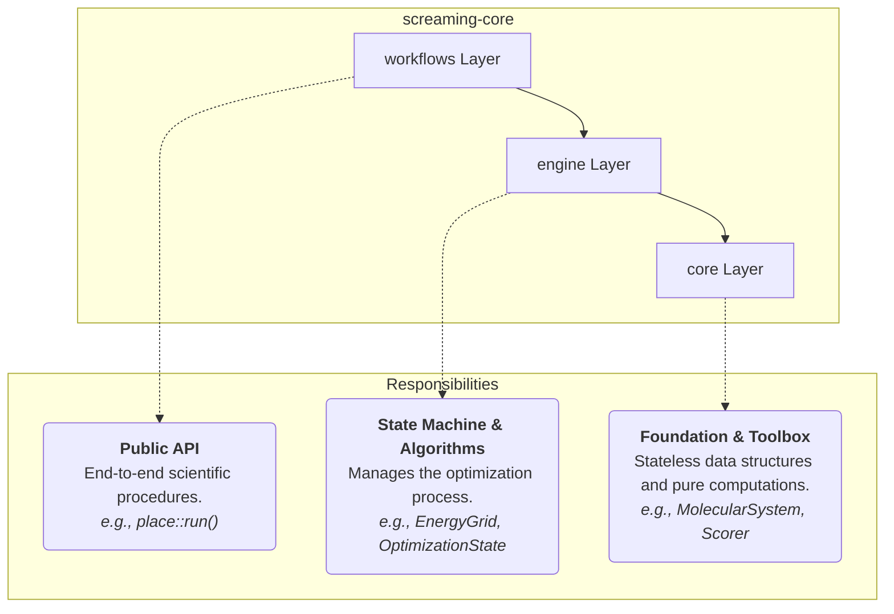
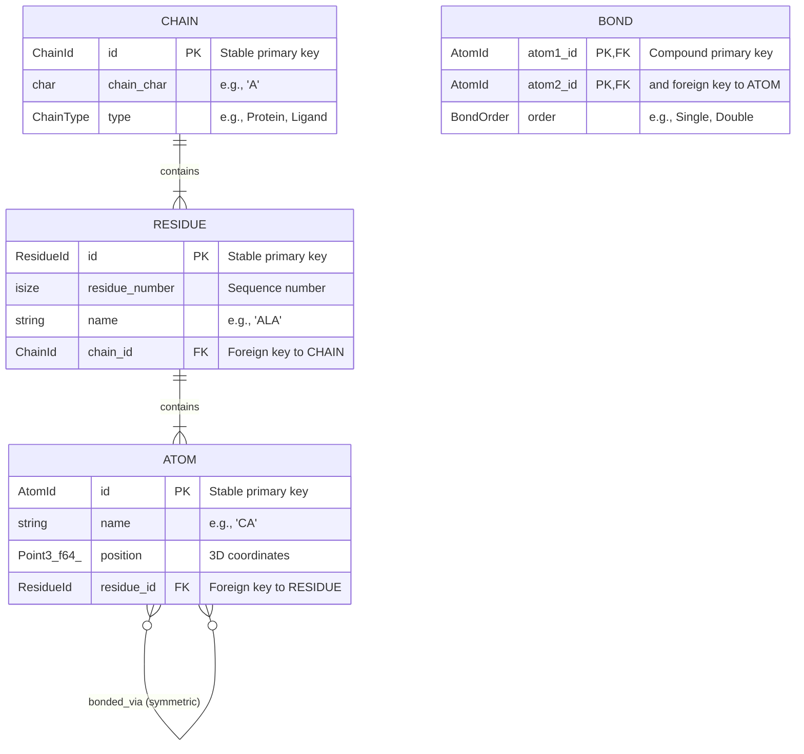

# 1. Core Library: Architecture and Data Models

This document outlines the foundational architecture and the core data models of the `scream-core` library. Understanding these concepts is essential for navigating, using, and contributing to the scientific core of SCREAM++.

**Table of Contents**

- [1. Core Library: Architecture and Data Models](#1-core-library-architecture-and-data-models)
  - [1. Architectural Philosophy: The Three-Layer Pyramid](#1-architectural-philosophy-the-three-layer-pyramid)
    - [1.1. The `core` Layer: The Foundation](#11-the-core-layer-the-foundation)
    - [1.2. The `engine` Layer: The Logic Core](#12-the-engine-layer-the-logic-core)
    - [1.3. The `workflows` Layer: The Public API](#13-the-workflows-layer-the-public-api)
  - [2. Core Data Models: The Representation of a Molecular World](#2-core-data-models-the-representation-of-a-molecular-world)
    - [2.1. `MolecularSystem`: The Central Data Store](#21-molecularsystem-the-central-data-store)
    - [2.2. Identifier Stability: The Role of `slotmap`](#22-identifier-stability-the-role-of-slotmap)
    - [2.3. Structural Knowledge Representation](#23-structural-knowledge-representation)

---

## 1. Architectural Philosophy: The Three-Layer Pyramid

The `scream-core` library is designed with a clear, hierarchical three-layer architecture. This separation of concerns ensures that the library is modular, highly testable, and easy to extend. Each layer has a distinct responsibility, building upon the one below it.

**Figure 1: The Three-Layer Architecture**

### 1.1. The `core` Layer: The Foundation

This is the bedrock of the library. It contains stateless data structures and pure computational logic.

- **Responsibility**: To define **what** a molecular system is and **how** to perform fundamental calculations on it.
- **Key Modules**:
  - `models`: Defines the data representation for `MolecularSystem`, `Atom`, `Residue`, `Chain`, and their relationships. It is the single source of truth for structural data.
  - `forcefield`: Implements the mathematical formulas for potential energy functions (`potentials`), defines parameter structures (`params`), and provides the `Scorer` for calculating energy between atoms. It does not know anything about optimization.
  - `topology` & `rotamers`: Define the structural "knowledge base" of the system, such as which atoms constitute a sidechain (`TopologyRegistry`) and the possible discrete conformations (`RotamerLibrary`).
  - `io`: Handles the serialization and deserialization of the `models` to and from standard file formats like BGF.

### 1.2. The `engine` Layer: The Logic Core

The engine is the stateful "brain" of the optimization process. It takes the tools from the `core` layer and orchestrates them according to a specific algorithm.

- **Responsibility**: To manage the **state** and **logic** of an optimization workflow.
- **Key Components**:
  - `config`: Defines all parameters for a computational task, such as `PlacementConfig`.
  - `context`: A lightweight, read-only "view" that provides the engine's tasks with access to the `system`, `forcefield`, and `config`.
  - `state`: Tracks the progress of an optimization, including the best solutions found so far (`OptimizationState`).
  - `cache` & `energy_grid`: High-performance data structures designed to prevent redundant calculations and enable efficient incremental energy updates.
  - `transaction`: Implements the `SystemView` model, which allows for temporary, reversible modifications to the `MolecularSystem` for "what-if" energy calculations without expensive cloning.
  - `tasks`: Contains the discrete steps of an algorithm, such as `clash_detection` or `el_energy` calculation.

### 1.3. The `workflows` Layer: The Public API

This is the highest-level, user-facing layer. It ties the `engine` and `core` together to execute a complete, end-to-end scientific procedure.

- **Responsibility**: To provide simple, powerful entry points for common scientific tasks.
- **Example**: The `workflows::place::run` function is the primary entry point for side-chain placement. It takes a `MolecularSystem` and a `PlacementConfig`, orchestrates the entire sequence of `engine` tasks, and returns a final, easy-to-use `PlacementResult`.

## 2. Core Data Models: The Representation of a Molecular World

The data models in `scream-core::core::models` are designed to be both comprehensive and efficient.

### 2.1. `MolecularSystem`: The Central Data Store

The `MolecularSystem` is the central struct that owns all structural data. Its design follows a relational database model, where entities (`Chain`, `Residue`, `Atom`) are stored in their own collections and linked by stable identifiers.

**Figure 2: Entity Relationship Diagram of `MolecularSystem`**

- **`CHAIN`**: Contains a list of `ResidueId`s.
- **`RESIDUE`**: Belongs to one `CHAIN` and contains a list of `AtomId`s.
- **`ATOM`**: Belongs to one `RESIDUE`.
- **`BOND`**: Represents a connection between two `ATOM` entities. Stored separately in a flat list within `MolecularSystem`.

### 2.2. Identifier Stability: The Role of `slotmap`

A critical design choice is the use of the `slotmap` crate for generating identifiers (`AtomId`, `ResidueId`, `ChainId`).

- **The Problem**: If we used simple `Vec<Atom>` and referred to atoms by their index (`usize`), removing an atom from the middle of the vector would shift all subsequent indices, invalidating any stored references. This is a common source of bugs ("dangling pointers" or "off-by-one errors").
- **The Solution**: `slotmap` provides generational identifiers. An `AtomId` remains valid for the entire lifetime of an atom. If the atom is deleted, its "slot" can be reused later, but a new, different `AtomId` will be generated. This ensures that an old, invalid ID will never accidentally point to a new atom. This makes operations like removing side-chains during placement robust and safe.

### 2.3. Structural Knowledge Representation

Beyond the core system, two key structures encode the "rules" of protein chemistry:

- **`TopologyRegistry` (`core::topology::registry`)**: This acts as a dictionary that defines the "blueprint" for each type of amino acid. For a given residue name (e.g., "ALA"), it specifies which atom names belong to the conserved **backbone** (`anchor_atoms`) and which belong to the variable **sidechain** (`sidechain_atoms`). This is fundamental for nearly all operations, from coloring atoms in a viewer to separating fixed vs. mobile parts during optimization.

- **`RotamerLibrary` (`core::rotamers::library`)**: This is the discrete library of pre-calculated, low-energy side-chain conformations. It is the key simplification that makes the side-chain placement problem computationally tractable. Each entry maps a `ResidueType` to a list of possible `Rotamer` structures. The `engine` uses this library to sample different conformations during the optimization search.
