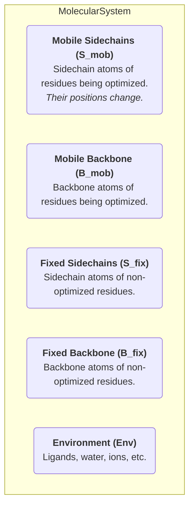
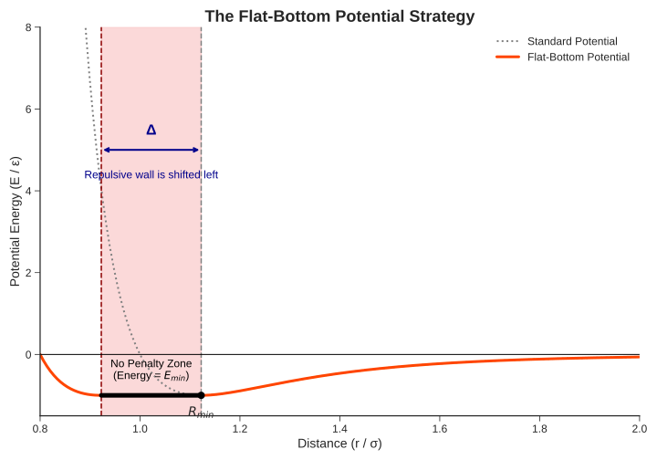

# 2. Forcefield and Energy Calculation

This document details the theoretical foundation and algorithmic implementation of energy calculation in SCREAM++. It connects the underlying physics to the specific energy terms used throughout the optimization engine.

**Table of Contents**

- [2. Forcefield and Energy Calculation](#2-forcefield-and-energy-calculation)
  - [2.1. The Physical Model: Pairwise Non-Bonded Energy](#21-the-physical-model-pairwise-non-bonded-energy)
    - [2.1.1. The Fundamental Equation](#211-the-fundamental-equation)
    - [2.1.2. The Five Atom Sets (Conceptual)](#212-the-five-atom-sets-conceptual)
  - [2.2. The Algorithmic Model: Decomposing for Efficiency](#22-the-algorithmic-model-decomposing-for-efficiency)
    - [2.2.1. From Five Sets to Two: Active vs. Fixed](#221-from-five-sets-to-two-active-vs-fixed)
    - [2.2.2. The Core Decomposition of Total Energy](#222-the-core-decomposition-of-total-energy)
    - [2.2.3. Mapping Decomposition to SCREAM++ Concepts](#223-mapping-decomposition-to-scream-concepts)
  - [2.3. The Flat-Bottom Strategy](#23-the-flat-bottom-strategy)
    - [2.3.1. The Problem: Discrete Libraries vs. Continuous Reality](#231-the-problem-discrete-libraries-vs-continuous-reality)
    - [2.3.2. The Solution: A "Forgiving" Potential](#232-the-solution-a-forgiving-potential)

---

## 2.1. The Physical Model: Pairwise Non-Bonded Energy

At its most fundamental level, the total non-bonded energy of a molecular system in SCREAM++ is modeled as the sum of all pairwise interactions between atoms. Bonded interactions (bonds, angles, dihedrals) are considered fixed within the rigid rotamers and backbone, and thus do not change during the side-chain placement optimization.

### 2.1.1. The Fundamental Equation

The total non-bonded energy, $E_{\text{total}}$, is given by the summation over all unique atom pairs $(i, j)$:

$$
E_{\mathrm{total}} = \sum_{i=1}^{N} \sum_{j=i+1}^{N} E_{\mathrm{pair}}(i,j)
$$

The pairwise energy $E_{\text{pair}}$ is composed of three terms, implemented in `core::forcefield::potentials`:

$$
E_{\text{pair}}(i, j) = E_{\text{vdw}}(i, j) + E_{\text{coulomb}}(i, j) + E_{\text{hbond}}(i, j)
$$

- **$E_{\text{vdw}}$**: Van der Waals interaction, typically modeled by a Lennard-Jones 12-6 or Buckingham potential.
- **$E_{\text{coulomb}}$**: Electrostatic interaction, modeled by Coulomb's law.
- **$E_{\text{hbond}}$**: A specialized hydrogen bond potential (e.g., Dreiding 12-10 with an angular term).

### 2.1.2. The Five Atom Sets (Conceptual)

For the side-chain placement problem, it is useful to conceptually divide all atoms in the system into five distinct sets. This helps in understanding which interactions change during optimization.

**Figure 1: Conceptual Atom Sets**

The key insight for optimization is that **only the coordinates of atoms in the $S_{\text{mob}}$ set change** when a new rotamer is placed. All other atoms are considered fixed in space.

## 2.2. The Algorithmic Model: Decomposing for Efficiency

Calculating the full pairwise sum $E_{\text{total}}$ at every optimization step is computationally prohibitive. The SCREAM++ engine uses a strategic decomposition of this energy to isolate the parts that change from those that remain constant.

### 2.2.1. From Five Sets to Two: Active vs. Fixed

For the algorithm, we simplify the five conceptual sets into two operational sets:

- **The Active Set (A)**: This set contains all atoms whose positions are subject to change during optimization. In the side-chain placement problem, this is exclusively the **Mobile Sidechains ($S_{\text{mob}}$)**.
  > $A = S_{\text{mob}}$
- **The Fixed Set (F)**: This set contains all other atoms in the system, which form a static background or "lattice" against which the active atoms are evaluated.
  > $F = B_{\text{mob}} \cup S_{\text{fix}} \cup B_{\text{fix}} \cup \text{Env}$

### 2.2.2. The Core Decomposition of Total Energy

Using the Active (A) and Fixed (F) sets, the total energy can be rewritten as the sum of three distinct components, where $E(X, Y)$ denotes the sum of all pairwise interactions between atoms in set X and set Y:

$$
E_{\text{total}} = E(A, A) + E(A, F) + E(F, F)
$$

- **$E(F, F)$**: The internal energy of the fixed set. This term is **constant** throughout the optimization.
- **$E(A, F)$**: The interaction energy between the active set and the fixed set.
- **$E(A, A)$**: The internal interaction energy within the active set.

The sum $E(A, A) + E(A, F)$ is the portion of the energy that changes during optimization. We define this as the **Optimization Score**.

### 2.2.3. Mapping Decomposition to SCREAM++ Concepts

The SCREAM++ engine directly implements this decomposition:

- **Fixed Energy ($E_{\text{fixed}}$)**:

  - **Definition**: $E_{\text{fixed}} = E(F, F)$
  - **Description**: The constant energy offset of the system. It is calculated only once at the beginning of the workflow.
  - **Implementation**: `engine::tasks::fixed_energy`

- **Interaction Energy ($E_{\text{interaction}}$)**:

  - **Definition**: $E_{\text{interaction}} = E(A, A)$
  - **Description**: The energy arising from interactions _between_ the side-chains of active residues. This term captures how well the moving parts fit together.
  - **Implementation**: `engine::tasks::interaction_energy`

- **Empty Lattice Energy ($E_{\text{EL}}$)**:
  - **Definition**: For a single active residue $i$ with a specific rotamer $r$, its Empty Lattice energy $E_{\text{EL}}(i_r)$ is defined as the energy of its side-chain atoms ($A_i$) interacting with the entire fixed set ($F$), plus the internal energy of the side-chain itself. $E_{\text{EL}}(i_r) = E(A_i, F) + E_{\text{internal}}(A_i)$
  - **Description**: This is the energy contribution of a single rotamer in the "empty lattice" of the fixed environment. Since this interaction is independent of other active rotamers, it can be pre-calculated for every possible rotamer of every active residue.
  - **Implementation**: `engine::tasks::el_energy` pre-computes these values and stores them in the `ELCache`.

Finally, the **Optimization Score** used by the engine is assembled as:

$$
E_{\text{optimization}} = E_{\text{interaction}} + \sum_{i \in A} E_{\text{EL}}(i)
$$

This decomposition is the key to the engine's performance. Instead of a full $O(N^2)$ calculation at each step, the engine can perform efficient $O(N)$ updates by leveraging pre-computed $E_{\text{EL}}$ values and incrementally updating $E_{\text{interaction}}$. This is discussed further in `04_performance_and_memory.md`.

## 2.3. The Flat-Bottom Strategy

The "Flat-Bottom Strategy" is the core scientific innovation of SCREAM, designed to address a fundamental limitation of discrete rotamer libraries.

### 2.3.1. The Problem: Discrete Libraries vs. Continuous Reality

Rotamer libraries provide a finite set of conformations for each side-chain. It is highly unlikely that any single rotamer in the library perfectly matches the true, continuous optimal position of the side-chain in the protein. This small discrepancy can lead to:

- A slight steric clash (e.g., atoms are 2.9Å apart instead of an ideal 3.0Å).
- In a standard Lennard-Jones potential, this small clash results in a massive, disproportionate repulsive energy penalty.
- The optimization algorithm incorrectly discards this near-perfect rotamer in favor of a much worse one that avoids the minor clash.

### 2.3.2. The Solution: A "Forgiving" Potential

The Flat-Bottom Strategy modifies the repulsive part of the VDW and H-bond potentials to be more tolerant of these small inaccuracies.

**Figure 2: Comparison of Standard vs. Flat-Bottom VDW Potential**

- **Mechanism**: A "flat bottom" of width $\Delta$ is introduced into the potential well. If an atom's distance $r$ falls within the range $[R_e - \Delta, R_e]$ (where $R_e$ is the ideal distance), the energy is clamped to the minimum value, $E(R_e)$. No penalty is applied for this minor clash.
- **The Delta ($\Delta$) Parameter**: The width of this tolerance region is not arbitrary. It is atom-specific and derived from the uncertainty of atom positions in the rotamer library.
  $$
  \Delta = s \cdot \sigma
  $$
  - **$\sigma$ (sigma)**: This value is pre-calculated and stored in `data/delta/delta-*.csv`. It represents the standard deviation of an atom's position from its ideal crystal structure location, based on the "coarseness" (diversity) of the rotamer library. Atoms further down the side-chain have a larger $\sigma$.
  - **$s$ (s-factor)**: A global, user-configurable scaling factor (`--s-factor` or `s-factor` in config) that uniformly tunes the "forgiveness" of the potential. This is a critical parameter for balancing accuracy and conformational search.
- **Implementation**: This logic is encapsulated within `core::forcefield::potentials::apply_flat_bottom_vdw` and `apply_flat_bottom_hbond`.
