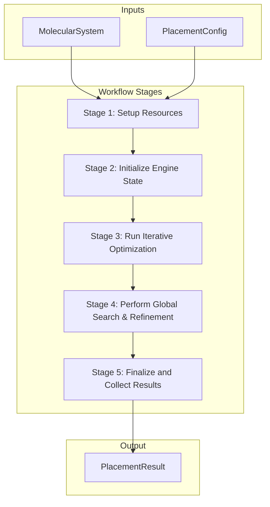
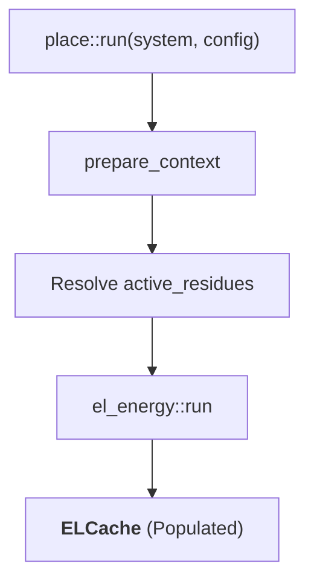
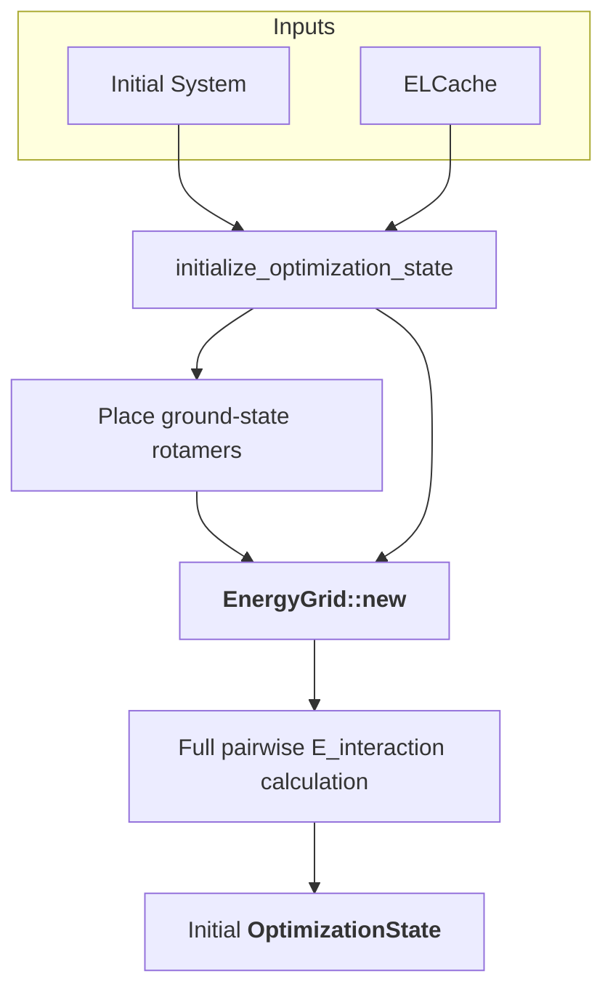
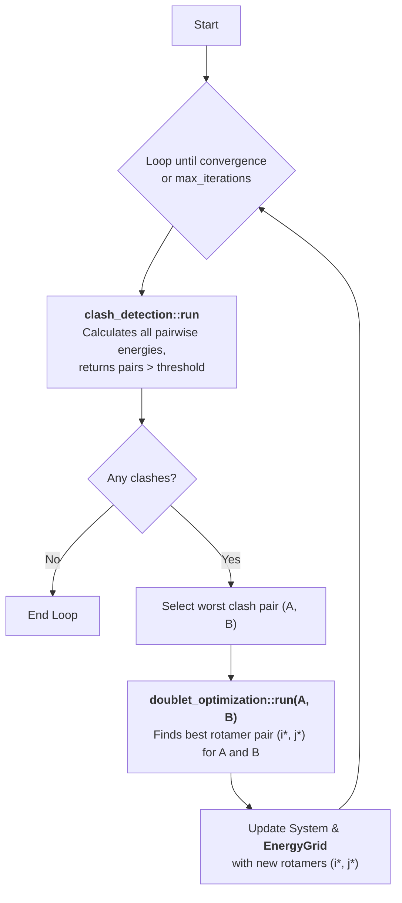
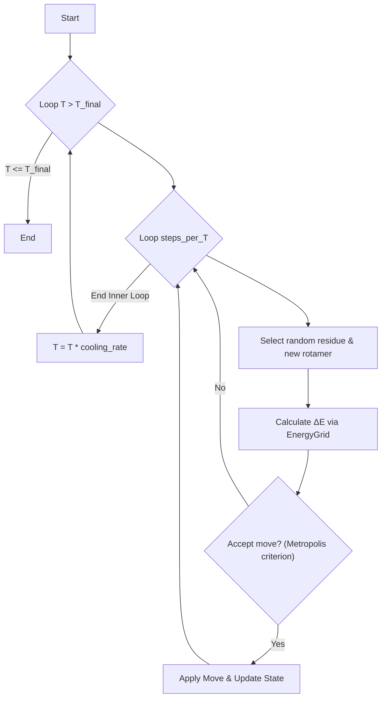
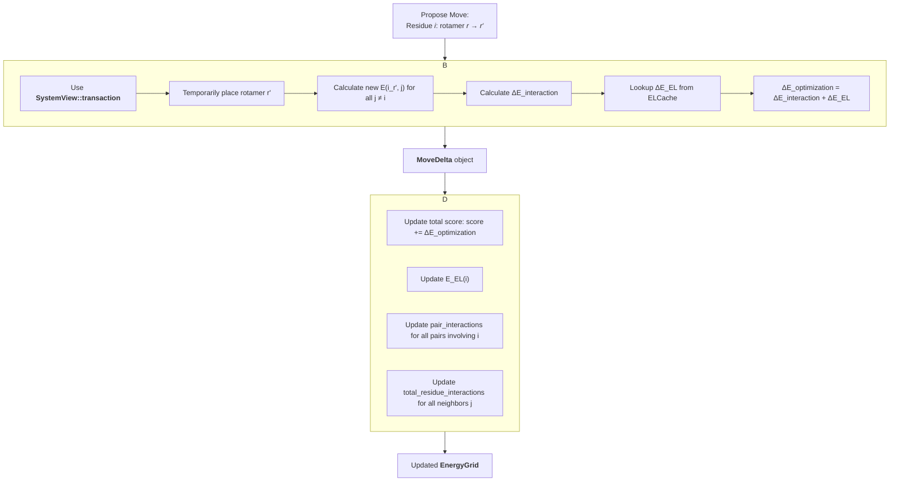
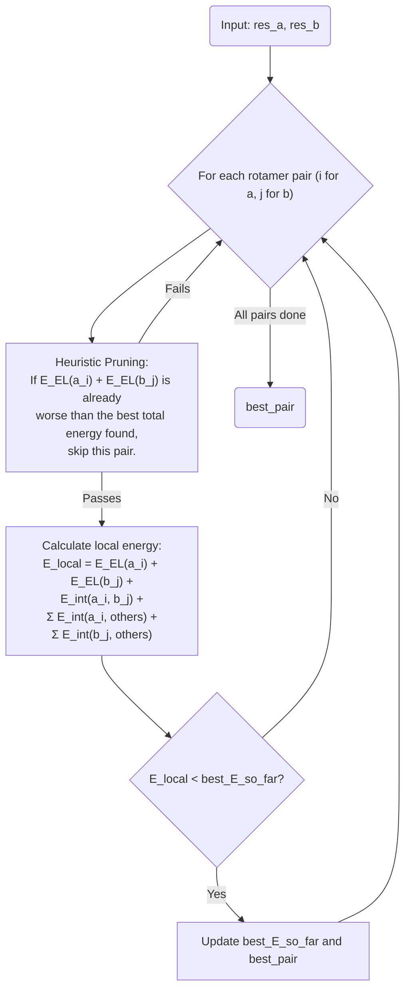
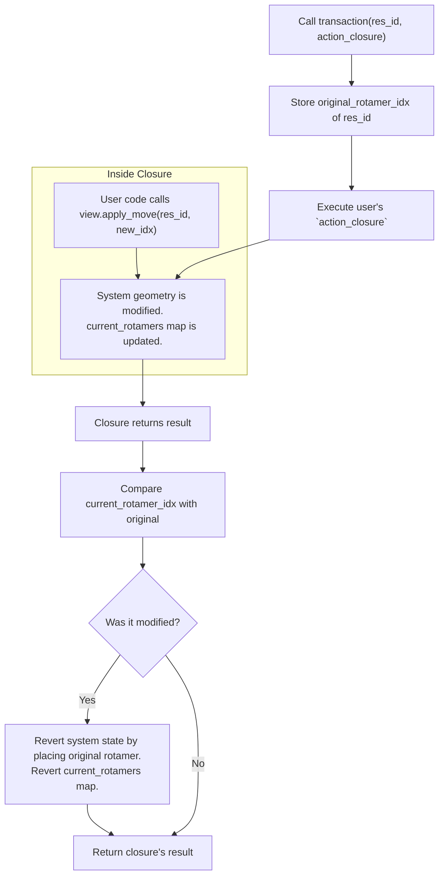

# 3. Algorithms and Workflows

This document provides a detailed, top-down explanation of the algorithms and workflows that power `scream-core`. It connects the high-level user-facing API to the underlying engine logic and core computational tasks, serving as a comprehensive guide for developers looking to understand, modify, or extend the library.

**Table of Contents**

- [3. Algorithms and Workflows](#3-algorithms-and-workflows)
  - [3.1. The `place` Workflow: The Top-Level Conductor](#31-the-place-workflow-the-top-level-conductor)
    - [3.1.1. High-Level Execution Flow](#311-high-level-execution-flow)
  - [3.2. The Optimization Engine: A Deeper Dive](#32-the-optimization-engine-a-deeper-dive)
    - [3.2.1. Phase 1: Preparation \& Pre-computation](#321-phase-1-preparation--pre-computation)
    - [3.2.2. Phase 2: State Initialization](#322-phase-2-state-initialization)
    - [3.2.3. Phase 3: The Iterative Optimization Loop (Clash Resolution)](#323-phase-3-the-iterative-optimization-loop-clash-resolution)
    - [3.2.4. Phase 4: Search \& Refinement](#324-phase-4-search--refinement)
    - [3.2.5. Phase 5: Finalization](#325-phase-5-finalization)
  - [3.3. Core Algorithms and Data Structures in Action](#33-core-algorithms-and-data-structures-in-action)
    - [3.3.1. The Incremental Energy Update Model with `EnergyGrid`](#331-the-incremental-energy-update-model-with-energygrid)
    - [3.3.2. Doublet Optimization: Heuristic for Clash Resolution](#332-doublet-optimization-heuristic-for-clash-resolution)
    - [3.3.3. The Transactional Model: Safe, Temporary System Modification with `SystemView`](#333-the-transactional-model-safe-temporary-system-modification-with-systemview)

---

## 3.1. The `place` Workflow: The Top-Level Conductor

The primary entry point for any side-chain placement task is the `workflows::place::run` function. From a developer's perspective, this function serves as a high-level "conductor," orchestrating the complex sequence of operations performed by the `engine` and `core` layers.

### 3.1.1. High-Level Execution Flow

The workflow can be conceptualized as a five-stage pipeline. Each stage builds upon the results of the previous one, progressively refining the state of the molecular system to find low-energy side-chain conformations.

**Figure 1: High-Level `place` Workflow**

- **Stage 1: Setup Resources**: The workflow begins by loading and preparing all necessary data based on the `PlacementConfig`. This includes loading the forcefield parameters, the specified rotamer library, and the residue topology registry. It also determines the set of `active_residues` to be optimized.
- **Stage 2: Initialize Engine State**: The engine computes baseline energies. The constant `E_fixed` is calculated, and the initial energy of the input conformation is determined. Crucially, the `ELCache` is populated by pre-calculating the Empty Lattice energy for every possible rotamer of every active residue. Finally, an initial `EnergyGrid` is built based on a "ground state" conformation.
- **Stage 3: Iterative Optimization**: This is the main loop for clash resolution. The engine repeatedly identifies the most severe steric/energetic clash in the system and attempts to resolve it by performing a **Doublet Optimization** on the two clashing residues. The system's energy is updated incrementally at each step.
- **Stage 4: Global Search & Refinement**: After the iterative clash resolution converges, optional, more computationally intensive algorithms are run. This includes **Simulated Annealing** to escape local energy minima and **Final Refinement** (Singlet Optimization) to perform a final greedy search for improvements.
- **Stage 5: Finalize and Collect Results**: The best solutions tracked by the `OptimizationState` are collected, sorted, and de-duplicated. The final `total_energy` for each solution is computed by adding the constant `E_fixed` back to the final `optimization_score`. The results are then returned in a structured `PlacementResult`.

## 3.2. The Optimization Engine: A Deeper Dive

This section breaks down the high-level workflow into the specific engine tasks and logic that execute each phase.

### 3.2.1. Phase 1: Preparation & Pre-computation

This phase sets the stage for the entire optimization process.

**Figure 2: Preparation & Pre-computation Flow**

- **`prepare_context` (in `workflows::place`)**: This internal function is the first step. It calls `engine::utils::query::resolve_selection_to_ids` to interpret the `ResidueSelection` criteria from the `PlacementConfig`. It translates user-friendly specifications (e.g., "all", "chain A residues 10-20") into a concrete `HashSet<ResidueId>` of active residues, filtering out any that lack rotamers in the provided `RotamerLibrary`.
- **`engine::tasks::el_energy::run`**: This is the most significant pre-computation step.
  - **Algorithm**: It iterates through every active residue and, for each one, every possible rotamer conformation available in the `RotamerLibrary`. This process is parallelized using `rayon` if the `parallel` feature is enabled.
  - **Calculation**: For each `(residue, rotamer)` pair, it calculates its Empty Lattice Energy ($E_{\text{EL}}$). As defined in the previous document, this includes the rotamer's internal energy and its interaction energy with the entire fixed environment (backbone, non-active sidechains, etc.).
  - **Output**: The results are stored in an `ELCache`, which acts as a lookup table: `(ResidueId, ResidueType, rotamer_idx) -> EnergyTerm`.

### 3.2.2. Phase 2: State Initialization

With pre-computations complete, the engine initializes the data structures that will manage the optimization state.

**Figure 3: State Initialization Flow**

- **`initialize_optimization_state` (in `workflows::place`)**:
  - **Algorithm**: For each active residue, this function queries the `ELCache` to find the rotamer with the lowest $E_{\text{EL}}$. This set of lowest-energy rotamers constitutes the "ground state" conformation.
  - **Action**: It then modifies a copy of the system by placing these ground-state rotamers onto their respective residues.
- **`engine::energy_grid::EnergyGrid::new`**:
  - **Algorithm**: This constructor receives the system with ground-state rotamers. It performs a **one-time, full, all-pairs calculation** of the interaction energy ($E_{\text{interaction}}$) between the side-chains of all active residues.
  - **Output**: It populates its internal data structures: `pair_interactions` (storing energy between each pair) and `total_residue_interactions` (storing the sum of interactions for each residue). This populated `EnergyGrid` is the starting point for all subsequent incremental updates.
  - Finally, an `OptimizationState` is created to hold the initial state and track future solutions.

### 3.2.3. Phase 3: The Iterative Optimization Loop (Clash Resolution)

This is the core iterative refinement loop of the SCREAM algorithm.

**Figure 4: Clash Resolution Loop**

- **`engine::tasks::clash_detection::run`**: At the beginning of each iteration, this task uses the current `EnergyGrid`'s `pair_interactions` to quickly find all residue pairs whose interaction energy exceeds a predefined threshold (e.g., 25 kcal/mol). It returns a list of these `ClashPair`s, sorted with the most severe clash first.
- **`engine::tasks::doublet_optimization::run`**: The engine then focuses on the worst clash pair. This task performs an exhaustive search over all rotamer combinations for these two residues. Its goal is to find the pair of rotamers that minimizes the local energy (their mutual interaction energy plus their interactions with all other active residues). A detailed breakdown of this algorithm is in Section 3.2.
- **Update**: Once the best new rotamer pair is found, the `EnergyGrid` is updated. This is a highly efficient operation, as described in Section 3.1. The system state is modified, and the new total energy is submitted to the `OptimizationState`.
- **Convergence**: The loop terminates if no clashes are found, the maximum number of iterations is reached, or the best energy found does not improve significantly over a set number of "patience" iterations (`ConvergenceConfig`).

### 3.2.4. Phase 4: Search & Refinement

After the primary loop, these optional phases further polish the solution.

- **Simulated Annealing (`run_simulated_annealing`)**:
  - **Algorithm**: If enabled, this phase uses a Monte Carlo approach. It repeatedly picks a random residue, proposes a random new rotamer, and calculates the change in energy ($\Delta E$). The move is always accepted if $\Delta E < 0$. If $\Delta E > 0$, it is accepted with a probability of $P(\text{accept}) = e^{-\Delta E / T}$, where $T$ is the current "temperature". The temperature is gradually lowered according to a cooling schedule.
  - **Purpose**: This allows the search to occasionally accept "worse" moves, giving it the ability to escape from local energy minima and explore a wider conformational space.

**Figure 5: Simulated Annealing Flow**

- **Final Refinement (`final_refinement`)**:
  - **Algorithm**: This is a greedy, iterative **Singlet Optimization**. It runs for a fixed number of passes (e.g., `final-refinement-iterations`). In each pass, it iterates through every active residue one by one. For each residue, it evaluates the energy of all its possible rotamers (given the current state of all other residues) and greedily selects the one that results in the lowest total energy.
  - **Purpose**: To perform a final, local "polishing" of the best solution found so far.

### 3.2.5. Phase 5: Finalization

The final step is to prepare the results for the user.

- **`finalize_results` (in `workflows::place`)**:
  - **Algorithm**: This function retrieves the sorted list of best solutions from the `OptimizationState`'s `BinaryHeap`.
  - **Logic**: It handles the `include_input_conformation` option by comparing the initial state's energy with the found solutions and inserting it into the list if it ranks high enough. It also performs de-duplication to remove solutions with nearly identical energies.
  - **Energy Conversion**: It converts the final **Optimization Score** of each solution into a physically meaningful **Total Energy** by adding back the pre-calculated `E_fixed`.

## 3.3. Core Algorithms and Data Structures in Action

This section provides a deeper look into the key mechanisms that enable the engine's performance and correctness.

### 3.3.1. The Incremental Energy Update Model with `EnergyGrid`

The `EnergyGrid` is the performance centerpiece of the optimization engine. It transforms the computationally expensive problem of energy recalculation into a fast, incremental update.

**Figure 6: Incremental Energy Update Flow**

- **The Problem**: A naive approach would re-calculate all pairwise interactions ($O(N^2)$ pairs) after every single rotamer change. For a system with 200 active residues, this is nearly 20,000 pairs.
- **The Solution**: When a single residue `i` changes its rotamer, only its interactions with the other `N-1` active residues change. The interactions between any other pair `(j, k)` where `j,k ≠ i` remain constant.
- **`calculate_delta_for_move`**: This function computes the total change in energy without iterating over all pairs.
  1. It uses a `SystemView` transaction to temporarily place the new rotamer.
  2. It calculates the **new** interaction energies between the new rotamer and all other active side-chains ($O(N)$ calculations).
  3. It finds the change in interaction energy: $\Delta E_{\text{interaction}} = E_{\text{interaction}}^{\text{new}} - E_{\text{interaction}}^{\text{old}}$. The old value is efficiently retrieved from the `EnergyGrid`.
  4. It finds the change in Empty Lattice energy, $\Delta E_{\text{EL}}$, by a simple $O(1)$ lookup in the `ELCache`.
  5. The total change is $\Delta E_{\text{optimization}} = \Delta E_{\text{interaction}} + \Delta E_{\text{EL}}$.
- **`apply_move`**: This function takes the `MoveDelta` object and updates the `EnergyGrid`'s internal tables in $O(N)$ time, reflecting the new energy landscape.

### 3.3.2. Doublet Optimization: Heuristic for Clash Resolution

This task (`engine::tasks::doublet_optimization`) is the primary workhorse for resolving unfavorable interactions.

**Figure 7: Doublet Optimization Algorithm**

- **Algorithm**: It performs a brute-force search over the cross-product of the rotamer sets for two residues, `res_a` and `res_b`.
- **Energy Calculation**: For each pair of rotamers `(i, j)`, it calculates a total local energy. This includes their pre-computed $E_{\text{EL}}$ values and their newly computed interaction energies with each other and with all other active residues in the system.
- **Optimization**: A critical performance heuristic is used. Before performing the expensive interaction energy calculations, it checks if the sum of the two rotamers' $E_{\text{EL}}$ is already greater than the best total energy found so far. If it is, this pair can be safely pruned from the search space, as the interaction energies can only add positive (or slightly negative) values.

### 3.3.3. The Transactional Model: Safe, Temporary System Modification with `SystemView`

The `SystemView` (`engine::transaction`) is a key piece of the engine's design, ensuring both correctness and performance.

**Figure 8: `SystemView::transaction` Lifecycle**

- **The Problem**: During energy calculation for a proposed move (e.g., in `calculate_delta_for_move`), we need to see what the system _would_ look like with the new rotamer to calculate its interactions. However, we don't want to permanently commit this change until we know if the move will be accepted. Cloning the entire `MolecularSystem` for every check would be extremely slow and memory-intensive.
- **The Solution**: `SystemView` holds a mutable reference to the _single, shared_ `MolecularSystem`. The `transaction` method saves the state of the residue(s) of interest, allows the provided closure to make temporary modifications, and then **guarantees** that the original state is restored before the function returns. This provides the illusion of a temporary copy without the performance overhead. This is a powerful pattern that ensures the `EnergyGrid` and the `MolecularSystem` remain consistent and correct throughout the optimization.
