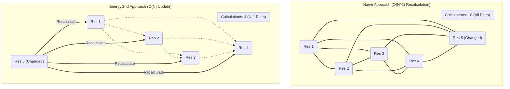
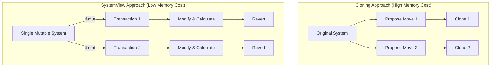

# 4. Performance and Memory

Performance is a cornerstone of SCREAM++. This document details the key architectural and algorithmic choices made to ensure the library is both CPU-efficient and memory-conscious. These strategies allow SCREAM++ to tackle large and complex protein systems effectively.

**Table of Contents**

- [4. Performance and Memory](#4-performance-and-memory)
  - [4.1. CPU Performance Strategies](#41-cpu-performance-strategies)
    - [4.1.1. Algorithmic Efficiency: The Incremental Update Model](#411-algorithmic-efficiency-the-incremental-update-model)
    - [4.1.2. Parallelism with Rayon](#412-parallelism-with-rayon)
    - [4.1.3. Heuristic Pruning in Optimization Tasks](#413-heuristic-pruning-in-optimization-tasks)
  - [4.2. Memory Efficiency Strategies](#42-memory-efficiency-strategies)
    - [4.2.1. The Transactional Model: Avoiding Clones with `SystemView`](#421-the-transactional-model-avoiding-clones-with-systemview)
    - [4.2.2. Data Representation and Ownership](#422-data-representation-and-ownership)

---

## 4.1. CPU Performance Strategies

CPU performance is optimized through a combination of algorithmic cleverness, parallelism, and heuristic shortcuts.

### 4.1.1. Algorithmic Efficiency: The Incremental Update Model

The single most important performance feature of the optimization engine is the incremental energy update model, orchestrated by the `EnergyGrid`.

- **The Problem**: A naive side-chain optimization algorithm would re-calculate the total energy of the system after every single change to a rotamer. For a system with $N$ active residues, the total interaction energy involves approximately $N(N-1)/2$ pairwise calculations. A full recalculation is an $O(N^2)$ operation, which becomes prohibitively expensive for large systems within an iterative loop.

- **The Solution**: The `EnergyGrid` transforms this into an $O(N)$ operation. When a single residue `i` changes its conformation, the only interaction energies that change are those involving residue `i`. All other pairwise interactions $(j, k)$ where $j, k \neq i$ remain unchanged.

**Figure 1: Visualizing Energy Update Complexity (Example: N=5 Active Residues)**

**Explanation of the diagram:**

- **Naive Approach**: When Residue 5 changes, the algorithm recalculates the energy for **all 10 pairs** (solid lines). The complexity grows quadratically with the number of residues.
- **EnergyGrid Approach**:

  - The interactions between residues 1, 2, 3, and 4 (dashed gray lines) are **not recalculated**. Their values are already stored in the `EnergyGrid`.
  - Only the **4 pairs** involving the changed Residue 5 (solid blue lines) need to be recomputed.
  - The total energy is then updated by subtracting the old interaction energies of Residue 5 and adding the new ones. This complexity grows linearly.

- **Implementation**: This is achieved through the `calculate_delta_for_move` and `apply_move` methods on the `EnergyGrid`.
  1. `calculate_delta_for_move` computes the change in energy ($\Delta E$) by summing only the changes in the $N-1$ pairs involving the moving residue.
  2. `apply_move` then updates the `EnergyGrid`'s internal tables (`pair_interactions`, `total_residue_interactions`) by applying these deltas, again in $O(N)$ time.

This incremental model is the primary reason the engine can perform many thousands of optimization steps per second.

### 4.1.2. Parallelism with Rayon

Many of the most computationally intensive tasks in SCREAM++ are "embarrassingly parallel," meaning they can be broken down into many independent sub-problems that can be solved concurrently. We leverage the `rayon` crate to exploit this parallelism on multi-core processors.

- **Where Parallelism is Used**:

  - **`el_energy::run`**: The calculation of Empty Lattice energies for each `(residue, rotamer)` pair is completely independent. This task is parallelized over the list of all pairs, providing a significant speedup during the initial setup phase.
  - **`doublet_optimization::run`**: The search for the best pair of rotamers for two residues is parallelized over the cross-product of their rotamer libraries. Each pair `(rotamer_i, rotamer_j)` can be evaluated independently.
  - **`interaction_energy::run`**: The initial, full calculation of all pairwise interactions is parallelized over the list of all unique residue pairs.

- **How to Use**: Parallelism is enabled via the `parallel` feature flag in `Cargo.toml`. When enabled, the CLI automatically defaults to using all available CPU cores but can be controlled via the `-j`/`--threads` argument. The library code uses `par_iter()` (from `rayon::prelude::*`) instead of `iter()` where appropriate.

### 4.1.3. Heuristic Pruning in Optimization Tasks

In search algorithms like `doublet_optimization`, we can often "prune" large portions of the search space that cannot possibly lead to a better solution.

- **The Heuristic**: Before calculating the expensive interaction energy for a rotamer pair `(a_i, b_j)`, we first check the sum of their pre-calculated Empty Lattice energies, $E_{\text{EL}}(a_i) + E_{\text{EL}}(b_j)$. Interaction energies are typically either repulsive (positive) or only weakly attractive. Therefore, if the sum of their $E_{\text{EL}}$ is already worse than the best total energy found so far, it is extremely unlikely that a favorable interaction energy could compensate. We can safely skip this pair and move to the next.

  > If `E_EL(a_i) + E_EL(b_j) + E_interaction_min_possible > E_best_found`, then prune.

- **Impact**: This simple check can prune a significant fraction of the rotamer pairs, especially later in the optimization when a good `E_best_found` has been established. This drastically reduces the number of full energy calculations required.

## 4.2. Memory Efficiency Strategies

Memory efficiency is crucial for handling large protein systems and for enabling effective parallelism, as each thread may require its own working space.

### 4.2.1. The Transactional Model: Avoiding Clones with `SystemView`

The most significant memory optimization is the avoidance of cloning the `MolecularSystem` during "what-if" calculations.

- **The Problem**: A straightforward way to calculate the energy of a proposed move would be to clone the entire `MolecularSystem`, apply the change to the clone, calculate its energy, and then discard it. For a large protein, `MolecularSystem` can be many megabytes in size. Cloning it thousands of times per second would lead to massive memory allocation overhead and poor cache performance.

- **The Solution**: The `engine::transaction::SystemView` provides a safe way to perform temporary modifications on a _mutable reference_ to the single, shared `MolecularSystem`.

**Figure 2: `SystemView` Memory Model vs. Cloning**

- **Implementation**: The `transaction` and `transaction_doublet` methods on `SystemView` work by:

1. Saving the original rotamer index (a `usize`) of the residue(s) being modified.
2. Executing a user-provided closure that is allowed to modify the system via `apply_move`.
3. After the closure finishes, it restores the original rotamer, reverting the system geometry to its initial state.

- **Benefit**: The overhead per transaction is just a few bytes to store the original indices, rather than megabytes for a full clone. This drastically reduces memory pressure and allocation overhead.

### 4.2.2. Data Representation and Ownership

Rust's strict ownership and borrowing model provides memory safety guarantees that are invaluable in a complex scientific application.

- **Clear Ownership**: The `MolecularSystem` is the unambiguous owner of all core structural data. Other components, like the `OptimizationContext` and `Scorer`, hold immutable references (`&`) to it. This prevents data races and dangling pointers that could occur in a C++ implementation with complex object lifecycles.
- **`slotmap` for Stable IDs**: As mentioned in `01_architecture_and_data_models.md`, using `slotmap` prevents memory-related bugs that arise from index invalidation after deletions, a common problem when using `Vec` indices as identifiers.
