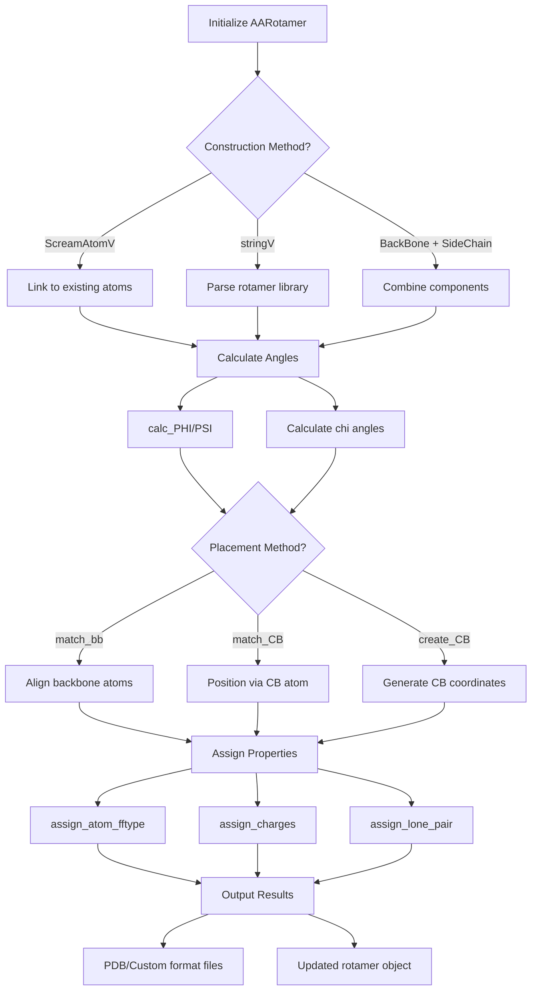

# `AARotamer.hpp` File Analysis

## File Purpose and Primary Role

The `AARotamer` class represents an amino acid rotamer (a specific rotational conformation of an amino acid side chain) within the SCREAM molecular modeling software. It extends the base `Rotamer` class to provide amino acid-specific functionality for protein side-chain placement. The class manages both backbone and side-chain atomic coordinates, handles rotamer library data, calculates torsion angles (PHI, PSI, chi angles), and provides methods for placing rotamers onto protein backbones through various matching strategies.

## Key Classes, Structs, and Functions (if any)

- **`AARotamer` class**: Main class inheriting from `Rotamer`
  - **Constructors**: Multiple constructors for different initialization scenarios (from atom lists, strings, backbone/sidechain components)
  - **`deepcopy()`**: Recursively copies all SCREAM_ATOM structures
  - **`calc_PHI()/calc_PSI()`**: Calculate backbone dihedral angles
  - **`chi1()-chi5()`**: Return side-chain dihedral angles
  - **`match_bb()`**: Place rotamer by matching backbone atoms
  - **`match_CB()`**: Place rotamer by matching CB atom position
  - **`create_CB()`**: Generate CB atom coordinates
  - **`assign_atom_fftype()`**: Assign Dreiding force field types
  - **`assign_charges()`**: Assign atomic charges (CHARMM22)
  - **`assign_lone_pair()`**: Set up lone pair and connectivity information

## Inputs

**Data Structures/Objects:**

- `ScreamAtomV`: Vector of SCREAM_ATOM pointers for atomic coordinates
- `stringV`: Vector of strings (likely from rotamer library files)
- `AABackBone*`: Pointer to amino acid backbone structure
- `AASideChain*`: Pointer to amino acid side-chain structure
- `Rotamer*`: Base rotamer for backbone matching operations
- `vector<double>`: Parameters for CB creation (angles, bond length, lambda)

**File-Based Inputs:**

- Rotamer library files (format inferred from `stringV` constructor)
- Rotamer connectivity files (mentioned in commented constructor)
- The class appears designed to read rotamer libraries but specific file formats are not explicitly defined in this header

**Environment Variables:**

- No direct environment variable usage evident in this header file

**Parameters/Configuration:**

- Force field type selection (currently supports Dreiding)
- Charge assignment method (supports "CHARM22")
- Amino acid termination state (N-term/C-term via integer parameter)
- Rotamer matching parameters (angles, bond lengths, lambda values)

## Outputs

**Data Structures/Objects:**

- Modified `AARotamer` objects with updated atomic coordinates
- `ScreamVector`: 3D coordinates for calculated atoms (e.g., C(i-1) position)
- Updated SCREAM_ATOM structures with assigned properties (charges, types, connectivity)

**File-Based Outputs:**

- PDB format output via `pdb_append_to_filehandle()`
- Custom format output via `append_to_filehandle()`
- Connectivity information output via `append_to_ostream_connect_info()`

**Console Output (stdout/stderr):**

- Debug information via `print_Me()` and `print_ordered_by_n()`
- No explicit error messaging visible in header

**Side Effects:**

- Modifies atomic coordinates during rotamer placement
- Updates PHI/PSI angle values
- Assigns force field properties to atoms
- Potentially modifies passed-in backbone structures

## External Code Dependencies (Libraries/Headers)

**Standard C++ Library:**

- `<string>`: String manipulation
- `<iostream>`: Input/output operations
- `<fstream>`: File stream operations
- `<vector>`: Dynamic arrays

**Internal SCREAM Project Headers:**

- `defs.hpp`: Project-wide definitions
- `scream_atom.hpp`: Atomic data structures
- `scream_vector.hpp`: Custom 3D vector class
- `scream_matrix.hpp`: Custom matrix operations
- `sc_BackBone.hpp`: Generic backbone class
- `sc_AABackBone.hpp`: Amino acid backbone class
- `sc_SideChain.hpp`: Generic side-chain class
- `sc_AASideChain.hpp`: Amino acid side-chain class
- `Rotamer.hpp`: Base rotamer class

**External Compiled Libraries:**

- None evident (uses custom SCREAM vector/matrix classes instead of external libraries)

## Core Logic/Algorithm Flowchart (Mermaid JS Format)

## Potential Areas for Modernization/Refactoring in SCREAM++

1. **Memory Management and Smart Pointers**: The class uses raw pointers extensively (`AABackBone*`, `AASideChain*`, `SCREAM_ATOM*`) with manual memory management. Modern C++ should use `std::unique_ptr` or `std::shared_ptr` to prevent memory leaks and improve safety. The warning about pointer scope in the constructor comments indicates problematic ownership semantics.

2. **STL Container Integration**: Replace custom `ScreamAtomV` and `stringV` types with standard containers like `std::vector<std::unique_ptr<Atom>>` and `std::vector<std::string>`. The custom vector types add unnecessary complexity and reduce interoperability with modern C++ algorithms and libraries.

3. **Error Handling and Return Values**: Functions like `chi1()-chi5()` return magic numbers (1000) for errors instead of using exceptions or `std::optional<double>`. The charge assignment and force field methods should return error codes or throw exceptions rather than silently failing. Modern error handling would make the API more robust and easier to debug.
