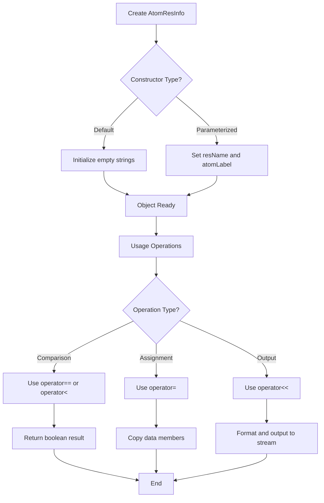

# `AtomResInfo.hpp` File Analysis

## File Purpose and Primary Role

The `AtomResInfo` class serves as a data container and identifier for atom-residue pairs in the SCREAM molecular modeling software. Its primary responsibility is to store and manage the relationship between residue names (3-letter codes like "ALA", "GLY") and specific atom labels within those residues (e.g., "CA", "CB", "N"). This class appears to be used as a key or identifier throughout the SCREAM system to uniquely identify atoms within protein structures by combining residue type information with specific atom labels.

## Key Classes, Structs, and Functions (if any)

### Classes:

- **`AtomResInfo`**: The main class that encapsulates atom-residue information
  - **Purpose**: Stores and manages residue name and atom label pairs, providing comparison operators for use in containers like maps and sets

### Key Member Functions:

- **Constructors**: Default constructor and parameterized constructor taking residue name and atom label
- **Destructor**: Standard destructor for cleanup
- **Comparison Operators**:
  - `operator=`: Assignment operator for copying instances
  - `operator==`: Equality comparison for matching atom-residue pairs
  - `operator<`: Less-than operator enabling use in ordered containers (std::map, std::set)
- **Stream Operator**: `operator<<` for output formatting

### Static Data Members:

- **`atomLabel_value_map`**: A static map associating atom labels with numerical values (likely for energy calculations or atom type identification)

## Inputs

### Data Structures/Objects:

- **String parameters**: Two `std::string` objects representing residue name (3-letter code) and atom label
- **AtomResInfo objects**: For copy assignment and comparison operations

### File-Based Inputs:

- Not directly evident from this header file, but the static `atomLabel_value_map` likely gets populated from external parameter files (potentially `.par` or `.lib` files containing atom type definitions)

### Environment Variables:

- No direct environment variable usage apparent in this header file

### Parameters/Configuration:

- The static `atomLabel_value_map` suggests this class relies on predefined atom type parameters, likely loaded during program initialization from configuration files

## Outputs

### Data Structures/Objects:

- **AtomResInfo instances**: Objects containing residue name and atom label pairs
- **Boolean values**: From comparison operators for equality and ordering
- **Stream output**: Formatted representation via the stream insertion operator

### File-Based Outputs:

- No direct file output functionality in this header

### Console Output (stdout/stderr):

- Formatted output through the overloaded `operator<<` for debugging or logging purposes

### Side Effects:

- The static `atomLabel_value_map` represents shared state that could be modified globally

## External Code Dependencies (Libraries/Headers)

### Standard C++ Library:

- `<string>`: For residue name and atom label storage
- `<iostream>`: For stream output operations
- `<map>`: For the static atom label to value mapping

### Internal SCREAM Project Headers:

- None explicitly included in this header file

### External Compiled Libraries:

- None apparent from this header file

## Core Logic/Algorithm Flowchart (Mermaid JS Format)

## Potential Areas for Modernization/Refactoring in SCREAM++

### 1. **Modern C++ Data Members and Initialization**

- Replace public data members (`resName`, `atomLabel`) with private members and provide proper getters/setters
- Use member initializer lists and default member initialization
- Consider using `std::string_view` for read-only string operations to improve performance

### 2. **Enhanced Type Safety and Resource Management**

- Replace the static `std::map` with a more modern approach using `std::unordered_map` for better performance
- Consider using `enum class` for atom types instead of string-based labels where appropriate
- Implement proper RAII principles and consider if the destructor is actually needed

### 3. **API Design and Const-Correctness**

- Make data members private and provide const-correct accessor methods
- Add validation in constructors to ensure valid residue names and atom labels
- Consider implementing a factory pattern or builder pattern for creating AtomResInfo objects with validation
- Add `noexcept` specifications where appropriate for better optimization and exception safety
