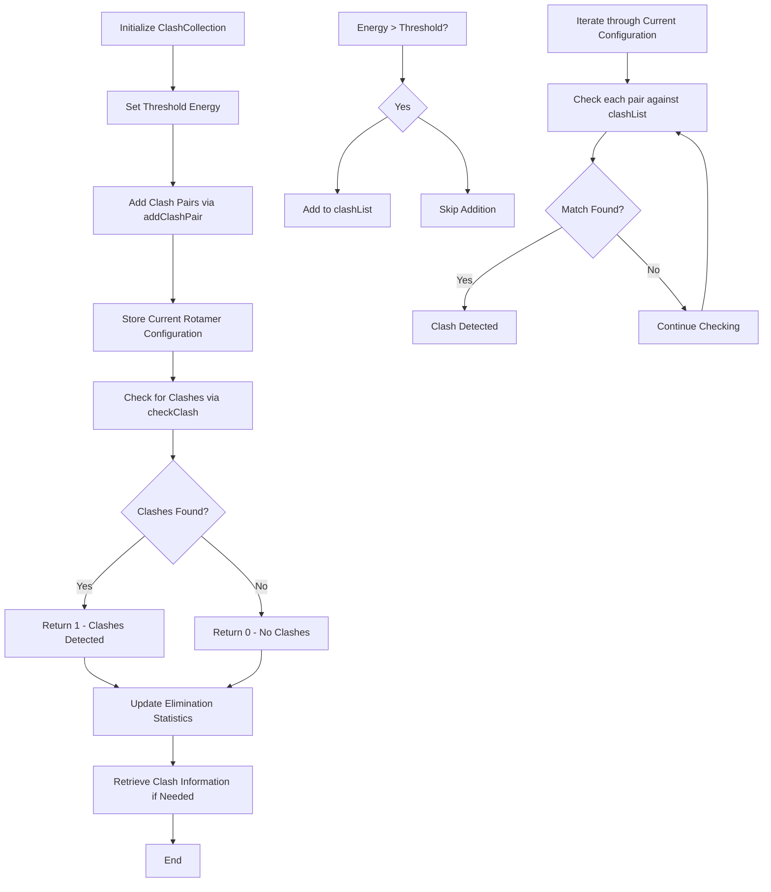

# `ClashCollection.hpp` File Analysis

## File Purpose and Primary Role

The `ClashCollection` class serves as a central manager for detecting and storing clashing rotamer pairs in the SCREAM molecular modeling software. Its primary responsibility is to maintain a collection of rotamer pairs that have interaction energies above a specified threshold (indicating steric clashes), and to provide methods for checking whether a given rotamer configuration contains any of these problematic clashing pairs. This is crucial for protein side-chain placement algorithms to avoid physically unrealistic conformations.

## Key Classes, Structs, and Functions (if any)

### Primary Class: `ClashCollection`

- **Purpose**: Manages a collection of clashing rotamer pairs and provides clash detection functionality
- **Key Constructors**:
  - `ClashCollection()`: Default constructor
  - `ClashCollection(double)`: Constructor with threshold energy parameter
- **Core Methods**:
  - `addClashPair()`: Adds clashing rotamer pairs to the collection (two overloads)
  - `checkClash()`: Determines if a given rotamer configuration contains clashes
  - `setThresholdE()`/`getThresholdE()`: Manage the energy threshold for clash detection
  - `storeCurrentRotamerConfiguration()`: Updates internal state with current rotamer indices
  - `getDiscreteClashPairList()`: Returns non-overlapping clash pairs

### Key Type Definitions

- **`ExcitationEnumeration`**: Type alias for `std::map<std::string, unsigned short>` representing rotamer configurations

## Inputs

### Data Structures/Objects

- **`MutInfoPair`**: Pairs of rotamer mutation information objects representing clashing rotamers
- **`MutInfo`**: Individual rotamer mutation information objects
- **`ExcitationEnumeration`**: Maps representing current rotamer configurations (string keys to rotamer indices)
- **`double`**: Energy values for clash threshold and rotamer-rotamer interaction energies

### File-Based Inputs

- **None directly**: This header file does not directly read from external data files. Input data comes through method parameters from other SCREAM components.

### Environment Variables

- **None identified**: No direct usage of environment variables in this header file.

### Parameters/Configuration

- **`threshold_E`**: The energy threshold above which rotamer-rotamer interactions are considered clashing
- **Rotamer indices**: Provided through `ExcitationEnumeration` objects from `RotlibCollection`

## Outputs

### Data Structures/Objects

- **`vector<MutInfoPair>`**: Lists of clashing rotamer pairs (via `getClashList()` and `getDiscreteClashPairList()`)
- **`int`**: Clash detection results (1 if clashes found, presumably 0 otherwise)
- **`double`**: Energy threshold values
- **Clash statistics**: Count of eliminated clashing rotamers

### File-Based Outputs

- **None directly**: This header file does not directly write to output files.

### Console Output (stdout/stderr)

- **None apparent**: No console output methods visible in this header file.

### Side Effects

- **Internal state modification**: Updates `clashList`, `currentRotamerConfiguration`, and clash statistics
- **Counter incrementation**: Tracks total eliminated clashing rotamers

## External Code Dependencies (Libraries/Headers)

### Standard C++ Library

- **`<algorithm>`**: For STL algorithms
- **`<map>`**: For `std::map` container (used in `ExcitationEnumeration`)
- **`<vector>`**: For `std::vector` container (used in `clashList`)

### Internal SCREAM Project Headers

- **`"defs.hpp"`**: Project-wide definitions and constants
- **`"MutInfo.hpp"`**: Mutation/rotamer information classes

### External Compiled Libraries

- **None identified**: No third-party library dependencies apparent in this header.

## Core Logic/Algorithm Flowchart (Mermaid JS Format)

## Potential Areas for Modernization/Refactoring in SCREAM++

### 1. **Smart Pointer Usage and RAII**

The current code uses raw pointers and manual memory management patterns. Modern C++ should leverage smart pointers (`std::unique_ptr`, `std::shared_ptr`) and RAII principles to eliminate potential memory leaks and improve exception safety.

### 2. **STL Container and Algorithm Optimization**

- Replace the custom `ExcitationEnumeration` type alias with more descriptive naming
- Consider using `std::unordered_map` instead of `std::map` for better performance if ordering is not required
- Leverage STL algorithms more extensively (e.g., `std::find_if`, `std::any_of`) for clash detection instead of manual loops

### 3. **Interface Design and Const-Correctness**

- Many getter methods should be marked as `const` (e.g., `getThresholdE()`, `getNumberOfClashes()`)
- The `checkClash()` method should take a `const ExcitationEnumeration&` parameter
- Consider using enum classes for return codes instead of magic numbers (0/1)
- Implement proper move semantics for the container members to improve performance with large clash collections
