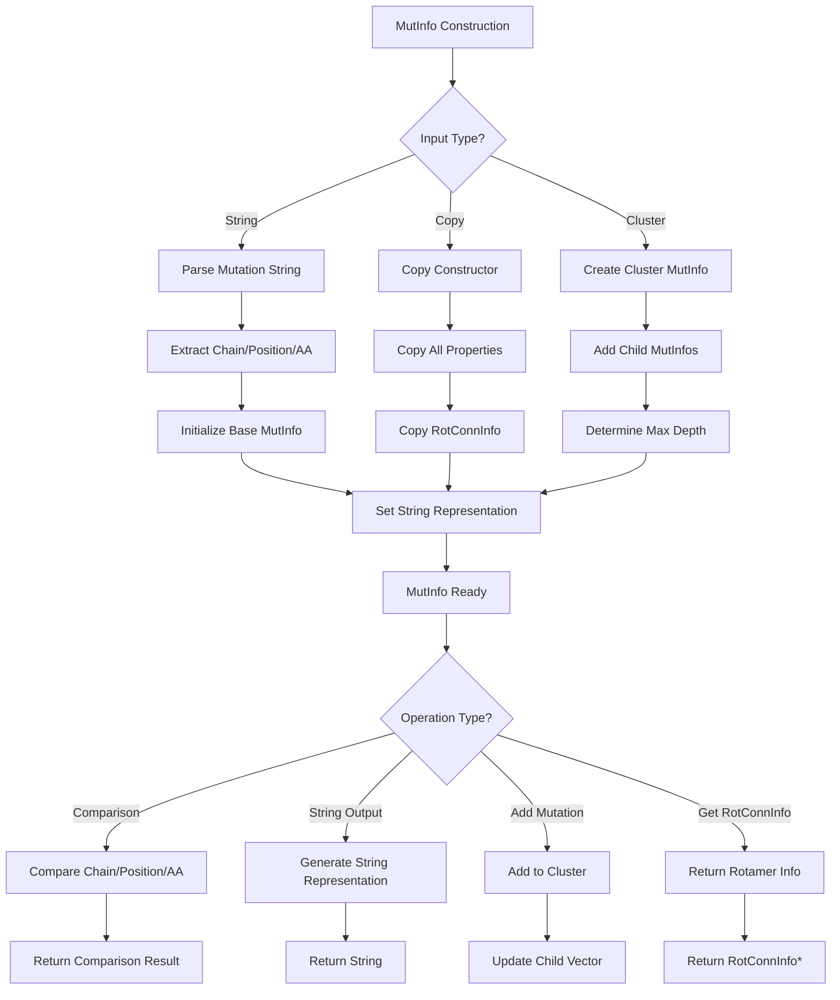

# `MutInfo.hpp` File Analysis

## File Purpose and Primary Role

The `MutInfo.hpp` file defines classes for representing and managing mutation information in the SCREAM protein side-chain placement software. The primary role is to encapsulate data about amino acid mutations, including the chain identifier, position, and amino acid type, along with supporting hierarchical mutation clusters and rotamer connectivity information. This appears to be a core data structure for tracking and manipulating protein mutations during side-chain optimization.

## Key Classes, Structs, and Functions (if any)

### `MutInfo` Class

- **Purpose:** Represents a single mutation or a cluster of mutations with chain, position, and amino acid information
- **Key Features:**
  - Stores mutation data (chain, position, amino acid)
  - Supports hierarchical clustering of mutations
  - Integrates with rotamer connectivity information
  - Provides string-based and comparison operations

### `MutInfoPair` Class

- **Purpose:** Represents a pair of mutations, typically used for analyzing interactions between two mutation sites
- **Key Features:**
  - Contains two `MutInfo` objects
  - Stores clash energy between the mutation pair
  - Provides comparison and string representation methods

## Inputs

### Data Structures/Objects

- **`string`:** Mutation strings in format like "C218_A" (chain C, position 218, amino acid A)
- **`MutInfo` objects:** For copy construction and clustering operations
- **`RotConnInfo*`:** Rotamer connectivity information for arbitrary rotamer placement
- **`int`:** Index values for rotamer numbering and mutation identification

### File-Based Inputs

- Not directly evident from this header file, but the class likely processes mutation data from external sources through string initialization

### Environment Variables

- No direct environment variable usage evident in this header file

### Parameters/Configuration

- **Mutation string format:** Appears to follow "Chain_Position_AminoAcid" pattern
- **Clustering format:** Uses pipe delimiters (|) for hierarchical mutation clusters
- **Index system:** Integer-based indexing for rotamer identification

## Outputs

### Data Structures/Objects

- **`MutInfo` objects:** Created and returned by constructors and copy operations
- **`vector<MutInfo*>`:** Collection of all mutation information from `getAllMutInfos()`
- **`map<string, RotConnInfo*>`:** Mapping of mutation strings to rotamer connectivity info
- **`string`:** String representations of mutations via `getString()`

### File-Based Outputs

- No direct file output evident in this header file

### Console Output (stdout/stderr)

- **Debug/Info output:** Via `print_Me()` method and overloaded `operator<<`
- **Mutation information:** String representations for logging and debugging

### Side Effects

- **RotConnInfo management:** Stores and manages pointers to rotamer connectivity information
- **Child mutation tracking:** Maintains hierarchical relationships between mutations

## External Code Dependencies (Libraries/Headers)

### Standard C++ Library

- **`<string>`:** For mutation string handling and representation
- **`<iostream>`:** For input/output operations and stream overloading
- **`<vector>`:** For storing collections of child mutations (implied from `vector<MutInfo*>`)
- **`<map>`:** For mapping mutation strings to rotamer connectivity info (implied)

### Internal SCREAM Project Headers

- **`"RotConnInfo.hpp"`:** For rotamer connectivity information integration

### External Compiled Libraries

- **`using namespace std`:** Indicates reliance on standard library without explicit std:: prefixing

## Core Logic/Algorithm Flowchart (Mermaid JS Format)

## Potential Areas for Modernization/Refactoring in SCREAM++

### 1. **Smart Pointer Management**

- Replace raw `RotConnInfo*` pointers with `std::unique_ptr<RotConnInfo>` or `std::shared_ptr<RotConnInfo>`
- Replace `vector<MutInfo*>` with `vector<std::unique_ptr<MutInfo>>` for automatic memory management
- This would eliminate manual memory management concerns and prevent memory leaks

### 2. **Modern C++ Class Design**

- Remove `using namespace std` and use explicit `std::` prefixes for better namespace hygiene
- Make data members private and provide proper getter/setter methods with const-correctness
- Use `= default` and `= delete` for special member functions where appropriate
- Consider making the class move-constructible and move-assignable for better performance

### 3. **Type Safety and API Improvements**

- Replace string-based mutation parsing with a more type-safe approach using structured data or enum classes
- Use `std::optional<RotConnInfo>` instead of nullable pointers for optional rotamer information
- Implement proper exception handling instead of relying on implicit error states
- Consider using `std::variant` for handling different mutation types (single vs. cluster) instead of runtime polymorphism
