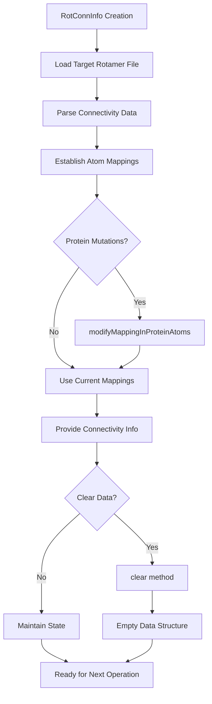

# `RotConnInfo.hpp` File Analysis

## File Purpose and Primary Role

The `RotConnInfo` class serves as a data container that stores connectivity and mapping information for rotamer conformers in the SCREAM molecular modeling software. Its primary responsibility is to maintain the relationship between atoms in a rotamer library structure and the corresponding atoms in the actual protein structure. This includes tracking which atoms should be exactly matched during side-chain placement, how atoms are connected to each other, and which atoms represent the "sidechain" portion that will be replaced during rotamer substitution.

## Key Classes, Structs, and Functions (if any)

### Classes:

- **`RotConnInfo`**: The main and only class in this file
  - **Purpose**: Acts as a data structure to store rotamer connectivity information, atom mappings, and anchor points for protein side-chain placement operations.

### Key Methods:

- **`modifyMappingInProteinAtoms(vector<int>&)`**: Modifies the atom number mapping after mutations have been performed in the Protein class
- **`clear()`**: Resets all stored information by clearing all member containers

## Inputs

### Data Structures/Objects:

- **`vector<int>&`**: Input to `modifyMappingInProteinAtoms()` method, likely containing updated atom indices after protein mutations
- **Rotamer Library Data**: The class is designed to store information parsed from rotamer library files and connectivity files

### File-Based Inputs:

- **Rotamer Library Files**: Referenced by `targetRotamerLibFile` member variable (`.lib` files)
- **Rotamer Connectivity Files**: Implied by the class design and comments, these files specify how rotamers connect to the protein backbone

### Environment Variables:

- No direct environment variable usage is evident in this header file

### Parameters/Configuration:

- **Target Rotamer Library File Path**: Stored in `targetRotamerLibFile`
- **Atom Mapping Configuration**: Various mapping and connectivity parameters stored in member variables

## Outputs

### Data Structures/Objects:

- **Connectivity Maps**: `atom_connectivity_info` mapping atoms to their connected atoms
- **Atom Mappings**: `atom_n_map` providing rotamer-to-protein atom number correspondence
- **Atom Labels**: `atom_n_label_map` providing atom labels for identification
- **Anchor Points**: `anchor_pts` specifying atoms for structural alignment
- **Sidechain Atoms**: `side_chain_atoms` identifying atoms to be replaced

### File-Based Outputs:

- No direct file output from this class

### Console Output (stdout/stderr):

- No console output methods present in this header

### Side Effects:

- **State Modification**: The `modifyMappingInProteinAtoms()` method modifies the internal `atom_n_map`
- **Memory Management**: The `clear()` method resets all internal containers

## External Code Dependencies (Libraries/Headers)

### Standard C++ Library:

- `<vector>`: For dynamic arrays of integers
- `<map>`: For key-value mappings between atoms
- `<string>`: For file names and atom labels

### Internal SCREAM Project Headers:

- None directly included in this header file

### External Compiled Libraries:

- None used in this header file

## Core Logic/Algorithm Flowchart (Mermaid JS Format)

## Potential Areas for Modernization/Refactoring in SCREAM++

### 1. **Replace Raw Containers with Modern C++ Alternatives**

- Convert `using namespace std;` to explicit `std::` prefixes to avoid namespace pollution
- Consider using `std::unordered_map` instead of `std::map` for better performance in atom mappings
- Use `std::array` for fixed-size containers where appropriate

### 2. **Improve Memory Safety and RAII**

- Add proper constructors, copy constructor, move constructor, and assignment operators (Rule of Five)
- Consider using smart pointers if this class needs to manage dynamic memory in the future
- Add const-correctness to methods that don't modify state

### 3. **Enhanced API Design and Error Handling**

- Add validation methods to ensure data consistency
- Implement proper error handling for invalid atom mappings or connectivity information
- Add const getter methods for read-only access to internal data
- Consider making member variables private and providing controlled access through methods
- Add documentation comments for all public methods and member variables
