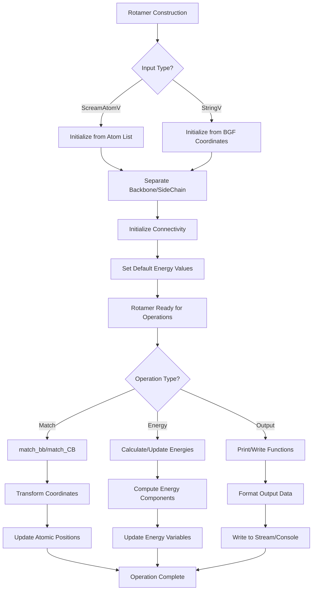

# `Rotamer.hpp` File Analysis

## File Purpose and Primary Role

The `Rotamer.hpp` file defines the base `Rotamer` class, which is a fundamental component of the SCREAM molecular modeling software for protein side-chain placement. This class represents a specific conformation (rotamer) of a molecular structure, typically amino acid side chains. It serves as the base class for more specialized rotamer types and encapsulates the geometric and energetic properties of molecular conformations. The class manages both backbone and side-chain atoms, handles energy calculations, and provides functionality for rotamer matching and manipulation during protein structure optimization.

## Key Classes, Structs, and Functions (if any)

### Primary Class

- **`Rotamer`**: Base class representing a molecular rotamer conformation
  - Manages atomic coordinates and connectivity
  - Stores energy components (valence, VDW, Coulombic, hydrogen bonds, solvation)
  - Provides rotamer matching and manipulation functionality
  - Handles backbone and side-chain separation

### Key Member Functions

- **Constructors**: Multiple constructors for different initialization methods (atom lists, coordinate strings)
- **`deepcopy()`**: Creates deep copy of rotamer object
- **`match_bb()`**: Matches backbone conformation to another rotamer
- **`match_CB()`**: Matches CB atom position
- **`print_Me()`**: Output functions for BGF format
- **Energy accessors/mutators**: Get/set functions for various energy components
- **`getAllRotamers()`**: Virtual function for rotamer ensemble management

## Inputs

### Data Structures/Objects

- **`ScreamAtomV`**: Vector of SCREAM_ATOM pointers representing atomic coordinates
- **`RotConnInfo*`**: Connectivity information defining bonds and rotamer axes
- **`stringV`**: Vector of strings containing rotamer coordinate lines in BGF format
- **`vector<int>`**: Atom number lists for backbone/side-chain definition

### File-Based Inputs

- **BGF format files**: Coordinate files containing atomic positions and properties
- **Connectivity files (`.cnn`)**: Define atomic connectivity and rotamer axis information
- **Rotamer library files**: Pre-calculated rotamer conformations with energy data

### Environment Variables

- Not directly evident from this header file, but likely inherits environment dependencies from included modules

### Parameters/Configuration

- **`library_name`**: String identifying the rotamer library source
- **`same_backbone`**: Boolean flag for backbone matching optimization
- **`is_Original`**: Flag indicating if this is an original vs. generated rotamer
- **Energy cutoff parameters**: For distance-based rotamer filtering

## Outputs

### Data Structures/Objects

- **`BackBone*`**: Pointer to backbone structure component
- **`SideChain*`**: Pointer to side-chain structure component
- **`ScreamAtomV`**: Vectors of atomic coordinates for backbone and side-chain
- **`vector<Rotamer*>`**: Collections of rotamer conformations

### File-Based Outputs

- **BGF format output**: Atomic coordinates via `print_Me()` and `append_to_filehandle()`
- **PDB format output**: Via `pdb_append_to_filehandle()`
- **Connectivity output**: Via `append_to_ostream_connect_info()`

### Console Output (stdout/stderr)

- **Energy summaries**: Total, PreCalc, VDW, HB, and Coulombic energies via `printEnergies()`
- **Atomic coordinates**: Ordered and unordered atom listings
- **Debug information**: Various print functions for rotamer state

### Side Effects

- **Memory management**: Allocates/deallocates atomic data structures
- **Energy state updates**: Modifies energy components during calculations
- **Atomic position modifications**: Changes coordinates during matching operations

## External Code Dependencies (Libraries/Headers)

### Standard C++ Library

- **`<string>`**: String manipulation and storage
- **`<iostream>`**: Input/output operations
- **`<fstream>`**: File stream operations
- **`<vector>`**: Dynamic array containers

### Internal SCREAM Project Headers

- **`defs.hpp`**: Project-wide definitions and constants
- **`scream_atom.hpp`**: Atomic data structures
- **`scream_vector.hpp`**: Custom vector mathematics
- **`scream_matrix.hpp`**: Custom matrix operations
- **`sc_BackBone.hpp`**: Backbone structure management
- **`sc_SideChain.hpp`**: Side-chain structure management
- **`RotConnInfo.hpp`**: Rotamer connectivity information

### External Compiled Libraries

- No external compiled libraries evident from this header file

## Core Logic/Algorithm Flowchart (Mermaid JS Format)

## Potential Areas for Modernization/Refactoring in SCREAM++

### 1. Memory Management and Smart Pointers

The current code uses raw pointers extensively (`BackBone*`, `SideChain*`, `SCREAM_ATOM*`) with manual memory management. This should be modernized using:

- `std::unique_ptr` for exclusive ownership of backbone and side-chain objects
- `std::shared_ptr` for atoms that may be referenced by multiple objects
- RAII principles to eliminate manual `new`/`delete` operations
- Move semantics for efficient object transfers

### 2. Replace C-Style Arrays and Custom Containers with Modern STL

The code uses custom vector types (`ScreamAtomV`, `stringV`) and C-style approaches:

- Replace custom vector types with standard `std::vector` with appropriate template specializations
- Use `std::array` for fixed-size collections where appropriate
- Leverage STL algorithms (`std::find`, `std::transform`) instead of manual loops
- Use range-based for loops and iterators for cleaner code

### 3. API Design and Error Handling

The current interface has several design issues that could be improved:

- Replace public member variables (e.g., `self_E`, `is_Original`) with proper encapsulation using getters/setters
- Implement comprehensive error handling with exceptions instead of relying on return codes or undefined behavior
- Use `std::optional` for functions that may not return valid results
- Create type-safe enums (enum class) instead of integer flags
- Implement builder pattern for complex rotamer construction scenarios
