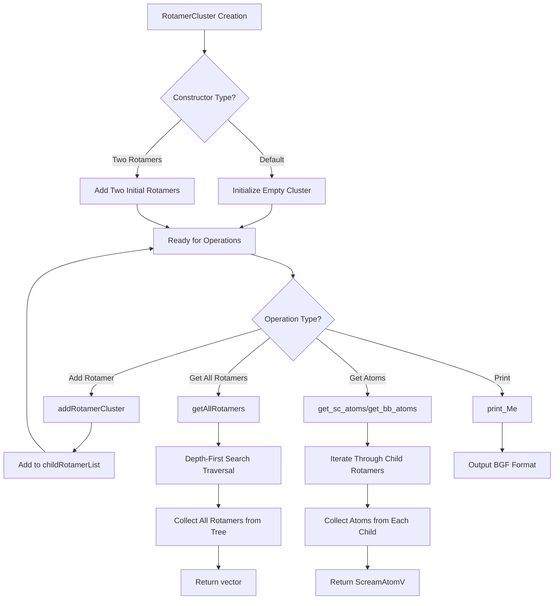

# `RotamerCluster.hpp` File Analysis

## File Purpose and Primary Role

The `RotamerCluster` class serves as a hierarchical container for grouping multiple rotamers (protein side-chain conformations) together in the SCREAM molecular modeling software. It implements a tree-like structure where rotamer clusters can contain other rotamers or rotamer clusters, enabling hierarchical organization of conformational data. The class inherits from `Rotamer` for practical coding reasons (as noted in the extensive comments), allowing it to be used interchangeably with individual rotamers in the broader SCREAM framework. Importantly, this class does not initialize or own atom data directly but rather manages references to existing rotamer objects.

## Key Classes, Structs, and Functions (if any)

**Primary Class:**

- **`RotamerCluster`**: A hierarchical container class that inherits from `Rotamer`
  - **Constructor `RotamerCluster()`**: Default constructor
  - **Constructor `RotamerCluster(Rotamer*, Rotamer*)`**: Convenience constructor for creating a cluster from two rotamers
  - **`addRotamerCluster(Rotamer*)`**: Adds a rotamer or rotamer cluster to the child tree
  - **`getAllRotamers()`**: Returns a flat list of all rotamers using depth-first search traversal
  - **`get_sc_atoms()`**: Returns side-chain atoms from all contained rotamers
  - **`get_bb_atoms()`**: Returns backbone atoms from all contained rotamers
  - **`print_Me()`**: Outputs atom information in BGF format (unordered)

**Data Members:**

- **`childRotamerList`**: Vector containing child rotamer/cluster pointers (multi-tree representation)
- **`rCI`**: Pointer to `RotConnInfo` object for connectivity information
- **`Idx`**: String identifier for the cluster

## Inputs

**Data Structures/Objects:**

- `Rotamer*` objects - Individual rotamers or other rotamer clusters to be added to the hierarchy
- `RotConnInfo*` - Connectivity information object (stored but not shown to be initialized in this header)

**File-Based Inputs:**

- No direct file reading is evident in this header file. File I/O is likely handled by parent `Rotamer` class or other components.

**Environment Variables:**

- No direct environment variable usage is apparent from this header file.

**Parameters/Configuration:**

- No explicit configuration parameters are visible in this header, though the parent `Rotamer` class may have configuration dependencies.

## Outputs

**Data Structures/Objects:**

- `vector<Rotamer*>` - List of all rotamers in the cluster hierarchy (from `getAllRotamers()`)
- `ScreamAtomV` - Collections of side-chain and backbone atoms (from `get_sc_atoms()` and `get_bb_atoms()`)

**File-Based Outputs:**

- Output stream operations are supported but not implemented (empty virtual functions `append_to_filehandle`, `pdb_append_to_filehandle`, `append_to_ostream_connect_info`)

**Console Output (stdout/stderr):**

- BGF-style atom information via `print_Me()` function

**Side Effects:**

- Modifies the internal `childRotamerList` when rotamers are added
- Does not modify the actual rotamer objects it references (maintains references only)

## External Code Dependencies (Libraries/Headers)

**Standard C++ Library:**

- `<vector>` - For the `childRotamerList` container
- Standard namespace usage (`using namespace std`)

**Internal SCREAM Project Headers:**

- `defs.hpp` - Project-wide definitions and typedefs
- `Rotamer.hpp` - Parent class definition
- `RotConnInfo.hpp` - Connectivity information class

**External Compiled Libraries:**

- None evident from this header file

## Core Logic/Algorithm Flowchart (Mermaid JS Format)

## Potential Areas for Modernization/Refactoring in SCREAM++

1. **Smart Pointer Usage**: Replace raw pointers (`Rotamer*`, `RotConnInfo*`) with modern smart pointers (`std::shared_ptr` or `std::unique_ptr`) to improve memory safety and automatic resource management. The current design with raw pointers requires careful manual memory management and is prone to memory leaks.

2. **Eliminate Inheritance Anti-pattern**: The class comment explicitly acknowledges that inheriting from `Rotamer` violates OOP principles. A better design would use composition rather than inheritance, creating a separate `RotamerContainer` or `RotamerCollection` class that aggregates rotamers without inheriting unnecessary functionality. This would provide a cleaner interface and better adherence to the "is-a" vs "has-a" relationship principles.

3. **Modern Container and Algorithm Usage**: The manual depth-first search implementation in `getAllRotamers()` could be replaced with modern C++ algorithms and iterators. Additionally, consider using `std::variant` or templates to handle the heterogeneous nature of storing both individual rotamers and rotamer clusters, rather than relying on polymorphism through base class pointers.
