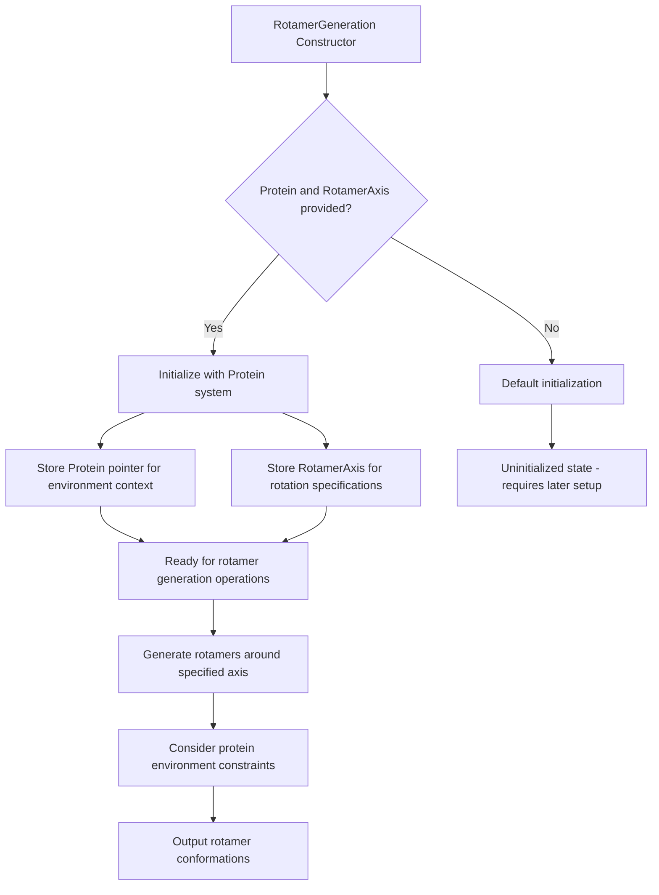

# `RotamerGeneration.hpp` File Analysis

## File Purpose and Primary Role

The `RotamerGeneration.hpp` file defines the `RotamerGeneration` class, which is responsible for generating rotamers (different conformations of protein side chains) within the context of a protein system. This class appears to be a core component of the SCREAM molecular modeling software, specifically handling the generation of alternative side-chain conformations around specified rotational axes. The class is designed to work within the environment of a `Protein` object, suggesting it takes into account the surrounding molecular context when generating rotamers.

## Key Classes, Structs, and Functions (if any)

### Primary Class:

- **`RotamerGeneration`**: The main class responsible for rotamer generation functionality
  - **Default Constructor**: `RotamerGeneration()` - Creates an uninitialized rotamer generator
  - **Parameterized Constructor**: `RotamerGeneration(Protein*, RotamerAxis*)` - Creates a rotamer generator with specified protein context and rotation axis

### Key Member Variables:

- **`ptn`**: Pointer to a `Protein` object representing the molecular system/environment
- **`axis`**: Pointer to a `RotamerAxis` object defining the rotational axis for rotamer generation

## Inputs

### Data Structures/Objects:

- **`Protein*`**: Pointer to a protein/molecular system object that provides environmental context
- **`RotamerAxis*`**: Pointer to an object defining the rotational axis, containing two `SCREAM_ATOM` pointers that specify both the axis direction and are guaranteed to be atoms within the protein system

### File-Based Inputs:

- **Not directly evident** from this header file. The class likely relies on data already loaded into the `Protein` and `RotamerAxis` objects, which may have been populated from various SCREAM input files (`.lib`, `.cnn`, `.par`, `.rtf` files) in other parts of the system.

### Environment Variables:

- **Not directly evident** from this header file.

### Parameters/Configuration:

- The rotational axis configuration (embedded in the `RotamerAxis` object)
- Protein system configuration and atom coordinates (embedded in the `Protein` object)

## Outputs

### Data Structures/Objects:

- **Not explicitly defined** in this header file. The class likely generates or modifies rotamer conformations, potentially returning collections of alternative side-chain configurations or modifying existing molecular structures.

### File-Based Outputs:

- **Not directly evident** from this header file.

### Console Output (stdout/stderr):

- **Not directly evident** from this header file, though the inclusion of `<iostream>` suggests potential console output capabilities.

### Side Effects:

- Likely modifies the protein system or generates new conformational states, though specific details are not visible in this header-only file.

## External Code Dependencies (Libraries/Headers)

### Standard C++ Library:

- `<string>`: String manipulation capabilities
- `<iostream>`: Input/output stream operations
- `<fstream>`: File stream operations
- `<vector>`: Dynamic array container

### Internal SCREAM Project Headers:

- `"defs.hpp"`: Project-wide definitions and constants
- `"scream_atom.hpp"`: Atom representation classes
- `"scream_vector.hpp"`: Custom vector mathematics classes
- `"scream_matrix.hpp"`: Custom matrix mathematics classes
- `"sc_Protein.hpp"`: Protein system representation
- `"scream_helper_classes.hpp"`: Utility and helper classes (likely includes `RotamerAxis`)

### External Compiled Libraries:

- **None evident** - The project appears to use custom implementations rather than external libraries like Boost or Eigen.

## Core Logic/Algorithm Flowchart (Mermaid JS Format)

## Potential Areas for Modernization/Refactoring in SCREAM++

### 1. **Smart Pointer Usage**

Replace raw pointers (`Protein*`, `RotamerAxis*`) with smart pointers (`std::shared_ptr` or `std::unique_ptr`) to improve memory safety and automatic resource management. This would eliminate potential memory leaks and dangling pointer issues.

### 2. **Modern C++ Container and Algorithm Usage**

The current code uses `using namespace std;` which is considered bad practice. Replace with specific `using` declarations or fully qualified names. Additionally, leverage modern STL algorithms and containers more effectively, and consider using range-based for loops when iterating over collections.

### 3. **Enhanced API Design with RAII and Exception Safety**

Implement proper RAII (Resource Acquisition Is Initialization) principles and add comprehensive error handling with exceptions rather than relying on potentially unsafe pointer-based initialization. Consider adding validation in constructors and implementing move semantics for better performance with modern C++ standards (C++11 and later).
