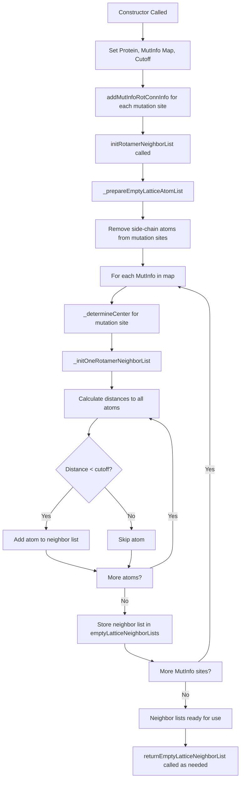

# `RotamerNeighborList.hpp` File Analysis

## File Purpose and Primary Role

The `RotamerNeighborList` class is responsible for managing and constructing neighbor lists for rotamer (side-chain conformation) calculations in the SCREAM molecular modeling software. Its primary role is to efficiently identify and organize atoms that are within a specified cutoff distance of residues undergoing side-chain placement or mutation. This optimization is crucial for computational efficiency, as it allows the software to consider only relevant neighboring atoms during energy calculations rather than evaluating all possible atom pairs in the protein.

The class maintains "empty lattice" neighbor lists, which contain backbone atoms and atoms from residues not being mutated, providing a foundation for rotamer placement calculations.

## Key Classes, Structs, and Functions (if any)

### Primary Class

- **`RotamerNeighborList`**: The main class that manages neighbor list construction and retrieval for rotamer calculations.

### Key Public Methods

- **`RotamerNeighborList()`**: Default constructor
- **`RotamerNeighborList(Protein*, map<MutInfo, RotConnInfo*>, double)`**: Primary constructor that initializes the neighbor list with protein structure, mutation information, and cutoff distance
- **`setCutoff(double)` / `getCutoff()`**: Setter and getter for the neighbor list cutoff distance
- **`setProtein(Protein*)` / `getProtein()`**: Setter and getter for the protein structure
- **`addMutInfoRotConnInfo(MutInfo, RotConnInfo*)`**: Adds mutation information and corresponding rotamer connection data
- **`initRotamerNeighborList()`**: Initializes the neighbor lists after all mutation information has been added
- **`returnEmptyLatticeNeighborList(MutInfo)`**: Returns the neighbor list for a specific mutation site

### Key Private Helper Methods

- **`_prepareEmptyLatticeAtomList()`**: Prepares the atom list by removing side-chain atoms from residues being mutated
- **`_initOneRotamerNeighborList()`**: Constructs the neighbor list for a single mutation site
- **`_determineCenter()`**: Calculates the geometric center for neighbor list construction

## Inputs

### Data Structures/Objects

- **`Protein*`**: Pointer to the protein structure containing atomic coordinates and topology
- **`map<MutInfo, RotConnInfo*>`**: Map associating mutation information with rotamer connection data
- **`MutInfo`**: Objects representing specific residues to be mutated or analyzed
- **`RotConnInfo*`**: Pointers to rotamer connection information defining side-chain conformations
- **`ScreamAtomV`**: Custom vector class containing lists of atoms (likely `scream_atom` objects)
- **`double cutoff`**: Distance cutoff for neighbor list construction

### File-Based Inputs

- No direct file I/O is performed in this header file, but the class depends on data that may be read from:
  - Protein structure files (PDB format, likely parsed elsewhere)
  - Rotamer library files (`.lib` files containing side-chain conformations)
  - Connection files (`.cnn` files defining atomic connectivity)

### Environment Variables

- No direct environment variable usage is evident from this header file

### Parameters/Configuration

- **Cutoff distance**: Determines the radius for neighbor list inclusion
- **Mutation sites**: Specified through `MutInfo` objects defining which residues undergo side-chain placement
- **Rotamer conformations**: Defined through `RotConnInfo` objects

## Outputs

### Data Structures/Objects

- **`ScreamAtomV`**: Neighbor lists containing atoms within the cutoff distance of mutation sites
- **Modified internal maps**: `emptyLatticeNeighborLists` storing pre-computed neighbor lists
- **`ScreamVector`**: Geometric centers used for neighbor list calculations

### File-Based Outputs

- No direct file output is performed by this class

### Console Output (stdout/stderr)

- No explicit console output is visible in this header file

### Side Effects

- **Modifies internal state**: Populates the `emptyLatticeNeighborLists` map
- **Memory management**: Stores pointers to `RotConnInfo` objects (potential memory management responsibility)

## External Code Dependencies (Libraries/Headers)

### Standard C++ Library

- **`<vector>`**: For STL vector containers
- **`<map>`**: For STL map containers

### Internal SCREAM Project Headers

- **`"defs.hpp"`**: Likely contains project-wide definitions and custom data types
- **`"MutInfo.hpp"`**: Defines the `MutInfo` class for mutation information
- **`"RotConnInfo.hpp"`**: Defines the `RotConnInfo` class for rotamer connection data
- **`"sc_Protein.hpp"`**: Defines the `Protein` class and related molecular structure classes

### External Compiled Libraries

- None explicitly visible in this header file

## Core Logic/Algorithm Flowchart (Mermaid JS Format)

## Potential Areas for Modernization/Refactoring in SCREAM++

### 1. **Smart Pointer Usage and Memory Management**

The current code uses raw pointers (`RotConnInfo*`, `Protein*`) which can lead to memory leaks and ownership issues. Modern C++ should utilize:

- `std::unique_ptr<RotConnInfo>` for exclusive ownership
- `std::shared_ptr<Protein>` if the protein structure is shared across multiple components
- RAII principles to ensure automatic cleanup

### 2. **Replace Custom Containers with Modern STL**

The code uses custom vector classes (`ScreamAtomV`, `ScreamVector`) which should be evaluated for replacement with:

- `std::vector<Atom>` with proper custom `Atom` class
- `std::array<double, 3>` or modern linear algebra libraries like Eigen for 3D vectors
- Range-based algorithms from `<algorithm>` for more efficient and readable operations

### 3. **Improved API Design and Error Handling**

The current interface has several areas for improvement:

- Add `const` correctness to getter methods and parameters that shouldn't be modified
- Replace the two-step initialization pattern (`addMutInfoRotConnInfo` followed by `initRotamerNeighborList`) with a more robust builder pattern or factory method
- Add exception handling for invalid inputs (null pointers, negative cutoffs)
- Use `std::optional<ScreamAtomV>` for the return type of `returnEmptyLatticeNeighborList` to handle cases where no neighbor list exists
- Consider making the class non-copyable or implement proper copy/move semantics
