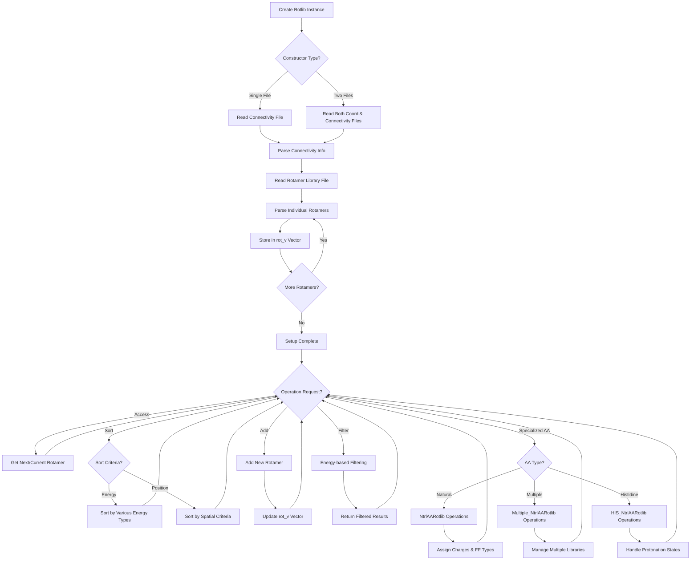

# `Rotlib.hpp` File Analysis

## File Purpose and Primary Role

The `Rotlib.hpp` file defines the core rotamer library system for the SCREAM molecular modeling software. Its primary responsibility is to manage collections of protein side-chain conformations (rotamers) and provide interfaces for accessing, manipulating, and organizing these conformations. The file implements a hierarchical class structure that handles both general rotamers and specialized amino acid rotamers, with support for natural amino acids, multiple residue types, and special cases like histidine with different protonation states. The rotamer library serves as a fundamental component for protein side-chain placement algorithms.

## Key Classes, Structs, and Functions (if any)

### Primary Classes:

1. **`Rotlib`** (Base class)

   - Non-virtual base class for all rotamer library implementations
   - Manages vectors of rotamer pointers and connectivity information
   - Provides basic functionality for reading, accessing, and sorting rotamers

2. **`AARotlib`** (Derived from Rotlib)

   - Specialized for amino acid rotamers
   - Adds amino acid-specific functionality like PHI/PSI angle calculations
   - Provides type-safe accessors returning `AARotamer*` instead of `Rotamer*`

3. **`NtrlAARotlib`** (Derived from AARotlib)

   - Handles natural amino acid rotamer libraries
   - Implements charge assignment, force field type assignment, and library setup
   - Manages file I/O for natural amino acid conformations

4. **`Multiple_NtrlAARotlib`** (Derived from NtrlAARotlib)

   - Manages multiple amino acid types in a single library
   - Uses a map structure to organize different residue type libraries
   - Supports selective loading of specific amino acid types

5. **`HIS_NtrlAARotlib`** (Derived from NtrlAARotlib)
   - Special handling for histidine residues with different protonation states
   - Manages H and J protonation state libraries separately
   - Automatically generates alternative protonation conformations

### Key Member Functions:

- `readConnectivityFile()` / `readRotamerLibrary()`: File I/O operations
- `get_next_rot()` / `get_current_rot()`: Iterator-style access to rotamers
- `sort_by_*()` functions: Sorting rotamers by various energy criteria
- `add_rotamer()`: Adding rotamers to the library
- `assign_charges()` / `assign_atom_fftype()`: Force field parameter assignment

## Inputs

### Data Structures/Objects:

- `RotConnInfo` objects containing connectivity and anchor point information
- `Rotamer*` and `AARotamer*` objects representing individual conformations
- `vector<Rotamer*>` collections for managing multiple rotamers
- `scream_atom` objects (implied from includes) for atomic coordinates
- `sc_BackBone`, `sc_SideChain` objects for molecular structure representation

### File-Based Inputs:

- **Rotamer coordinate files**: Contains 3D coordinates of rotamer conformations (referenced in constructors)
- **Connectivity files (`.cnn`)**: Defines atom connectivity, anchor points, and atom mapping information
- **Charge parameter files**: Used by `assign_charges()` for force field charge assignment (e.g., CHARMM22 format)
- **Rotamer library files**: Multi-rotamer coordinate databases read by `readRotamerLibrary()`

### Environment Variables:

- Not directly referenced in this header file, but likely used indirectly through file path resolution

### Parameters/Configuration:

- Resolution parameters for library selection (used in `Multiple_NtrlAARotlib`)
- Energy cutoff thresholds for rotamer filtering (`get_next_rot_with_empty_lattice_E_below()`)
- Charge assignment scheme specifications (e.g., "CHARM22")
- Force field type assignment parameters

## Outputs

### Data Structures/Objects:

- `Rotamer*` and `AARotamer*` pointers to individual conformations
- `RotamerCluster*` objects for hierarchical organization
- `RotConnInfo*` objects containing processed connectivity information
- Modified rotamer libraries with updated energies, charges, and force field parameters
- Sorted vectors of rotamers based on various energy criteria

### File-Based Outputs:

- Rotamer library files via `print_to_file()` and `append_to_filehandle()`
- Formatted coordinate output through inherited output methods

### Console Output (stdout/stderr):

- Debug information via `print_Me()` functions
- Library statistics (number of rotamers, energy ranges)
- Error messages for file I/O failures or invalid rotamer data

### Side Effects:

- Modifies internal rotamer vectors through sorting operations
- Updates energy values and force field parameters of constituent rotamers
- Manages memory allocation/deallocation for rotamer objects
- Updates iterator positions for library traversal

## External Code Dependencies (Libraries/Headers)

### Standard C++ Library:

- `<iostream>`: Input/output stream operations
- `<fstream>`: File stream operations for library I/O
- `<string>`: String manipulation for file paths and names
- `<vector>`: Dynamic arrays for rotamer storage
- `<map>`: Key-value storage in `Multiple_NtrlAARotlib`

### Internal SCREAM Project Headers:

- `"defs.hpp"`: Project-wide definitions and constants
- `"RotConnInfo.hpp"`: Connectivity and anchor point information
- `"scream_atom.hpp"`: Atomic coordinate and property representation
- `"Rotamer.hpp"`: Base rotamer class definition
- `"AARotamer.hpp"`: Amino acid-specific rotamer implementation
- `"RotamerCluster.hpp"`: Hierarchical rotamer organization
- `"sc_BackBone.hpp"` / `"sc_AABackBone.hpp"`: Backbone structure classes
- `"sc_SideChain.hpp"` / `"sc_AASideChain.hpp"`: Side chain structure classes

### External Compiled Libraries:

- None explicitly referenced (relies on standard C++ library only)

## Core Logic/Algorithm Flowchart (Mermaid JS Format)

## Potential Areas for Modernization/Refactoring in SCREAM++

### 1. **Memory Management and Smart Pointers**

The current code uses raw pointers extensively (`vector<Rotamer*>`, manual `new`/`delete` operations) which is error-prone and can lead to memory leaks. Modern C++ should use:

- `std::unique_ptr<Rotamer>` or `std::shared_ptr<Rotamer>` for automatic memory management
- `std::vector<std::unique_ptr<Rotamer>>` instead of `vector<Rotamer*>`
- RAII principles to ensure proper resource cleanup

### 2. **Iterator and Range-Based Design**

The current iterator design using manual position tracking (`rot_itr`, `reset_pstn()`) is outdated and error-prone. Modernization should include:

- Standard STL iterator interfaces conforming to C++ iterator concepts
- Range-based for loop support (`begin()`, `end()` methods)
- Modern algorithms from `<algorithm>` instead of manual sorting implementations
- Consider using `std::ranges` (C++20) for more expressive data manipulation

### 3. **Type Safety and API Design**

The current API has several type safety issues and design inconsistencies:

- Replace C-style function overloading with template-based generic programming
- Use `std::variant` or proper inheritance instead of manual type casting
- Implement proper const-correctness throughout the API
- Replace the `using namespace std;` directive with explicit `std::` prefixes
- Use strongly-typed enums instead of magic strings for charge schemes and file types
- Consider implementing a proper builder pattern for complex rotamer library construction
