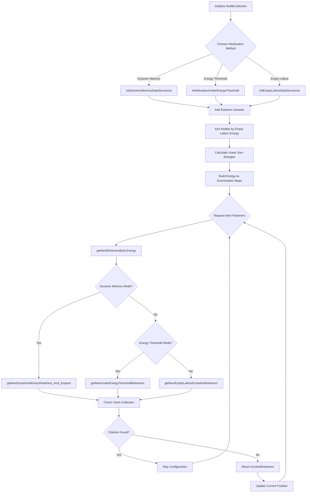

# `RotlibCollection.hpp` File Analysis

## File Purpose and Primary Role

The `RotlibCollection` class serves as the central hub for managing collections of rotamer libraries in the SCREAM protein side-chain placement software. Its primary responsibility is to store, organize, and provide efficient access to rotamer libraries for different amino acid residues, while implementing sophisticated algorithms for excitation enumeration and energy-based ordering. The class acts as a high-level interface that coordinates rotamer selection based on various energy criteria and memory management schemes, supporting both dynamic memory allocation and energy threshold-based approaches for computational efficiency.

## Key Classes, Structs, and Functions (if any)

### Primary Class

- **`RotlibCollection`**: Main class that manages collections of rotamer libraries with energy-based ordering and memory management capabilities.

### Key Type Definitions

- **`ExcitationEnumeration`**: `std::map<std::string, unsigned short>` - Maps residue names to excitation levels
- **`ExcitedRotamers`**: `std::map<std::string, Rotamer*>` - Dictionary of excited rotamers
- **`ExcitationEnumeration_n`**: `std::map<unsigned short, unsigned short>` - Numeric version for faster comparison
- **`ExcitedRotamers_n`**: `std::map<unsigned short, Rotamer*>` - Numeric version of excited rotamers

### Key Public Methods

- **`addRotlib()`**: Adds rotamer libraries to the collection
- **`initEmptyLatticeDataStructures()`**: Initializes empty lattice-based data structures
- **`initDynamicMemoryDataStructures()`**: Sets up dynamic memory allocation scheme
- **`getNextRotamersByELEnergy()`**: Primary interface for retrieving rotamers by energy
- **`setExcitationEnergy()`/`getExcitationEnergy()`**: Energy management functions
- **`getNextEmptyLatticeExcitationRotamers()`**: Retrieves next excitation in empty lattice ordering

## Inputs

### Data Structures/Objects

- **`Rotlib*`**: Rotamer library objects containing rotamer data for specific residues
- **`ClashCollection*`**: Object for managing rotamer clash detection and elimination
- **`ExcitationEnumeration`/`ExcitationEnumeration_n`**: Excitation state specifications
- **`ExcitedRotamers`/`ExcitedRotamers_n`**: Collections of rotamers in excited states

### Parameters/Configuration

- **Energy thresholds**: `HIGHEST_ALLOWED_ROTAMER_E` for rotamer energy cutoffs
- **Memory management scheme**: Choice between "DynamicMemory" and "AllocationUnderThreshold"
- **Energy threshold values**: For allocation-based memory management
- **Clash detection parameters**: Via the ClashCollection object

### File-Based Inputs

- The file itself doesn't directly read files, but it manages rotamer libraries that are presumably loaded from external rotamer library files (likely `.lib` format based on SCREAM conventions)

### Environment Variables

- Not directly used in this header file, though the rotamer libraries it manages may depend on environment variables for file locations

## Outputs

### Data Structures/Objects

- **`ExcitedRotamers`/`ExcitedRotamers_n`**: Collections of rotamers for specific excitation states
- **`ExcitationEnumeration`/`ExcitationEnumeration_n`**: Excitation state enumerations
- **Energy values**: `double` values representing various energy calculations
- **`ClashCollection*`**: Pointer to clash collection object

### Console Output (stdout/stderr)

- **`printExcitationEnergyTable()`**: Prints tables of excitation energies
- **`printEmptyLatticeLinearEnergyTable()`**: Prints empty lattice energy orderings
- **`printEmptyLatticeTable()`**: Prints complete empty lattice information

### Side Effects

- Modifies internal state tracking current positions in energy-ordered lists
- Updates energy mappings and multimap structures
- Manages memory allocation for rotamer configurations
- Maintains clash detection state

## External Code Dependencies

### Standard C++ Library

- **`<string>`**: String manipulation and storage
- **`<map>`**: Primary container for mappings (rotlibs, energies, excitations)
- **`<set>`**: For enumeration lists
- **`<list>`**: For tracking latest round enumerations (implied from `latest_round_EnumerationList`)

### Internal SCREAM Project Headers

- **`"Rotamer.hpp"`**: Base rotamer class
- **`"AARotamer.hpp"`**: Amino acid specific rotamer class
- **`"Rotlib.hpp"`**: Rotamer library class
- **`"ClashCollection.hpp"`**: Clash detection and management

## Core Logic/Algorithm Flowchart

## Potential Areas for Modernization/Refactoring in SCREAM++

### 1. **Smart Pointer Management**

The current code uses raw pointers extensively (`Rotamer*`, `ClashCollection*`, `Rotlib*`). Modern C++ should employ smart pointers (`std::unique_ptr`, `std::shared_ptr`) to ensure automatic memory management and prevent memory leaks. This is particularly important given the complex ownership relationships between rotamer libraries and individual rotamers.

### 2. **Template-Based Generic Programming**

The dual implementation of data structures (e.g., `ExcitationEnumeration` vs `ExcitationEnumeration_n`, `ExcitedRotamers` vs `ExcitedRotamers_n`) suggests a need for template-based solutions. A single templated class could handle both string and numeric key types, reducing code duplication and maintenance overhead while improving type safety.

### 3. **Modern Container Usage and Algorithms**

The code could benefit from modern STL containers and algorithms. The extensive use of `std::map` and `std::multimap` could be supplemented with `std::unordered_map` for better performance where ordering isn't required. Additionally, the manual iteration and state tracking could be replaced with STL algorithms and range-based loops, making the code more readable and less error-prone. The energy threshold and dynamic memory management schemes could be implemented using modern C++ patterns like strategy pattern with lambda functions or function objects.
