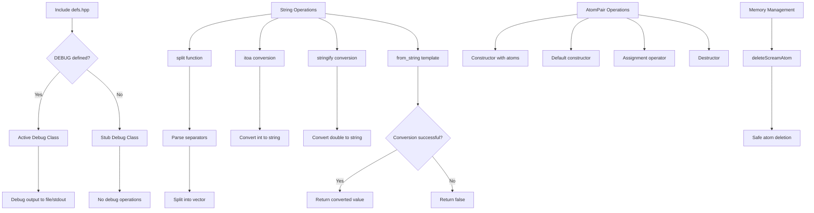

# `defs.hpp` File Analysis

## File Purpose and Primary Role

This header file serves as a central definitions and utilities module for the SCREAM project. It provides foundational type definitions, utility functions for string manipulation and data conversion, a custom `AtomPair` class for representing pairs of atoms, and a conditional debug system. The file acts as a common dependency that other modules can include to access shared typedefs, utility functions, and debugging capabilities. It essentially establishes the basic infrastructure and helper utilities that support the molecular modeling operations throughout the SCREAM codebase.

## Key Classes, Structs, and Functions (if any)

**Classes:**

- **`AtomPair`**: Represents a pair of `SCREAM_ATOM` pointers with basic construction, assignment, and destruction capabilities
- **`BadConversion`**: Exception class for handling string conversion errors, inherits from `std::runtime_error`
- **`Debug`**: Conditional compilation debug class with two implementations (active when `DEBUG` is defined, inactive stub when not defined)

**Key Functions:**

- **`deleteScreamAtom(SCREAM_ATOM*)`**: Utility function for safe deletion of `SCREAM_ATOM` pointers
- **`split()`**: Two overloaded functions for splitting strings into vectors based on separators
- **`itoa(int, unsigned int)`**: Integer-to-string conversion with optional base parameter
- **`stringify(double)`**: Template-based string conversion for doubles using stringstream
- **`from_string<T>()`**: Template function for converting strings to various numeric types
- **`print(string)`** and **`dump(SCREAM_ATOM*)`**: Utility functions for output operations

**Type Definitions:**

- Vector typedefs for `SCREAM_ATOM*` containers (`ScreamAtomV`, iterators)
- Vector typedefs for string containers (`stringV`, iterators)

## Inputs

**Data Structures/Objects:**

- `SCREAM_ATOM*` pointers for atom deletion and pair creation
- `std::string` objects for string manipulation and conversion functions
- Template types `T` for generic string conversion operations
- `double` values for stringify operations
- `int` values for itoa conversion

**File-Based Inputs:**

- No direct file I/O operations are performed in this header file

**Environment Variables:**

- No direct environment variable usage detected in this file

**Parameters/Configuration:**

- `DEBUG` preprocessor macro controls the debug system behavior (compile-time configuration)
- Base parameter for `itoa()` function (defaults to base 10)
- Separator strings for the `split()` functions (defaults to space and tab)

## Outputs

**Data Structures/Objects:**

- `std::vector<std::string>` from split operations
- `std::string` objects from conversion functions (`itoa`, `stringify`)
- `AtomPair` objects containing paired atom pointers
- Template type `T` values from `from_string()` conversions

**File-Based Outputs:**

- Debug output can be directed to files through the `Debug::out()` method with filename parameter
- No other direct file writing operations

**Console Output (stdout/stderr):**

- Debug messages through the `Debug` class when enabled
- Output from `print()` function
- Atom information from `dump()` function
- Default debug output goes to "stdout"

**Side Effects:**

- Memory management for `AtomPair` objects
- Potential exceptions thrown by conversion functions (`BadConversion`)
- Debug state management in the `Debug` class

## External Code Dependencies (Libraries/Headers)

**Standard C++ Library:**

- `<vector>` - For vector containers and typedefs
- `<list>` - For list containers (though not directly used in visible code)
- `<string>` - For string operations and manipulations
- `<iostream>` - For stream operations and potential I/O
- `<sstream>` - For stringstream operations in conversion functions
- `<stdexcept>` - For `std::runtime_error` base class

**Internal SCREAM Project Headers:**

- `"scream_atom.hpp"` - Provides the `SCREAM_ATOM` class definition

**External Compiled Libraries:**

- None detected - relies only on standard C++ library

## Core Logic/Algorithm Flowchart (Mermaid JS Format)

## Potential Areas for Modernization/Refactoring in SCREAM++

1. **Replace Custom String Conversion with Modern C++ Alternatives**: The custom `itoa`, `stringify`, and `from_string` functions could be replaced with modern C++17/20 alternatives like `std::to_string`, `std::from_chars`, and `std::to_chars` which are more efficient and standardized. The custom `BadConversion` exception could be replaced with standard `std::invalid_argument` or `std::out_of_range` exceptions.

2. **Modernize Memory Management and Container Typedefs**: The raw pointer typedefs (`ScreamAtomV` containing `SCREAM_ATOM*`) should be replaced with smart pointers (`std::unique_ptr<SCREAM_ATOM>` or `std::shared_ptr<SCREAM_ATOM>`). The manual `deleteScreamAtom` function would become unnecessary with RAII. The `AtomPair` class should use smart pointers instead of raw pointers and could benefit from rule-of-five implementation or be replaced with `std::pair`.

3. **Replace Conditional Compilation Debug System with Modern Logging**: The `#ifdef DEBUG` conditional compilation approach could be replaced with a modern logging library (like spdlog) or a runtime-configurable logging system. This would provide better flexibility, multiple log levels, thread safety, and wouldn't require recompilation to change debug behavior. The current system's reliance on C-style strings (`char *`) in the debug class is particularly outdated.
