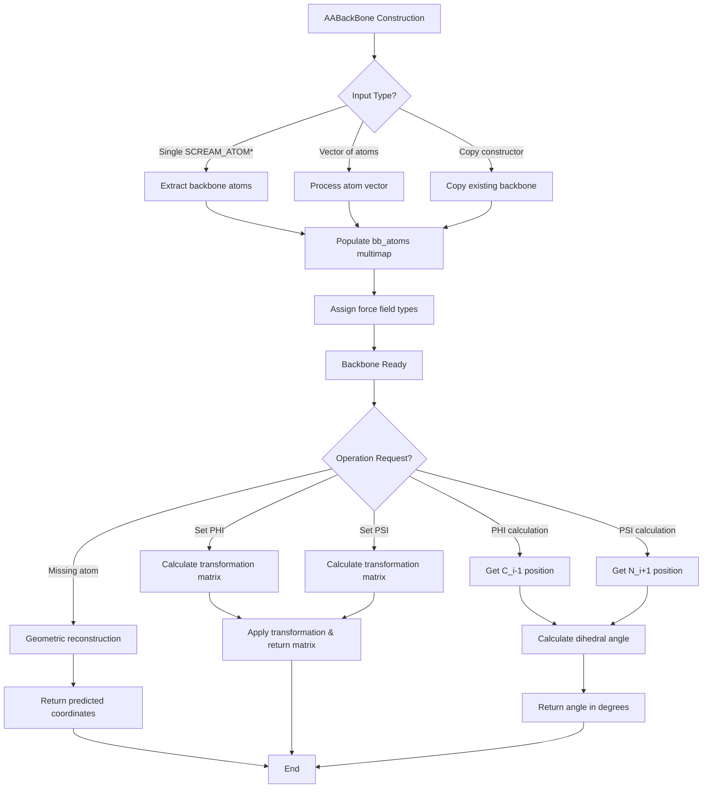

# `sc_AABackBone.hpp` File Analysis

## File Purpose and Primary Role

The `sc_AABackBone.hpp` file defines the `AABackBone` class, which represents the backbone structure of amino acid residues in protein chains. This class is derived from the `BackBone` base class and provides specialized functionality for amino acid backbone manipulation, including:

- Storage and management of backbone atoms (N, HN, CA, HCA, C, O)
- Calculation of dihedral angles (PHI and PSI)
- Geometric operations for missing atom position prediction
- Force field type assignment for backbone atoms
- Backbone conformation manipulation through angle setting

This is a core structural component in the SCREAM molecular modeling package, essential for protein side-chain placement algorithms.

## Key Classes, Structs, and Functions (if any)

### Primary Class:

- **`AABackBone`**: Main class derived from `BackBone`
  - Manages amino acid backbone atom collections
  - Provides dihedral angle calculations and manipulations
  - Handles geometric operations for backbone reconstruction

### Key Member Functions:

- **Constructors**: Multiple initialization methods from atoms and vectors
- **`PHI()` / `PSI()`**: Dihedral angle calculation methods
- **`set_PHI()` / `set_PSI()`**: Conformation manipulation methods returning transformation matrices
- **`calc_C_i_minus_one()` / `calc_N_i_plus_one()`**: Geometric prediction of missing backbone atoms
- **Atom accessors**: `N()`, `HN()`, `CA()`, `HCA()`, `C()`, `O()` - direct access to specific backbone atoms
- **`assign_atom_fftype()`**: Force field type assignment

### Static Data Members:

- **`atom_label_fftype_map`**: Maps atom labels to force field types
- **`atom_label_CHARM22_map`**: Maps atom labels to CHARMM22 parameters

## Inputs

### Data Structures/Objects:

- **`SCREAM_ATOM*`**: Individual atom pointers for backbone construction
- **`vector<SCREAM_ATOM*>`**: Collections of atom pointers
- **`AABackBone&`**: Other backbone instances for copy operations
- **External atom pointers**: `C_i_minus_one` and `N_i_plus_one` for dihedral calculations (from neighboring residues)

### File-Based Inputs:

- Not directly apparent from header, but likely reads force field parameter files through the static maps (implementation would be in `.cpp` file)

### Environment Variables:

- Not directly referenced in this header file

### Parameters/Configuration:

- **PHI/PSI angles**: Target dihedral angles for conformation setting
- **Force field types**: Atom type assignments for energy calculations
- **PROLINE_flag**: Boolean indicating special proline residue handling

## Outputs

### Data Structures/Objects:

- **`ScreamVector`**: 3D coordinates for calculated atom positions
- **`ScreamMatrix`**: Transformation matrices from conformational changes
- **`SCREAM_ATOM*`**: Pointers to specific backbone atoms
- **`double`**: Dihedral angle values in degrees

### File-Based Outputs:

- Not directly produced by this header (output would be in implementation or client code)

### Console Output (stdout/stderr):

- Not specified in header (would be in implementation)

### Side Effects:

- Modifies backbone atom positions when setting PHI/PSI angles
- Updates force field type assignments on atoms
- Potentially modifies the internal `bb_atoms` multimap inherited from `BackBone`

## External Code Dependencies (Libraries/Headers)

### Standard C++ Library:

- **`<vector>`**: For atom pointer collections
- **`<map>`**: For force field type mappings
- **`<string>`**: For atom labels and type names
- **`using namespace std`**: (Note: not a best practice in headers)

### Internal SCREAM Project Headers:

- **`"scream_atom.hpp"`**: Core atom class definition
- **`"scream_vector.hpp"`**: Custom 3D vector mathematics
- **`"scream_matrix.hpp"`**: Custom matrix operations
- **`"sc_BackBone.hpp"`**: Base backbone class

### External Compiled Libraries:

- None apparent from this header file

## Core Logic/Algorithm Flowchart (Mermaid JS Format)

## Potential Areas for Modernization/Refactoring in SCREAM++

### 1. **Smart Pointer Management**

- Replace raw `SCREAM_ATOM*` pointers with `std::shared_ptr<SCREAM_ATOM>` or `std::unique_ptr<SCREAM_ATOM>`
- This would eliminate manual memory management concerns and provide automatic cleanup
- The current design with raw pointers creates potential for memory leaks and dangling pointer issues

### 2. **Remove "using namespace std" from Header**

- The `using namespace std;` statement in a header file pollutes the global namespace for all including files
- Replace with explicit `std::` prefixes or selective using declarations in implementation files
- This follows modern C++ best practices and prevents naming conflicts

### 3. **Enhanced Type Safety and API Design**

- Replace magic numbers (like the 1.32Å distance) with named constants
- Use `enum class` for atom types instead of string-based lookups
- Consider using `std::optional<T>` for functions that might not find requested atoms
- Add `const` correctness throughout the interface and consider `noexcept` specifications where appropriate
- Replace the static maps with more efficient lookup mechanisms or compile-time alternatives
