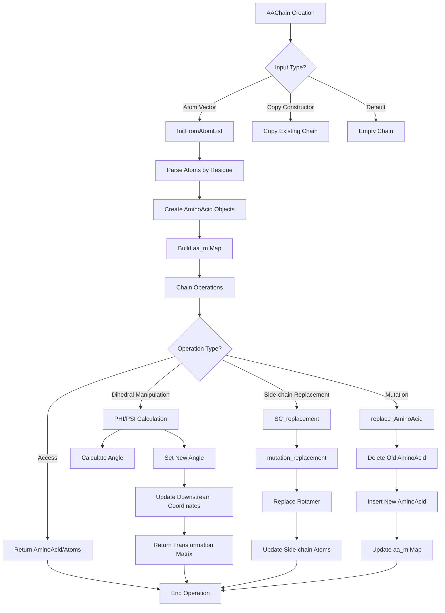

# `sc_AAChain.hpp` File Analysis

## File Purpose and Primary Role

The `sc_AAChain.hpp` file defines the `AAChain` class, which represents a polypeptide chain (amino acid chain) in the SCREAM molecular modeling software. This class serves as a high-level container for managing sequences of amino acids, providing functionality for:

- Storing and organizing amino acid residues in a chain structure
- Manipulating protein backbone dihedral angles (PHI, PSI)
- Performing side-chain replacements and mutations
- Managing atomic coordinates and structural data
- Providing access to individual amino acids and their atoms

The class inherits from `ProteinComponent`, indicating it's part of a larger protein structure hierarchy.

## Key Classes, Structs, and Functions (if any)

### Primary Class: `AAChain`

- **Purpose**: Represents a polypeptide chain containing multiple amino acid residues
- **Inheritance**: Derives from `ProteinComponent`
- **Key Responsibilities**: Chain management, dihedral angle manipulation, side-chain operations

### Key Public Methods:

- **Constructors**: Default, from atom vector, copy constructor
- **Access Methods**: `operator` for residue access, `getAtomList()`, `get_sc_atoms()`
- **State Information**: `length()`, `number_of_atoms()`, `total_charge()`, `getResidueNumbers()`
- **Structural Manipulation**: `PHI()`, `PSI()`, `set_PHI()`, `set_PSI()`
- **Side-chain Operations**: `SC_replacement()`, `replace_AminoAcid()`
- **Simulation Control**: `fix_toggle()`, `fix_toggle_sc_pstn()`
- **Output Functions**: Various print and file output methods

## Inputs

### Data Structures/Objects:

- **`ScreamAtomV`**: Vector of SCREAM atoms used in constructors and atom retrieval
- **`AARotamer* const`**: Rotamer data for side-chain replacement operations
- **`AminoAcid*`**: Individual amino acid objects for replacement operations
- **`int`**: Residue numbers for accessing specific amino acids
- **`double`**: Angle values for PHI/PSI dihedral angle setting
- **`string`**: Chain designation and other string parameters
- **`vector<double>&`**: Reference to parameter vectors for side-chain operations

### File-Based Inputs:

- **Not directly evident**: This header file doesn't show direct file I/O, but the class likely works with structural data files (PDB, BGF) through other components
- **BGF file reference**: Comments mention "residue number is taken from bgf file"

### Environment Variables:

- **Not specified**: No direct environment variable usage visible in this header

### Parameters/Configuration:

- **Residue numbering**: Uses residue numbers from input files (BGF format mentioned)
- **Chain designation**: Single letter chain identifiers
- **Dihedral angle values**: PHI, PSI angles in degrees (presumably)

## Outputs

### Data Structures/Objects:

- **`ScreamAtomV`**: Returns vectors of atoms from the chain
- **`AminoAcid*`**: Returns pointers to individual amino acid residues
- **`double`**: Returns dihedral angle values, total charge
- **`int`**: Returns chain length, atom counts
- **`vector<int>`**: Returns residue numbers present in the chain
- **`ScreamMatrix`**: Returns transformation matrices from dihedral angle operations
- **`map<int, AminoAcid*>`**: Returns the internal amino acid mapping

### File-Based Outputs:

- **Generic file output**: `append_to_filehandle()` for general structure output
- **PDB format**: `pdb_append_to_filehandle()` for PDB file writing
- **Connection info**: `append_to_ostream_connect_info()` for connectivity data
- **Chi angle analysis**: `print_chi_angle_spread()` for rotamer analysis

### Console Output (stdout/stderr):

- **Debug information**: `print_Me()`, `print_ordered_by_n()` for debugging
- **Structural information**: Various print methods for chain analysis

### Side Effects:

- **Atomic coordinate modification**: PHI/PSI setting functions modify downstream atom positions
- **Memory management**: Replace operations manage AminoAcid object lifecycle
- **Fixation state changes**: Fix toggle methods modify atom mobility flags

## External Code Dependencies (Libraries/Headers)

### Standard C++ Library:

- **`<map>`**: For amino acid storage mapping
- **`<vector>`**: For atom and residue collections
- **`<iostream>`**: For I/O operations
- **`using namespace std`**: Uses standard namespace (legacy practice)

### Internal SCREAM Project Headers:

- **`defs.hpp`**: Project-wide definitions and constants
- **`scream_atom.hpp`**: Atomic data structures and types
- **`sc_ProteinComponent.hpp`**: Base class for protein components
- **`sc_AminoAcid.hpp`**: Individual amino acid representation
- **`scream_vector.hpp`**: Custom vector mathematics
- **`scream_matrix.hpp`**: Custom matrix operations
- **`scream_tools.hpp`**: General utility functions

### External Compiled Libraries:

- **None evident**: Relies on internal SCREAM components and standard C++ library

## Core Logic/Algorithm Flowchart (Mermaid JS Format)

## Potential Areas for Modernization/Refactoring in SCREAM++

### 1. **Memory Management and Smart Pointers**

- **Current Issue**: Uses raw pointers (`AminoAcid*`, `SCREAM_ATOM*`) with manual memory management
- **Modernization**: Replace with `std::unique_ptr` or `std::shared_ptr` to eliminate memory leaks and improve safety
- **Example**: `map<int, std::unique_ptr<AminoAcid>>` instead of `map<int, AminoAcid*>`

### 2. **Container and API Design**

- **Current Issue**: Uses `map<int, AminoAcid*>` with raw pointers and C-style array access patterns
- **Modernization**:
  - Use modern STL containers with value semantics
  - Implement range-based iteration support
  - Add const-correctness throughout the interface
  - Replace `operator[]` with safer access methods that return references

### 3. **Error Handling and Type Safety**

- **Current Issue**: Functions return `NULL` pointers for errors, uses `using namespace std`
- **Modernization**:
  - Replace null pointer returns with `std::optional<T>` or exceptions
  - Remove `using namespace std` and use explicit `std::` prefixes
  - Add proper bounds checking and validation
  - Use `enum class` instead of magic numbers for residue types
