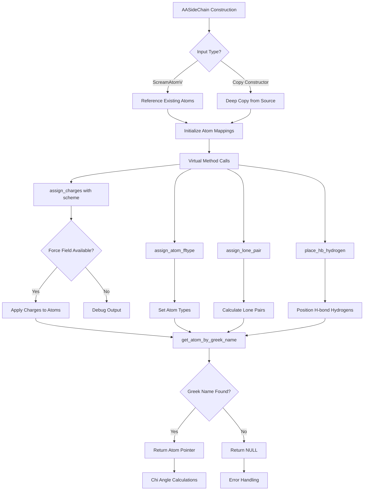

# `sc_AASideChain.hpp` File Analysis

## File Purpose and Primary Role

This header file defines the `AASideChain` class, which serves as a base class for representing the 20 different types of amino acid side chains in the SCREAM molecular modeling software. The class inherits from `SideChain` and provides a polymorphic interface for handling amino acid-specific operations such as charge assignment, atom type assignment, lone pair calculations, and hydrogen placement. The design uses a factory pattern with virtual assignment operators to enable runtime creation of the correct derived side chain objects (AlaSC, etc.).

## Key Classes, Structs, and Functions (if any)

### Primary Class:

- **`AASideChain`**: Base class for all 20 amino acid side chain types
  - Inherits from `SideChain`
  - Provides virtual interface for side chain-specific operations
  - Manages atom collections and label-to-atom mappings
  - Implements factory pattern for derived class instantiation

### Key Methods:

- **Constructors**: Multiple constructors handling different input types (atom vectors, copy construction)
- **`operator=()`**: Virtual assignment operator for polymorphic behavior
- **`assign_charges(string)`**: Virtual method for applying force field charges
- **`assign_atom_fftype()`**: Virtual method for atom type assignment
- **`assign_lone_pair()`**: Virtual method for lone pair calculations
- **`place_hb_hydrogen()`**: Virtual method for hydrogen bond donor hydrogen placement
- **`get_atom_by_greek_name(string)`**: Retrieves atoms by Greek alphabet position for chi angle calculations
- **`dummy_assignment_operator()`**: Protected helper for derived class assignment operators

## Inputs

### Data Structures/Objects:

- **`ScreamAtomV`**: Vector of SCREAM_ATOM structures representing the side chain atoms
- **`AASideChain`**: Copy constructor takes another AASideChain object
- **`string`**: Charge scheme identifier (e.g., "CHARM22") and Greek atom names

### File-Based Inputs:

- Not directly evident from this header file, but likely reads from:
  - Force field parameter files for charge assignment
  - Atom type definition files
  - Potentially topology/connectivity files

### Environment Variables:

- Not directly used in this header file

### Parameters/Configuration:

- **Charge schemes**: String identifiers for different force field charge sets
- **Greek alphabet naming**: Standard protein atom nomenclature for chi angle calculations
- **Atom precedence rules**: S > O > N > C for atoms at same Greek position, X1 preferred over X2

## Outputs

### Data Structures/Objects:

- **Modified AASideChain objects**: With assigned charges, atom types, lone pairs
- **`SCREAM_ATOM*`**: Pointers to specific atoms retrieved by Greek name
- **Hydrogen-bonded structures**: Side chains with properly placed donor hydrogens

### File-Based Outputs:

- Not directly written from this header file

### Console Output (stdout/stderr):

- **Debug messages**: "I'm in non-overridden assign_charges" for unimplemented virtual methods

### Side Effects:

- **Memory management**: Constructor variants may allocate SCREAM_ATOM structures on heap
- **Atom property modification**: Charges, types, and positions are modified in-place
- **Mapping updates**: Internal atom label to pointer mappings (`sc_atoms_mm`) are maintained

## External Code Dependencies (Libraries/Headers)

### Standard C++ Library:

- **`<vector>`**: For atom collections
- **`<map>`**: For atom label to pointer mappings
- **`<string>`**: For atom names and scheme identifiers
- **`using namespace std`**: (Note: not best practice)

### Internal SCREAM Project Headers:

- **`"defs.hpp"`**: Project-wide definitions and constants
- **`"scream_atom.hpp"`**: SCREAM_ATOM structure definition
- **`"scream_vector.hpp"`**: Custom vector class implementation
- **`"scream_matrix.hpp"`**: Custom matrix class implementation
- **`"sc_SideChain.hpp"`**: Base SideChain class definition

### External Compiled Libraries:

- None evident from this header file

## Core Logic/Algorithm Flowchart (Mermaid JS Format)

## Potential Areas for Modernization/Refactoring in SCREAM++

### 1. **Memory Management and Smart Pointers**

- Replace raw pointers with `std::unique_ptr` or `std::shared_ptr` for automatic memory management
- Eliminate manual `new`/`delete` operations mentioned in comments
- Use RAII principles to prevent memory leaks and improve exception safety

### 2. **Modern C++ Design Patterns**

- Replace the complex virtual assignment operator pattern with a proper factory method or visitor pattern
- Use `std::variant` or template-based approaches instead of runtime polymorphism where appropriate
- Implement move semantics with move constructors and move assignment operators

### 3. **API Design and Error Handling**

- Replace `NULL` returns with `std::optional<SCREAM_ATOM*>` for better null safety
- Remove `using namespace std` and use explicit `std::` prefixes
- Replace console debug output with proper logging framework or exception-based error handling
- Use `enum class` for charge schemes instead of string identifiers for type safety
