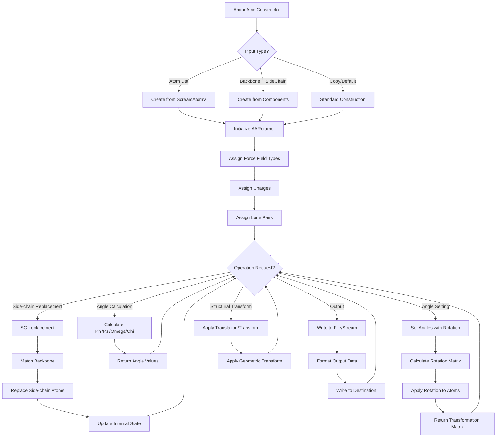

# `sc_AminoAcid.hpp` File Analysis

## File Purpose and Primary Role

This header file defines the `AminoAcid` class, which serves as a central representation of amino acid residues within the SCREAM molecular modeling framework. The class encapsulates both the backbone and side-chain components of amino acids, providing functionality for structural manipulation, conformational analysis, and rotamer-based side-chain replacement. It acts as a high-level interface that combines backbone (`AABackBone`) and side-chain (`AASideChain`) components through rotamer libraries (`AARotamer`), enabling protein structure modeling and side-chain placement operations.

## Key Classes, Structs, and Functions (if any)

### Primary Class:

- **`AminoAcid`**: The main class representing an amino acid residue
  - Manages both backbone and side-chain atoms
  - Provides conformational analysis (phi, psi, omega, chi angles)
  - Handles side-chain replacement using rotamer libraries
  - Supports structural transformations and charge assignment

### Key Member Functions:

- **Constructors**: Multiple constructors for different initialization scenarios (empty, from atoms, from state, copy constructor, from backbone+sidechain)
- **`SC_replacement()`**: Replaces side-chain with rotamer from library
- **Angle calculation methods**: `PHI()`, `PSI()`, `OMEGA()`, `chi1()` through `chi5()` for dihedral angle analysis
- **Angle setting methods**: `set_PHI()`, `set_PSI()`, `set_OMEGA()` for conformational changes
- **Structural manipulation**: `translate()`, `transform()` for geometric operations
- **Charge and force field assignment**: `assign_charges()`, `assign_atom_fftype()`, `assign_lone_pair()`
- **Output functions**: `append_to_filehandle()`, `pdb_append_to_filehandle()` for file writing

### Constants:

- **State constants**: `MAINCHAIN`, `NTERM`, `CTERM`, `SINGLE` for amino acid terminal states

## Inputs

### Data Structures/Objects:

- **`ScreamAtomV`**: Vector of SCREAM_ATOM pointers for construction from atom lists
- **`AABackBone`**: Backbone component object
- **`AASideChain`**: Side-chain component object
- **`AARotamer*`**: Rotamer objects for side-chain replacement
- **`ScreamVector`**: Custom vector class for translation operations
- **`ScreamMatrix`**: Custom matrix class for transformation operations
- **`vector<double>&`**: Reference to parameter vectors (likely for rotamer fitting)

### File-Based Inputs:

- No direct file reading is performed in this header file
- Rotamer data is accessed through `AARotamer` objects (which likely read rotamer libraries elsewhere)
- Force field parameters are assigned via string identifiers (e.g., "CHARM22")

### Environment Variables:

- Not directly used in this header file

### Parameters/Configuration:

- **Force field type**: String parameter for charge assignment (e.g., "CHARM22")
- **AA state**: Integer parameter indicating terminal state (NTERM, CTERM, etc.)
- **Angle values**: Double precision values for phi, psi, omega, and chi angle setting
- **Fix/moveable flags**: Boolean parameters for atom mobility control

## Outputs

### Data Structures/Objects:

- **`SCREAM_ATOM*`**: Pointers to individual atoms via `operator[]` and accessor methods
- **`ScreamAtomV`**: Lists of atoms via `getAtomList()`, `get_sc_atoms()`, `get_bb_atoms()`
- **`ScreamMatrix`**: Transformation matrices returned by angle-setting functions
- **`AARotamer*`**: Pointer to internal rotamer object via `get_rot()`
- **Angle values**: Double precision phi, psi, omega, and chi dihedral angles

### File-Based Outputs:

- **Generic file output**: Via `append_to_filehandle()` to any output stream
- **PDB format output**: Via `pdb_append_to_filehandle()` for PDB file writing
- **Connectivity information**: Via `append_to_ostream_connect_info()`

### Console Output (stdout/stderr):

- **Debug output**: `print_Me()` and `print_ordered_by_n()` methods for debugging
- No explicit error output specified in this header

### Side Effects:

- **Atom modification**: Functions modify internal SCREAM_ATOM structures
- **Rotamer replacement**: `SC_replacement()` modifies side-chain geometry
- **Conformational changes**: Angle-setting functions modify atomic coordinates
- **Flag toggling**: `fix_toggle()` methods modify atom mobility states

## External Code Dependencies (Libraries/Headers)

### Standard C++ Library:

- **`<map>`**: For multimap data structures (commented out but referenced)
- **`<vector>`**: For atom lists and parameter vectors
- **`using namespace std`**: Standard namespace usage

### Internal SCREAM Project Headers:

- **`"defs.hpp"`**: Core definitions and types
- **`"sc_BackBone.hpp"`**: Backbone component class
- **`"sc_AABackBone.hpp"`**: Amino acid specific backbone class
- **`"sc_SideChain.hpp"`**: Side-chain component class
- **`"sc_AASideChain.hpp"`**: Amino acid specific side-chain class
- **`"Rotamer.hpp"`**: Base rotamer class
- **`"AARotamer.hpp"`**: Amino acid rotamer class

### External Compiled Libraries:

- None explicitly linked in this header file

## Core Logic/Algorithm Flowchart (Mermaid JS Format)

## Potential Areas for Modernization/Refactoring in SCREAM++

### 1. Smart Pointer Management

The current code uses raw pointers extensively (`SCREAM_ATOM*`, `AARotamer*`) with manual memory management considerations mentioned in comments. Modern C++ should utilize `std::unique_ptr` and `std::shared_ptr` to eliminate memory leaks and improve safety. The distinction between "shallow copy" and "deep copy" operations could be handled more elegantly with proper smart pointer semantics.

### 2. Enhanced Type Safety and API Design

The class uses magic numbers for state constants (`MAINCHAIN = 0`, `NTERM = 1`, etc.) and string-based force field identification. Modern C++ should employ `enum class` for type-safe state representation and potentially a more structured approach to force field specification. The `operator[]` functionality is declared but not implemented, indicating incomplete API design that needs completion.

### 3. Improved Error Handling and Resource Management

The current design lacks explicit error handling mechanisms and relies on return values like `1000` for undefined chi angles. Modern C++ should use exceptions or `std::optional` for better error communication. The multiple constructor overloads could be simplified using default parameters or factory methods, and the custom vector/matrix classes (`ScreamVector`, `ScreamMatrix`) could potentially be replaced with modern linear algebra libraries like Eigen for better performance and maintainability.
