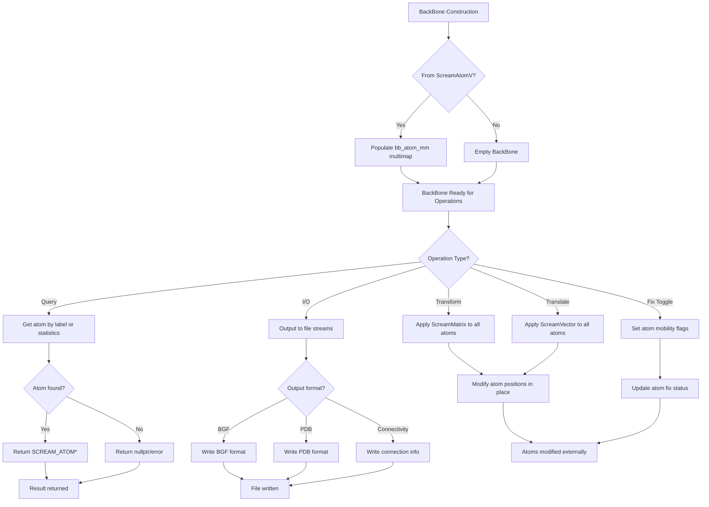

# `sc_BackBone.hpp` File Analysis

## File Purpose and Primary Role

The `sc_BackBone.hpp` file defines the `BackBone` class, which serves as a base class for representing protein backbone structures in the SCREAM molecular modeling software. This class manages collections of atoms that form the backbone of molecular structures (likely protein backbones), providing functionality for geometric transformations, I/O operations, and basic structural queries. It acts as a container and interface for manipulating backbone atom positions and properties during molecular modeling operations such as side-chain placement.

## Key Classes, Structs, and Functions (if any)

### Classes:

- **`BackBone`**: The primary class that represents a molecular backbone structure
  - **Purpose**: Manages a collection of atoms forming a backbone, providing methods for geometric transformations, I/O operations, and structural queries

### Key Methods:

- **Constructors**: Default constructor and constructor from `ScreamAtomV`
- **`fix_toggle(bool)`**: Controls whether atoms are fixed or moveable during optimization
- **`translate(const ScreamVector&)`**: Translates all backbone atoms by a given vector
- **`transform(const ScreamMatrix&)`**: Applies a transformation matrix to all backbone atoms
- **`get(const string)`**: Retrieves a specific atom by its label
- **I/O Methods**: Various output methods for different file formats (BGF, PDB, connectivity)
- **Query Methods**: `number_of_atoms()`, `total_charge()`, `get_atoms()`

## Inputs

### Data Structures/Objects:

- **`ScreamAtomV`**: Vector of SCREAM atoms used in constructor to initialize the backbone
- **`ScreamVector`**: 3D vector for translation operations
- **`ScreamMatrix`**: Transformation matrix for geometric transformations
- **`string`**: Atom labels for atom retrieval operations
- **`BackBone*`**: Another backbone object for copying atom positions

### File-Based Inputs:

- **Not directly evident from this header file** - The class appears to work with atom data that would be populated from molecular structure files, but file I/O is likely handled by other components

### Environment Variables:

- **Not evident from this header file** - No direct environment variable usage visible

### Parameters/Configuration:

- **Atom fix flags**: Boolean parameters controlling whether atoms are fixed during optimization
- **Atom labels**: String identifiers for specific atoms within the backbone

## Outputs

### Data Structures/Objects:

- **`SCREAM_ATOM*`**: Pointers to individual atoms retrieved by label
- **`vector<SCREAM_ATOM*>`**: Collections of atom pointers
- **`multimap<string, SCREAM_ATOM*>`**: The internal atom storage structure
- **`double`**: Total charge calculations

### File-Based Outputs:

- **BGF format files**: Through `append_to_filehandle()` method
- **PDB format files**: Through `pdb_append_to_filehandle()` method
- **Connectivity files**: Through `append_to_ostream_connect_info()` method

### Console Output (stdout/stderr):

- **Debug/diagnostic output**: Through `print_Me()` and `print_ordered_by_n()` methods (marked as obsolete)

### Side Effects:

- **Modifies atom positions**: The `translate()` and `transform()` methods modify the actual atom coordinates stored outside this class
- **Modifies fix flags**: The `fix_toggle()` method changes atom mobility status

## External Code Dependencies (Libraries/Headers)

### Standard C++ Library:

- **`<vector>`**: For dynamic arrays of atom pointers
- **`<map>`**: For the multimap container storing atoms by label
- **`<string>`**: For atom labels and string operations
- **`using namespace std`**: Uses standard namespace

### Internal SCREAM Project Headers:

- **`defs.hpp`**: Project-wide definitions and constants
- **`scream_atom.hpp`**: Defines `SCREAM_ATOM` and `ScreamAtomV` types
- **`scream_vector.hpp`**: Defines `ScreamVector` for 3D vector operations
- **`scream_matrix.hpp`**: Defines `ScreamMatrix` for transformation matrices

### External Compiled Libraries:

- **None evident** - Uses only standard C++ library and internal SCREAM components

## Core Logic/Algorithm Flowchart (Mermaid JS Format)

## Potential Areas for Modernization/Refactoring in SCREAM++

### 1. Smart Pointer Usage

**Current Issue**: Uses raw pointers (`SCREAM_ATOM*`) which can lead to memory management issues and unclear ownership semantics.
**Modernization**: Replace with `std::shared_ptr<SCREAM_ATOM>` or `std::unique_ptr<SCREAM_ATOM>` depending on ownership requirements. This would provide automatic memory management and clearer ownership semantics.

### 2. Modern Container and Iterator Usage

**Current Issue**: Uses `multimap<string, SCREAM_ATOM*>` with raw pointers and C++03-style practices.
**Modernization**:

- Use `std::unordered_map` for O(1) lookups if atom labels are unique
- Implement range-based for loops and modern iterator patterns
- Consider using `std::string_view` for string parameters to avoid unnecessary copies
- Replace the `using namespace std;` directive with specific using declarations

### 3. RAII and Exception Safety

**Current Issue**: The class modifies external atom positions through pointers without clear ownership or exception safety guarantees.
**Modernization**:

- Implement RAII principles with proper constructors/destructors
- Add exception safety guarantees for transformation operations
- Consider implementing a transaction-like system for atomic operations that can be rolled back
- Replace manual resource management with modern C++ patterns like scope guards
