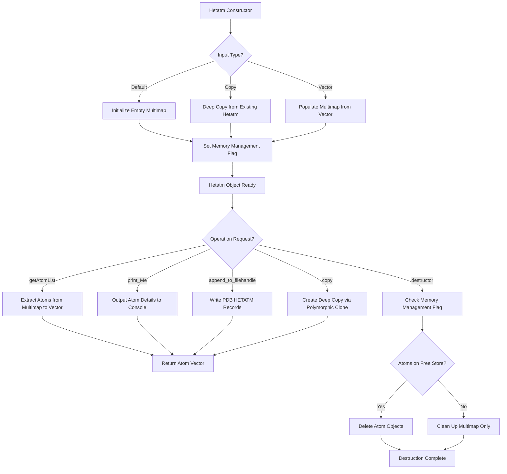

# `sc_Hetatm.hpp` File Analysis

## File Purpose and Primary Role

The `sc_Hetatm.hpp` file defines the `Hetatm` class, which represents heteroatom groups (non-standard amino acid atoms) in protein structures within the SCREAM molecular modeling software. This class inherits from `ProteinComponent` and is responsible for managing collections of heteroatoms that are not part of the standard 20 amino acids (such as water molecules, metal ions, cofactors, ligands, etc.). The class provides functionality to store, manipulate, and output heteroatom information in PDB-compatible formats.

## Key Classes, Structs, and Functions (if any)

### Classes:

- **`Hetatm`**: The primary class that extends `ProteinComponent`
  - Manages collections of heteroatoms using a multimap data structure
  - Provides copy construction and assignment capabilities
  - Implements virtual methods for polymorphic behavior within the protein component hierarchy

### Key Methods:

- **Constructors**: Default constructor, copy constructor, and constructor taking a vector of atoms
- **`getAtomList()`**: Returns a vector of all atoms in the heteroatom group
- **`print_Me()`**: Outputs heteroatom information to standard output
- **`append_to_filehandle()`**: Writes heteroatom data to a file stream
- **`append_to_ostream_connect_info()`**: Outputs connectivity information to a stream
- **`copy()`**: Virtual method for creating deep copies (polymorphic cloning)
- **`whatAmI()`**: Virtual method returning type identifier string

## Inputs

### Data Structures/Objects:

- **`vector<SCREAM_ATOM*>`**: Collection of pointers to SCREAM_ATOM objects representing individual heteroatoms
- **`SCREAM_ATOM*`**: Individual atom objects containing atomic coordinates, properties, and identifiers
- **`Hetatm` objects**: For copy construction operations

### File-Based Inputs:

- Not directly evident from this header file, but likely processes PDB HETATM records through higher-level parsing functions
- May indirectly read from PDB files or other molecular structure formats via the SCREAM_ATOM loading mechanisms

### Environment Variables:

- Not directly used in this header file
- May inherit environment variable dependencies from parent class `ProteinComponent`

### Parameters/Configuration:

- Atom naming conventions and types (stored in the multimap using string keys)
- Memory management flags (`hetatm_atoms_on_free_store`) to track ownership of atom objects

## Outputs

### Data Structures/Objects:

- **`vector<SCREAM_ATOM*>`**: Returns collections of atom pointers via `getAtomList()`
- **`ProteinComponent*`**: Returns polymorphic copies via the `copy()` method
- **Modified multimap**: Internal `hetatm_mm` structure organizing atoms by string identifiers

### File-Based Outputs:

- PDB-format HETATM records via `append_to_filehandle()`
- Connectivity information for molecular visualization/analysis tools
- Debug or diagnostic information through `print_Me()`

### Console Output (stdout/stderr):

- Heteroatom details and properties (atom coordinates, types, etc.)
- Diagnostic information about the heteroatom groups
- Possibly error messages during construction or manipulation

### Side Effects:

- Manages memory allocation/deallocation based on `hetatm_atoms_on_free_store` flag
- Modifies internal multimap structure when atoms are added or removed
- May affect global atom indexing or connectivity information

## External Code Dependencies (Libraries/Headers)

### Standard C++ Library:

- **`<map>`**: For the multimap container used in `hetatm_mm`
- **`<vector>`**: For atom collections and return types
- **`<iostream>`**: Implied for ostream operations in method signatures
- **`<string>`**: For string-based atom identifiers and type information

### Internal SCREAM Project Headers:

- **`scream_atom.hpp`**: Defines the `SCREAM_ATOM` class/struct
- **`sc_ProteinComponent.hpp`**: Defines the parent class `ProteinComponent`

### External Compiled Libraries:

- None evident from this header file (pure C++ STL usage)

## Core Logic/Algorithm Flowchart (Mermaid JS Format)

## Potential Areas for Modernization/Refactoring in SCREAM++

### 1. **Smart Pointer Implementation**

Replace raw `SCREAM_ATOM*` pointers with `std::unique_ptr<SCREAM_ATOM>` or `std::shared_ptr<SCREAM_ATOM>` to eliminate manual memory management concerns. The `hetatm_atoms_on_free_store` flag could be eliminated, and RAII principles would handle cleanup automatically.

### 2. **Modern Container and Algorithm Usage**

- Replace the `multimap<string, SCREAM_ATOM*>` with `std::unordered_multimap` for better performance
- Use range-based for loops and STL algorithms (`std::for_each`, `std::transform`) instead of manual iteration
- Consider `std::string_view` for string keys to reduce unnecessary string copying

### 3. **Interface and API Modernization**

- Use move semantics for constructors and assignment operators (`Hetatm(vector<SCREAM_ATOM*>&&)`)
- Replace raw ostream pointers with references (`ostream&` instead of `ostream*`)
- Implement proper const-correctness throughout the interface
- Consider using `std::optional` for return values that might not always be valid
- Replace the virtual `copy()` method with a proper copy constructor and assignment operator, or implement the Clone pattern more explicitly
