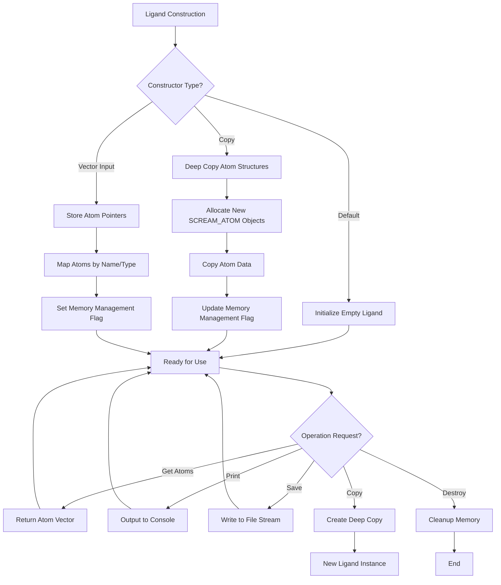

# `sc_Ligand.hpp` File Analysis

## File Purpose and Primary Role

The `sc_Ligand.hpp` file defines the `Ligand` class, which represents non-water molecules in the SCREAM molecular modeling software. This class is derived from `ProteinComponent` and serves as a specialized container for managing ligand atoms and their properties. Ligands are typically small molecules that bind to proteins, and this class provides the infrastructure to store, manipulate, and output ligand-specific data within the broader protein modeling context.

## Key Classes, Structs, and Functions (if any)

### Primary Class: `Ligand`

- **Purpose**: Represents a ligand molecule as a collection of atoms with specialized functionality for molecular modeling
- **Inheritance**: Derived from `ProteinComponent` class
- **Key Features**:
  - Deep copy semantics for atom data
  - Memory management for atom structures
  - Output formatting capabilities
  - Polymorphic behavior through virtual function implementations

### Key Member Functions:

- **Constructors**: Default, copy, and vector-based constructors with deep copy semantics
- **`getAtomList()`**: Returns vector of atom pointers for external access
- **`print_Me()`**: Console output functionality
- **`append_to_filehandle()`**: File output functionality
- **`append_to_ostream_connect_info()`**: Connectivity information output
- **`copy()`**: Virtual function implementation for polymorphic copying
- **`whatAmI()`**: Type identification function returning "Ligand"

## Inputs

### Data Structures/Objects:

- **`vector<SCREAM_ATOM*>`**: Primary input for constructor, containing pointers to atom structures
- **`Ligand` objects**: For copy constructor operations
- **`ostream*`**: Output stream pointers for file writing operations

### File-Based Inputs:

- **Not directly evident from header**: The header file doesn't show direct file reading operations, but the implementation likely reads ligand structure files (potentially `.mol`, `.sdf`, or custom SCREAM formats)

### Environment Variables:

- **Not directly evident**: No environment variable usage visible in the header

### Parameters/Configuration:

- **Atom connectivity information**: Managed through the `lig_mm` multimap structure
- **Memory management flags**: The `ligand_atoms_on_free_store` boolean controls memory allocation strategy

## Outputs

### Data Structures/Objects:

- **`vector<SCREAM_ATOM*>`**: Returned by `getAtomList()` for external atom access
- **`ProteinComponent*`**: Returned by polymorphic `copy()` function
- **Modified ligand objects**: Through copy constructors and assignment operations

### File-Based Outputs:

- **Formatted ligand data**: Via `append_to_filehandle()` method
- **Connectivity information**: Via `append_to_ostream_connect_info()` method

### Console Output (stdout/stderr):

- **Ligand information**: Through `print_Me()` method for debugging and visualization

### Side Effects:

- **Dynamic memory management**: Allocates and deallocates `SCREAM_ATOM` structures
- **Deep copying**: Modifies heap memory through atom structure duplication

## External Code Dependencies (Libraries/Headers)

### Standard C++ Library:

- **`<map>`**: For `multimap<string, SCREAM_ATOM*>` container
- **`<vector>`**: For atom list management
- **`<fstream>`**: For file output operations
- **`<iostream>`**: For console I/O operations
- **`<string>`**: Implicitly used for string operations

### Internal SCREAM Project Headers:

- **`scream_atom.hpp`**: Defines the `SCREAM_ATOM` structure
- **`sc_ProteinComponent.hpp`**: Base class definition

### External Compiled Libraries:

- **None evident**: Uses only standard C++ library components

## Core Logic/Algorithm Flowchart (Mermaid JS Format)

## Potential Areas for Modernization/Refactoring in SCREAM++

### 1. **Smart Pointer Implementation**

Replace raw `SCREAM_ATOM*` pointers with `std::unique_ptr<SCREAM_ATOM>` or `std::shared_ptr<SCREAM_ATOM>` to eliminate manual memory management and the `ligand_atoms_on_free_store` flag. This would prevent memory leaks and make the code more exception-safe.

### 2. **Modern Container and Algorithm Usage**

Replace the `multimap<string, SCREAM_ATOM*>` with more appropriate modern containers like `std::unordered_map` for better performance, or consider using `std::vector` with algorithms from `<algorithm>` for atom searches. The current design mixes vector and multimap storage which could be simplified.

### 3. **RAII and Rule of Five Compliance**

Implement proper move semantics (move constructor and move assignment operator) to complement the existing copy operations. Consider making the class non-copyable if deep copying is expensive, or implement copy-on-write semantics. Replace the custom destructor logic with RAII principles using smart pointers and standard containers.
