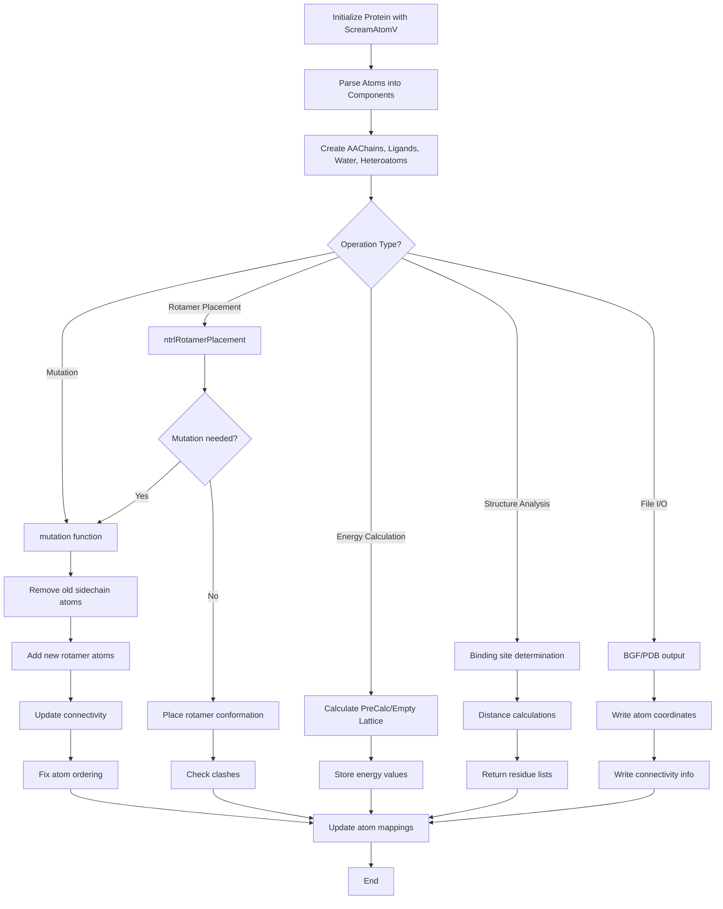

# `sc_Protein.hpp` File Analysis

## File Purpose and Primary Role

The `sc_Protein.hpp` file defines the core `Protein` class, which serves as the central molecular system representation in the SCREAM project. Despite its name, this class is more accurately described as a "System" that can contain various molecular components including amino acid chains, ligands, water molecules, and heteroatoms. The class is responsible for managing protein structures, performing side-chain manipulations, rotamer placements, mutations, and energy calculations. It acts as the primary interface for molecular modeling operations in SCREAM.

## Key Classes, Structs, and Functions (if any)

### Primary Class:

- **`Protein`**: The main class representing a molecular system containing:
  - Multiple protein components (amino acid chains, ligands, water, heteroatoms)
  - Atom management and manipulation
  - Side-chain placement and rotamer operations
  - Mutation capabilities
  - Energy calculations and clash detection

### Key Public Methods:

- **Constructors/Destructors**: `Protein(ScreamAtomV*)`, `~Protein()`
- **Component Access**: `get_AAChain()`, `get_Ligand()`, `operator`, `get_Component_with_ChainName()`
- **Atom Manipulation**: `getAtomList()`, `getAtom()`, `getTheseAtoms()`
- **Structure Modification**: `addHydrogens()`, `addConnectivity()`, `assignFFType()`
- **Rotamer Operations**: `ntrlRotamerPlacement()`, `conformerPlacement()`, `conformerExtraction()`
- **Mutation**: `mutation()` for amino acid substitutions
- **Energy Functions**: `setPreCalcEnergy()`, `getPreCalcEnergy()`, `setEmptyLatticeEnergy()`
- **Clash Detection**: `sc_clash()`, `conformer_clash()`
- **RMSD Calculations**: `sc_CRMS()`, `conformer_CRMS()`
- **I/O Operations**: `print_bgf_file()`, `pdb_append_to_filehandle()`

## Inputs

### Data Structures/Objects:

- **`ScreamAtomV*`**: Pointer to vector of SCREAM_ATOM objects (primary constructor input)
- **`AARotamer*`**: Amino acid rotamer conformations for side-chain placement
- **`Rotamer*`**: General conformer structures for placement operations
- **`RotConnInfo*`**: Rotamer connectivity information for conformer operations
- **`MutInfo`**: Mutation information objects for residue identification and modification
- **`SCREAM_RTF*`**: Residue topology file structures for force field assignments

### File-Based Inputs:

- **RTF Files**: Residue topology files (indirectly through SCREAM_RTF objects)
- **Rotamer Libraries**: Amino acid rotamer conformations (through AARotamer objects)
- **BGF Files**: Biograf format structure files (through atom vectors)
- **PDB Files**: Protein Data Bank format files (through atom vectors)

### Environment Variables:

- Not directly used in this header file, but likely relies on library path variables for rotamer and topology file locations

### Parameters/Configuration:

- **Placement Methods**: "Default", "CreateCB", "UseExistingCB" for side-chain placement strategies
- **CreateCB Parameters**: Off-bisector angle, off-plane angle, bond length, rotamer match vector lambda
- **Distance Thresholds**: For binding site determination and clash detection
- **Energy Types**: PreCalc energies, Empty Lattice energies, strain energies

## Outputs

### Data Structures/Objects:

- **Modified `ScreamAtomV`**: Updated atom lists after mutations or conformer placements
- **`vector<MutInfo>`**: Lists of residues around binding sites or within distance criteria
- **`AARotamer*`**: Extracted rotamer conformations from existing structures
- **`Rotamer*`**: General conformer objects extracted from protein structures
- **Energy Values**: Various energy types (double) for residues and conformers
- **RMSD Values**: Root mean square deviations between structures
- **Clash Distances**: Minimum distances indicating steric conflicts

### File-Based Outputs:

- **BGF Files**: Biograf format structure files with complete atom and connectivity information
- **PDB Files**: Protein Data Bank format files for visualization and analysis

### Console Output (stdout/stderr):

- **Debug Information**: Atom flag states, structure information
- **Error Messages**: Mutation failures, atom not found errors
- **Progress Information**: Structure processing status

### Side Effects:

- **Atom List Modification**: Direct modification of the underlying atom vector
- **Memory Management**: Allocation and deallocation of SCREAM_ATOM objects during mutations
- **Connectivity Updates**: Modification of bond information after structure changes
- **Flag State Changes**: Updates to atom moveable/fixed flags

## External Code Dependencies (Libraries/Headers)

### Standard C++ Library:

- **`<vector>`**: Primary container for atom and component storage
- **`<map>`**: Energy storage and atom mapping
- **`<string>`**: Chain names, residue types, file paths
- **`<iostream>`**: File I/O operations (implicitly through ostream\*)

### Internal SCREAM Project Headers:

- **`defs.hpp`**: Basic definitions and constants
- **`MutInfo.hpp`**: Mutation information structures
- **`sc_ProteinComponent.hpp`**: Base class for protein components
- **`scream_atom.hpp`**: SCREAM_ATOM class and ScreamAtomV typedef
- **`sc_AAChain.hpp`**: Amino acid chain representation
- **`sc_Ligand.hpp`**: Ligand molecule representation
- **`sc_Hetatm.hpp`**: Heteroatom representation
- **`sc_Water.hpp`**: Water molecule representation
- **`scream_rtf.hpp`**: Residue topology file handling
- **`AARotamer.hpp`**: Amino acid rotamer structures

### External Compiled Libraries:

- None identified in this header file

## Core Logic/Algorithm Flowchart (Mermaid JS Format)

## Potential Areas for Modernization/Refactoring in SCREAM++

### 1. Memory Management and Smart Pointers

The current code uses raw pointers extensively (`SCREAM_ATOM*`, `AARotamer*`, `ProteinComponent*`) with manual memory management. This creates significant risk for memory leaks and dangling pointers. Modern C++ should use:

- `std::unique_ptr` for exclusive ownership
- `std::shared_ptr` for shared ownership
- RAII principles for automatic resource management
- Replace manual `new`/`delete` operations with smart pointer factory functions

### 2. Container and Iterator Modernization

The code uses C-style patterns and could benefit from modern C++ container features:

- Replace custom `ScreamAtomV` with `std::vector<std::unique_ptr<ScreamAtom>>`
- Use range-based for loops instead of index-based iteration
- Implement proper const-correctness throughout
- Use STL algorithms (`std::find_if`, `std::transform`) instead of manual loops
- Consider `std::optional` for functions that may not return valid results

### 3. API Design and Error Handling

The current interface lacks modern error handling and type safety:

- Replace error codes (int returns) with exceptions or `std::expected` (C++23)
- Use strongly-typed enums instead of string-based method selection ("Default", "CreateCB")
- Implement builder pattern for complex object construction
- Add comprehensive const-correctness to all member functions
- Create separate interfaces for read-only vs. modifying operations
- Use move semantics for large object transfers to improve performance
