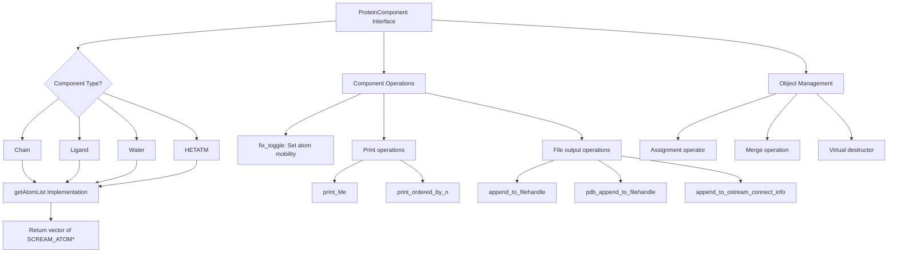

# `sc_ProteinComponent.hpp` File Analysis

## File Purpose and Primary Role

This file defines the abstract base class `ProteinComponent` which serves as the foundation for representing different components that make up a protein structure in the SCREAM molecular modeling software. The class provides a common interface for various protein constituents such as amino acid chains, ligands, water molecules, and HETATM records. It establishes the contract that all protein components must follow, enabling polymorphic handling of diverse structural elements within the protein modeling framework.

## Key Classes, Structs, and Functions (if any)

### `ProteinComponent` (Abstract Base Class)

- **Purpose:** Serves as the abstract base class for all protein structural components
- **Key Features:**
  - Pure virtual destructor for proper polymorphic cleanup
  - Pure virtual methods that derived classes must implement
  - Virtual methods with default implementations for optional functionality
  - Assignment operator and merge functionality

### Key Methods:

- **`getAtomList()`:** Pure virtual method that returns atom pointers belonging to the component
- **`whatAmI()`:** Pure virtual method for component type identification
- **`fix_toggle(bool)`:** Virtual method to toggle fixed/moveable state of atoms
- **Print methods:** Various virtual methods for output formatting (PDB, general, connection info)

## Inputs

### Data Structures/Objects:

- **`SCREAM_ATOM*`:** Pointers to SCREAM atom objects (referenced in return types)
- **`ProteinComponent&`:** Other ProteinComponent objects for assignment and merge operations
- **`bool`:** Boolean values for the `fix_toggle` method
- **`ostream*`:** Output stream pointers for file writing operations

### File-Based Inputs:

- **Not directly applicable:** This header file defines an interface; actual file reading would be implemented in derived classes

### Environment Variables:

- **Not directly used:** No evidence of environment variable usage in this interface definition

### Parameters/Configuration:

- **Component-specific parameters:** The interface allows for component-specific configuration through derived class implementations
- **Atom fixing state:** Boolean parameter to control whether atoms are fixed or moveable during simulations

## Outputs

### Data Structures/Objects:

- **`vector<SCREAM_ATOM*>`:** Collection of atom pointers representing the component's atoms
- **`string`:** Component type identification string from `whatAmI()`
- **`ProteinComponent&`:** Reference to modified component objects (assignment/merge operations)

### File-Based Outputs:

- **General output files:** Through `append_to_filehandle()` method
- **PDB format files:** Through `pdb_append_to_filehandle()` method
- **Connection information files:** Through `append_to_ostream_connect_info()` method

### Console Output (stdout/stderr):

- **Component information:** Through `print_Me()` and `print_ordered_by_n()` methods
- **Debugging/diagnostic output:** Potentially from derived class implementations

### Side Effects:

- **Atom state modification:** The `fix_toggle()` method can modify the fixed/moveable state of all atoms in the component
- **Object state changes:** Assignment and merge operations modify the target component's internal state

## External Code Dependencies (Libraries/Headers)

### Standard C++ Library:

- **`<fstream>`:** For file stream operations
- **`<vector>`:** For STL vector container used in `getAtomList()`
- **`using namespace std`:** Brings standard namespace into scope

### Internal SCREAM Project Headers:

- **`"scream_atom.hpp"`:** Defines the `SCREAM_ATOM` class/structure used throughout the interface

### External Compiled Libraries:

- **None identified:** No third-party library dependencies visible in this header file

## Core Logic/Algorithm Flowchart (Mermaid JS Format)

## Potential Areas for Modernization/Refactoring in SCREAM++

### 1. **Smart Pointer Usage**

Replace raw `SCREAM_ATOM*` pointers with smart pointers (`std::shared_ptr<SCREAM_ATOM>` or `std::unique_ptr<SCREAM_ATOM>`) to ensure automatic memory management and prevent memory leaks. The current interface exposes raw pointers which can lead to ownership ambiguity and potential memory management issues.

### 2. **Modern C++ Stream Handling**

Replace the C-style `ostream*` parameters with more modern approaches such as:

- `std::ostream&` references to avoid null pointer issues
- Template-based output with concepts/SFINAE for type safety
- Consider using `std::format` (C++20) or similar formatting libraries for better output control

### 3. **Enhanced Type Safety and Interface Design**

- Replace the `string whatAmI()` method with a strongly-typed enum class or std::variant approach
- Use `const` correctness more extensively (e.g., many methods should be `const`)
- Consider using CRTP (Curiously Recurring Template Pattern) for better compile-time polymorphism
- Add `noexcept` specifications where appropriate
- Replace `using namespace std` with specific using declarations or explicit std:: prefixes for better namespace hygiene
