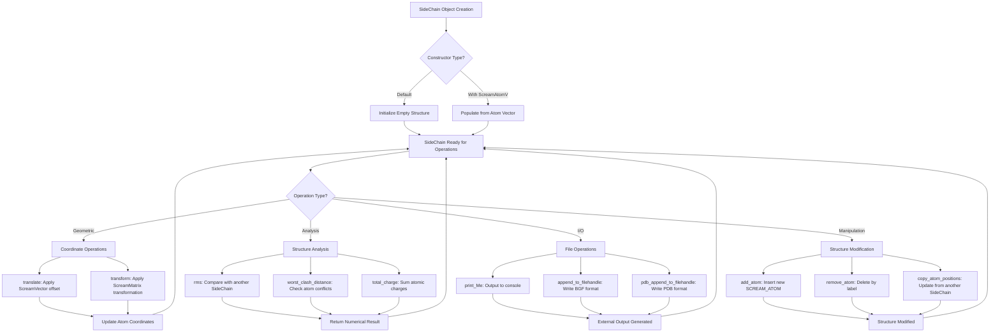

# `sc_SideChain.hpp` File Analysis

## File Purpose and Primary Role

The `sc_SideChain.hpp` file defines the base `SideChain` class, which serves as the foundation for representing protein side-chain structures in the SCREAM molecular modeling software. This class encapsulates the atomic composition and geometric properties of amino acid side chains, providing functionality for coordinate manipulation, structural comparison, and file I/O operations. It acts as a container for atoms that make up a side chain and provides methods for transformations, RMS calculations, and serialization to various file formats (BGF, PDB).

## Key Classes, Structs, and Functions (if any)

### Primary Class: `SideChain`

- **Purpose**: Base class for all side-chain representations in SCREAM
- **Key Responsibilities**:
  - Store and manage atoms that comprise a side chain structure
  - Provide geometric transformations (translation, rotation via transformation matrices)
  - Calculate structural similarity metrics (RMS deviation)
  - Handle file I/O operations for molecular structure formats
  - Manage atom properties and connectivity information

### Key Member Functions:

- **Constructors**: Default constructor and constructor taking `ScreamAtomV&`
- **Geometric Operations**: `translate()`, `transform()`, `rms()`, `rms_heavyatom()`
- **I/O Operations**: `print_Me()`, `append_to_filehandle()`, `pdb_append_to_filehandle()`
- **Structure Manipulation**: `copy_atom_positions()`, `add_atom()`, `remove_atom()`
- **Analysis Functions**: `worst_clash_distance()`, `total_charge()`, `number_of_atoms()`

## Inputs

### Data Structures/Objects:

- **`ScreamAtomV&`**: Vector of SCREAM_ATOM objects used in constructor
- **`SCREAM_ATOM*`**: Individual atom pointers for adding atoms to the side chain
- **`ScreamVector&`**: 3D vector for translation operations
- **`ScreamMatrix&`**: Transformation matrix for coordinate transformations
- **`SideChain*`**: Other SideChain objects for comparison and coordinate copying
- **`vector<SCREAM_ATOM*>&`**: Collection of atoms for clash detection
- **`string`**: Atom labels for atom access and manipulation
- **`ostream*`**: Output stream pointers for file writing operations

### File-Based Inputs:

- **Not directly specified in this header file**, but the class is designed to work with molecular structure files through its I/O methods

### Environment Variables:

- **None directly referenced** in this header file

### Parameters/Configuration:

- **`bool` flag**: For toggling atom fixed/moveable status via `fix_toggle()`
- **Atom labels**: String identifiers for accessing specific atoms within the side chain

## Outputs

### Data Structures/Objects:

- **`multimap<string, SCREAM_ATOM*>`**: Internal atom storage structure accessible via `get_sc_atom_mm()`
- **`vector<SCREAM_ATOM*>`**: List of atom pointers via `get_atoms()`
- **`SCREAM_ATOM*`**: Individual atom pointers via `get()` method
- **`double`**: Numerical results from RMS calculations, clash distances, and charge calculations
- **`int`**: Atom count from `number_of_atoms()`
- **`string`**: Side chain name via `get_SC_name()`

### File-Based Outputs:

- **BGF format**: Molecular structure output via `print_Me()` and `append_to_filehandle()`
- **PDB format**: Protein structure output via `pdb_append_to_filehandle()`
- **Connectivity information**: Bond/connection data via `append_to_ostream_connect_info()`

### Console Output (stdout/stderr):

- **Structure information**: Atom details printed to console via `print_Me()`
- **Ordered atom listings**: Sequential atom output via `print_ordered_by_n()`

### Side Effects:

- **Coordinate modification**: `translate()` and `transform()` modify atom positions in-place
- **Atom property changes**: `copy_atom_positions()` and related methods modify external atom objects
- **Structure modification**: `add_atom()` and `remove_atom()` alter the internal atom collection

## External Code Dependencies (Libraries/Headers)

### Standard C++ Library:

- **`<vector>`**: For dynamic arrays and atom collections
- **`<map>`**: For the multimap container storing atoms with string keys
- **`<string>`**: For atom labels and side chain names
- **`using namespace std`**: Brings standard library into global namespace

### Internal SCREAM Project Headers:

- **`defs.hpp`**: Project-wide definitions and constants
- **`scream_atom.hpp`**: SCREAM_ATOM class definition
- **`scream_vector.hpp`**: ScreamVector class for 3D coordinate operations
- **`scream_matrix.hpp`**: ScreamMatrix class for transformation matrices

### External Compiled Libraries:

- **None identified** in this header file

## Core Logic/Algorithm Flowchart (Mermaid JS Format)

## Potential Areas for Modernization/Refactoring in SCREAM++

### 1. **Smart Pointer Management and RAII**

The current implementation uses raw pointers (`SCREAM_ATOM*`) extensively, which poses risks for memory leaks and dangling pointer access. Modern C++ would benefit from:

- **`std::shared_ptr<SCREAM_ATOM>`** or **`std::unique_ptr<SCREAM_ATOM>`** for automatic memory management
- **RAII principles** to ensure proper resource cleanup
- **Elimination of manual `new`/`delete` operations** that may exist in the implementation

### 2. **STL Container Optimization and Type Safety**

The class uses `multimap<string, SCREAM_ATOM*>` and relies on `using namespace std`, which can be improved:

- **Replace raw string keys** with strongly-typed atom identifiers or enums
- **Use `std::unordered_map`** for better performance if ordering isn't critical
- **Eliminate `using namespace std`** to avoid namespace pollution
- **Consider `std::vector<std::unique_ptr<SCREAM_ATOM>>`** with custom find algorithms for better cache locality

### 3. **Modern C++ API Design and Error Handling**

The current interface lacks modern C++ safety and expressiveness features:

- **Replace raw pointer returns** with optional types (`std::optional<SCREAM_ATOM&>`) for safer atom access
- **Use const-correctness** more extensively and mark methods `noexcept` where appropriate
- **Implement proper exception handling** instead of relying on null pointer checks
- **Add move semantics** for efficient object transfers and construction
- **Replace C-style casts** with static_cast/dynamic_cast where needed in the implementation
