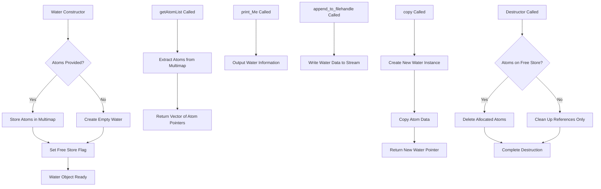

# `sc_Water.hpp` File Analysis

## File Purpose and Primary Role

The `sc_Water.hpp` file defines the `Water` class, which represents water molecules within the SCREAM molecular modeling software. This class is a specialized component that inherits from `ProteinComponent`, indicating that water molecules are treated as integral parts of the protein system. The class is responsible for managing collections of water atoms, providing methods for data output, and supporting the overall protein structure representation within SCREAM's molecular modeling framework.

## Key Classes, Structs, and Functions (if any)

### Classes

- **`Water`**: The primary class that inherits from `ProteinComponent`
  - Manages water molecule atoms through a multimap structure
  - Provides methods for atom list retrieval, printing, and file output
  - Supports copying and identification functionality

### Key Methods

- **Constructors**: Default constructor and parameterized constructor taking a vector of `SCREAM_ATOM*`
- **`getAtomList()`**: Returns a vector of atoms comprising the water molecule(s)
- **`print_Me()`**: Outputs water information to console
- **`append_to_filehandle()`**: Writes water data to a file stream
- **`append_to_ostream_connect_info()`**: Outputs connectivity information to a stream
- **`copy()`**: Creates a deep copy of the water component
- **`whatAmI()`**: Returns identification string "Water"

## Inputs

### Data Structures/Objects

- **`vector<SCREAM_ATOM*>`**: Primary input to the parameterized constructor, containing pointers to atoms that comprise water molecules
- **`ostream*`**: Output stream pointers for file writing operations

### File-Based Inputs

- Not directly evident from this header file. The class likely receives pre-parsed atom data from other parts of the SCREAM system that handle file I/O.

### Environment Variables

- No direct environment variable dependencies are apparent from this header file.

### Parameters/Configuration

- The class behavior may be influenced by the structure and properties of the `SCREAM_ATOM` objects it manages, but specific configuration parameters are not evident from the header alone.

## Outputs

### Data Structures/Objects

- **`vector<SCREAM_ATOM*>`**: Returned by `getAtomList()` method
- **`ProteinComponent*`**: Returned by the `copy()` method as a polymorphic copy
- **`string`**: Identification string returned by `whatAmI()`

### File-Based Outputs

- Output to file streams via `append_to_filehandle()` method (specific format not defined in header)
- Connectivity information output via `append_to_ostream_connect_info()` method

### Console Output (stdout/stderr)

- Console output via `print_Me()` method for debugging or information display

### Side Effects

- Memory management of water atoms (indicated by `water_atoms_on_free_store` flag)
- Potential modification of internal `multimap<string, SCREAM_ATOM*>` structure

## External Code Dependencies (Libraries/Headers)

### Standard C++ Library

- **`<vector>`**: For managing collections of atom pointers
- **`<map>`**: For the internal multimap data structure
- **`<iostream>`**: Implied for ostream operations

### Internal SCREAM Project Headers

- **`sc_ProteinComponent.hpp`**: Base class for the Water component
- **`scream_atom.hpp`**: Defines the `SCREAM_ATOM` structure/class

### External Compiled Libraries

- None apparent from this header file.

## Core Logic/Algorithm Flowchart (Mermaid JS Format)

## Potential Areas for Modernization/Refactoring in SCREAM++

### 1. Smart Pointer Usage

Replace raw `SCREAM_ATOM*` pointers with `std::shared_ptr<SCREAM_ATOM>` or `std::unique_ptr<SCREAM_ATOM>` to eliminate manual memory management concerns. The current `water_atoms_on_free_store` flag suggests manual tracking of memory ownership, which could be automated with smart pointers.

### 2. Modern Container and Algorithm Usage

The current `multimap<string, SCREAM_ATOM*>` could be replaced with more modern approaches such as `std::unordered_map` for better performance, or consider using `std::vector` with custom comparison functions. Additionally, leverage STL algorithms for operations like copying and searching instead of manual loops.

### 3. Enhanced Type Safety and API Design

- Use `const` correctness more extensively throughout the interface
- Consider using `std::string_view` instead of `string` for the `whatAmI()` return type
- Replace C-style function pointers (if any in implementation) with `std::function` or lambdas
- Implement move semantics for the constructor and copy operations to improve performance with large atom collections
