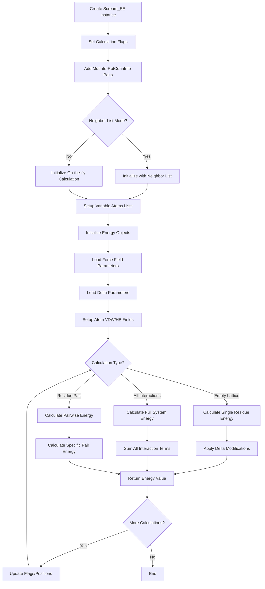

# `scream_EE.hpp` File Analysis

## File Purpose and Primary Role

The `scream_EE.hpp` file defines the `Scream_EE` class, which serves as the **SCREAM Energy Engine** - the central energy calculation and management system for the SCREAM molecular modeling software. This class orchestrates all energy computations including van der Waals, electrostatic (Coulomb), and hydrogen bonding interactions for protein side-chain placement calculations. It acts as a high-level interface that coordinates multiple specialized energy calculation objects and manages the overall energy evaluation workflow for both empty lattice calculations and full system interactions.

## Key Classes, Structs, and Functions (if any)

### Primary Class:

- **`Scream_EE`**: The main energy engine class that:
  - Manages multiple energy calculation objects (VDW, Coulomb, hydrogen bonding)
  - Handles initialization and configuration of energy parameters
  - Provides interfaces for empty lattice and full interaction energy calculations
  - Manages atom visibility and mobility flags for selective calculations
  - Coordinates neighbor list operations for efficiency

### Key Public Methods:

- **Initialization methods**: `init()`, `addMutInfoRotConnInfo()`, various `init_after_addedMutInfoRotConnInfo*()` variants
- **Flag manipulation**: `fix_mutInfo()`, `visible_mutInfo()`, `resetFlags()` for controlling which atoms participate in calculations
- **Energy calculation methods**:
  - Empty lattice: `calc_empty_lattice_E()` and variants with delta parameters
  - Full system: `calc_all_interaction_E()` and variants
  - Residue interactions: `calc_residue_interaction_E()`
  - Component-specific: separate methods for VDW, Coulomb, and hydrogen bonding energies

## Inputs

### Data Structures/Objects:

- **`Protein*`**: Core protein structure object containing atomic coordinates and topology
- **`vector<MutInfo>`**: List of mutation/residue information objects specifying which residues to consider
- **`RotConnInfo*`**: Rotamer connection information for side-chain conformations
- **`ClashCollection*`**: Object managing atomic clash detection and avoidance
- **`ScreamParameters*`**: Configuration parameters object (replacing individual file paths)
- **`AARotamer*`**: Amino acid rotamer objects for side-chain placement

### File-Based Inputs:

- **Force field parameter files**: Specified by string parameters, containing VDW radii, charges, and interaction parameters
- **SCREAM delta parameter files**: Custom flat-bottom energy modification parameters
- **EachAtomDeltaFile**: Individual atomic delta values for energy perturbations
- **Control files**: Via `scream_ctl_reader.hpp` for overall configuration

### Environment Variables:

- Not directly evident from this header file, but likely inherited through included dependencies

### Parameters/Configuration:

- **`_calcNonPolarHydrogen_flag`**: Controls whether non-polar hydrogen atoms are included in calculations
- **`_CBCalc_flag`**: Determines if C-beta atoms are treated as backbone or sidechain
- **Distance dielectric prefactor**: For electrostatic calculations
- **Delta parameters**: For flat-bottom energy modifications (full vs flat modes)
- **Visibility and mobility flags**: Per-atom controls for selective energy calculations

## Outputs

### Data Structures/Objects:

- **Energy values**: Double-precision floating-point energy calculations
- **Modified protein states**: Through rotamer placement operations
- **Updated internal energy objects**: Coulomb_EE, VDW_EE, HB_EE with calculated interaction matrices

### File-Based Outputs:

- No direct file output evident from this header file

### Console Output (stdout/stderr):

- Not explicitly shown in header, but likely includes energy values and calculation progress through member objects

### Side Effects:

- **Modifies protein coordinates**: Through `ntrlRotamerPlacement()` wrapper
- **Updates internal energy calculation objects**: Prepares interaction matrices and neighbor lists
- **Changes atom flags**: Visibility and mobility states affecting subsequent calculations
- **Manages clash collection state**: Updates clash detection information

## External Code Dependencies (Libraries/Headers)

### Standard C++ Library:

- `<vector>`: For dynamic arrays of MutInfo and other objects
- `<map>`: For associating MutInfo objects with RotConnInfo pointers
- `<string>`: For file paths and configuration parameters

### Internal SCREAM Project Headers:

- **`defs.hpp`**: Project-wide definitions and constants
- **`MutInfo.hpp`**: Mutation/residue information structures
- **`sc_Protein.hpp`**: Core protein representation classes
- **`RotConnInfo.hpp`**: Rotamer connection information
- **Energy calculation modules**:
  - `scream_coulomb_EE.hpp`: Electrostatic energy calculations
  - `scream_hb_EE.hpp`: Hydrogen bonding energy calculations
  - `scream_vdw_EE.hpp`: Van der Waals energy calculations
  - `scream_vdw_hb_exclusion_EE.hpp`: Exclusion rules between VDW and HB
- **Utility modules**:
  - `ClashCollection.hpp`: Atomic clash management
  - `RotamerNeighborList.hpp`: Neighbor list optimization
  - `scream_ctl_reader.hpp`: Control file parsing

### External Compiled Libraries:

- None evident from this header file (pure C++ Standard Library)

## Core Logic/Algorithm Flowchart (Mermaid JS Format)

## Potential Areas for Modernization/Refactoring in SCREAM++

### 1. **Smart Pointer Management**

Replace raw pointers (`Protein*`, `RotConnInfo*`, `ClashCollection*`) with smart pointers (`std::unique_ptr`, `std::shared_ptr`) to eliminate manual memory management risks and provide automatic cleanup. The current design shows potential for memory leaks and dangling pointer issues.

### 2. **Modern Container and Algorithm Usage**

Replace the custom `map<MutInfo, RotConnInfo*>` with more modern alternatives like `std::unordered_map` for better performance, and utilize standard algorithms instead of manual loops. The current approach uses older C++ patterns that could benefit from modern STL features and range-based operations.

### 3. **Interface Simplification and Type Safety**

Consolidate the numerous overloaded methods (e.g., multiple `calc_empty_lattice_E*` variants) into a single, template-based or policy-based design. Replace string-based mode selection ("FULL", "FLAT", "RESIDUE") with enum classes for better type safety and compile-time error detection. The current API has too many similar methods that could be unified with better design patterns.
