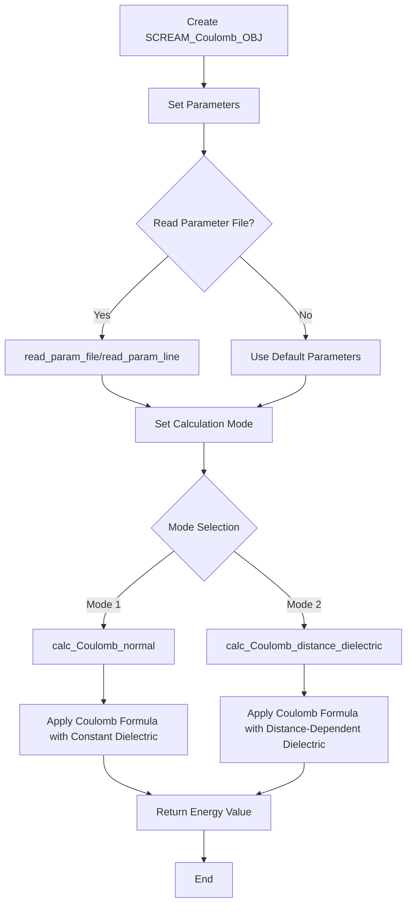

# `scream_E_functionals_coulomb.hpp` File Analysis

## File Purpose and Primary Role

This file implements the `SCREAM_Coulomb_OBJ` class, which is responsible for calculating Coulomb electrostatic energy interactions between atoms in the SCREAM molecular modeling software. The class provides multiple calculation modes including normal Coulomb interactions and distance-dependent dielectric calculations, which are essential for modeling electrostatic forces in protein structures during side-chain placement optimization.

## Key Classes, Structs, and Functions (if any)

### SCREAM_Coulomb_OBJ Class

- **Purpose**: Main class for Coulomb electrostatic energy calculations
- **Key Methods**:
  - `calc_Coulomb()`: Generic Coulomb energy calculation method
  - `calc_Coulomb_normal()`: Standard Coulomb calculation with constant dielectric
  - `calc_Coulomb_distance_dielectric()`: Coulomb calculation with distance-dependent dielectric constant
  - `read_param_line()` / `read_param_file()`: Parameter file parsing for Coulomb parameters
  - `getEpsilon()` / `set_dielectric()`: Dielectric constant management
  - `set_normal_mode()` / `set_distance_dependent_mode()`: Mode switching methods

## Inputs

### Data Structures/Objects

- **`SCREAM_ATOM*`**: Two atom pointers representing the interacting atom pair for energy calculation
- **`double`**: Optional scaling factor parameter (default value 1.0) for energy calculations
- **`string`**: Parameter strings for configuration and file paths

### File-Based Inputs

- **Parameter files**: The class can read "mpsim style parameter files" through `read_param_file()`, though the specific format is not detailed in this header
- **Parameter lines**: Individual parameter strings can be processed via `read_param_line()`

### Environment Variables

- No direct environment variable dependencies are evident from this header file

### Parameters/Configuration

- **`epsilon`**: Dielectric constant affecting electrostatic screening
- **`mode`**: Calculation mode (1 = Normal, 2 = Distance dependent dielectric)
- **`R_on`, `R_off`**: Likely cutoff distances for energy calculations (private members)

## Outputs

### Data Structures/Objects

- **`double`**: Coulomb energy values returned by the calculation methods
- **Modified `SCREAM_Coulomb_OBJ` state**: Internal parameters updated through setter methods

### File-Based Outputs

- No direct file output capabilities are evident from this header file

### Console Output (stdout/stderr)

- No explicit console output methods are shown in this header

### Side Effects

- Modifies internal state variables (`epsilon`, `mode`, `R_on`, `R_off`) through parameter reading and setter methods
- Does not appear to modify the input `SCREAM_ATOM` objects (const correctness could be improved)

## External Code Dependencies (Libraries/Headers)

### Standard C++ Library

- `<math.h>`: Mathematical functions for energy calculations
- `<vector>`: Standard container (though usage not evident in header)
- `<string>`: String handling for parameter processing

### Internal SCREAM Project Headers

- `"scream_atom.hpp"`: Defines the `SCREAM_ATOM` class used in energy calculations

### External Compiled Libraries

- None evident from this header file

## Core Logic/Algorithm Flowchart (Mermaid JS Format)



## Potential Areas for Modernization/Refactoring in SCREAM++

### 1. **Const Correctness and Modern C++ Parameter Passing**

- The `SCREAM_ATOM*` parameters should be `const SCREAM_ATOM*` or preferably `const SCREAM_ATOM&` since the atoms are not being modified
- Replace C-style string parameters with `const std::string&` for better performance
- Use `std::string_view` for read-only string parameters in C++17+

### 2. **Enum Class for Mode Management**

- Replace the integer-based `mode` system with a strongly-typed `enum class`:

```cpp
enum class CoulombMode { Normal = 1, DistanceDependent = 2 };
```

- This provides better type safety and self-documenting code

### 3. **RAII and Exception Safety**

- Add proper error handling for parameter file reading operations
- Consider using `std::optional<double>` for optional parameters instead of default values
- Implement proper validation for dielectric constants and distance parameters
- Use smart pointers if dynamic allocation becomes necessary in the implementation
