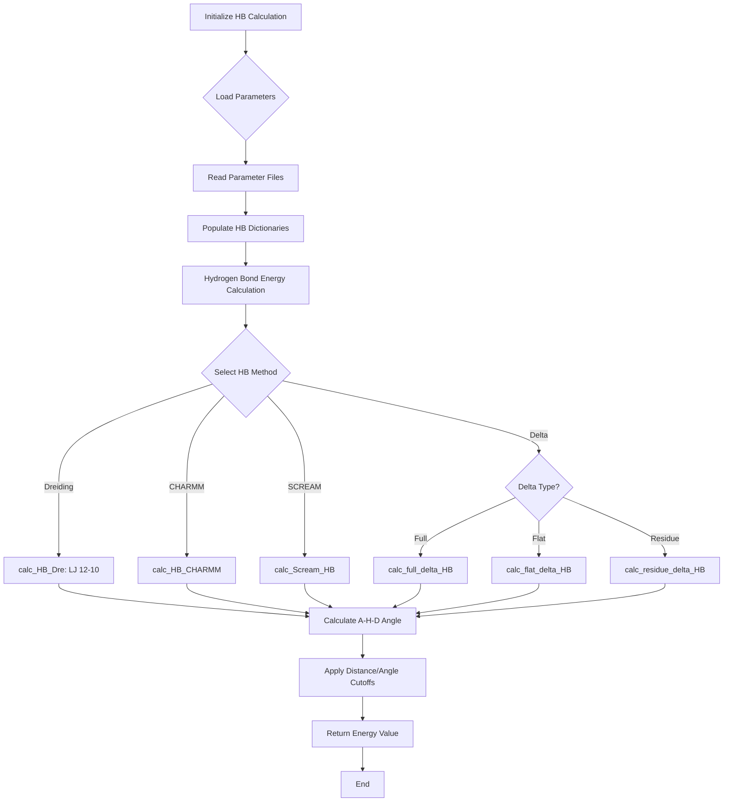

# `scream_E_functionals_hb.hpp` File Analysis

## File Purpose and Primary Role

This file implements hydrogen bonding energy calculations for the SCREAM molecular modeling software. It provides various hydrogen bonding energy functionals including traditional Dreiding force field calculations, CHARMM-style hydrogen bonds, and custom SCREAM hydrogen bonding potentials with delta corrections and flat-bottom strategies. The module is responsible for calculating energetic interactions between hydrogen bond acceptors, donors, and hydrogen atoms using different mathematical formulations (primarily LJ 12-10 potentials).

## Key Classes, Structs, and Functions (if any)

### Classes:

- **`SCREAM_HB_fields`**: Data container storing hydrogen bonding parameters (DE: well depth, RE: equilibrium distance)
- **`HB_delta_fields`**: Stores delta correction parameters (mu, sigma) for enhanced hydrogen bonding calculations
- **`SCREAM_HB_OBJ`**: Main hydrogen bonding calculation engine containing multiple energy calculation methods and parameter management
- **`SCREAM_HB_BASE_FUNCTIONAL_OBJ`**: Abstract base class for hydrogen bonding functional objects using polymorphism
- **`SCREAM_calc_full_delta_HB`**: Concrete implementation for full delta hydrogen bonding calculations
- **`SCREAM_calc_flat_delta_HB`**: Concrete implementation for flat delta hydrogen bonding calculations

### Key Methods:

- **`calc_HB_Dre()`**: Dreiding hydrogen bond calculation (LJ 12-10)
- **`calc_HB_CHARMM()`**: CHARMM-style hydrogen bond calculation
- **`calc_Scream_HB()`**: Custom SCREAM hydrogen bond with buffer zones
- **`calc_full_delta_HB()`** and **`calc_flat_delta_HB()`**: Delta-corrected hydrogen bonding methods
- **`calc_residue_delta_HB()`**: Residue-specific delta hydrogen bonding
- **`_calc_angle()`**: Geometric angle calculation for A-H-D triplets

## Inputs

### Data Structures/Objects:

- **`SCREAM_ATOM*`**: Three atom pointers representing Acceptor, Hydrogen, and Donor atoms
- **`AtomResInfo`**: Atom and residue information for delta parameter lookups
- **`string`**: Atom type labels and file paths
- **`double`**: Various parameters (distances, angles, sigma values, delta values)

### File-Based Inputs:

- **Parameter files**: Read via `read_param_file()` for hydrogen bonding parameters (DE, RE values)
- **Delta parameter files**: Read via `read_Scream_delta_file()` containing residue-specific correction parameters
- **Parameter lines**: Individual parameter entries via `read_param_line()`

### Environment Variables:

- Not directly evident from this header file

### Parameters/Configuration:

- **`R_on, R_off`**: Distance cutoff parameters for smooth switching functions
- **`theta_on, theta_off`**: Angular cutoff parameters for directional hydrogen bonding
- **`n_sigma`**: Number of standard deviations for full delta calculations
- **`delta`**: Flat delta correction value

## Outputs

### Data Structures/Objects:

- **`double`**: Energy values from various hydrogen bonding calculations
- **`SCREAM_HB_fields*`**: Retrieved hydrogen bonding parameter objects
- **`vector<string>`**: List of all hydrogen bonding atom types via `returnAllHBTypes()`

### File-Based Outputs:

- No direct file output evident from this header

### Console Output (stdout/stderr):

- Not explicitly shown in header, likely handled in implementation

### Side Effects:

- Modifies internal dictionaries (`hb_dict`, `hb_atom_type_mapping`, `hb_delta_library_dict`)
- Parameter loading populates internal data structures

## External Code Dependencies

### Standard C++ Library:

- **`<math.h>`**: Mathematical functions for energy calculations
- **`<vector>`**: STL vector containers
- **`<string>`**: String handling for atom types and file paths
- **`<map>`**: STL map containers for parameter dictionaries

### Internal SCREAM Project Headers:

- **`scream_atom.hpp`**: Core atom representation and functionality
- **`AtomResInfo.hpp`**: Atom and residue information structures

### External Compiled Libraries:

- None evident from this header file

## Core Logic/Algorithm Flowchart (Mermaid JS Format)

## Potential Areas for Modernization/Refactoring in SCREAM++

1. **Memory Management and Smart Pointers**: The code uses raw pointers extensively (`SCREAM_ATOM*`, `SCREAM_HB_fields*`, `HB_delta_fields*`). Modern C++ should employ `std::unique_ptr` or `std::shared_ptr` to ensure automatic memory management and prevent memory leaks. The manual `new`/`delete` operations should be replaced with RAII principles.

2. **Enhanced STL Usage and Type Safety**: Replace C-style maps with more type-safe alternatives. The `map<string, int>` for atom type mapping could benefit from `enum class` or `std::unordered_map` for better performance. The complex nested map structure `map<string, map<AtomResInfo, HB_delta_fields*> * >` should be simplified using modern container design and potentially `std::variant` for different parameter types.

3. **Functional Programming and Lambda Expressions**: The polymorphic functional objects (`SCREAM_HB_BASE_FUNCTIONAL_OBJ` and derived classes) could be modernized using `std::function` and lambda expressions, eliminating the need for multiple inheritance hierarchies. This would make the code more flexible and easier to extend with new hydrogen bonding calculation methods.
