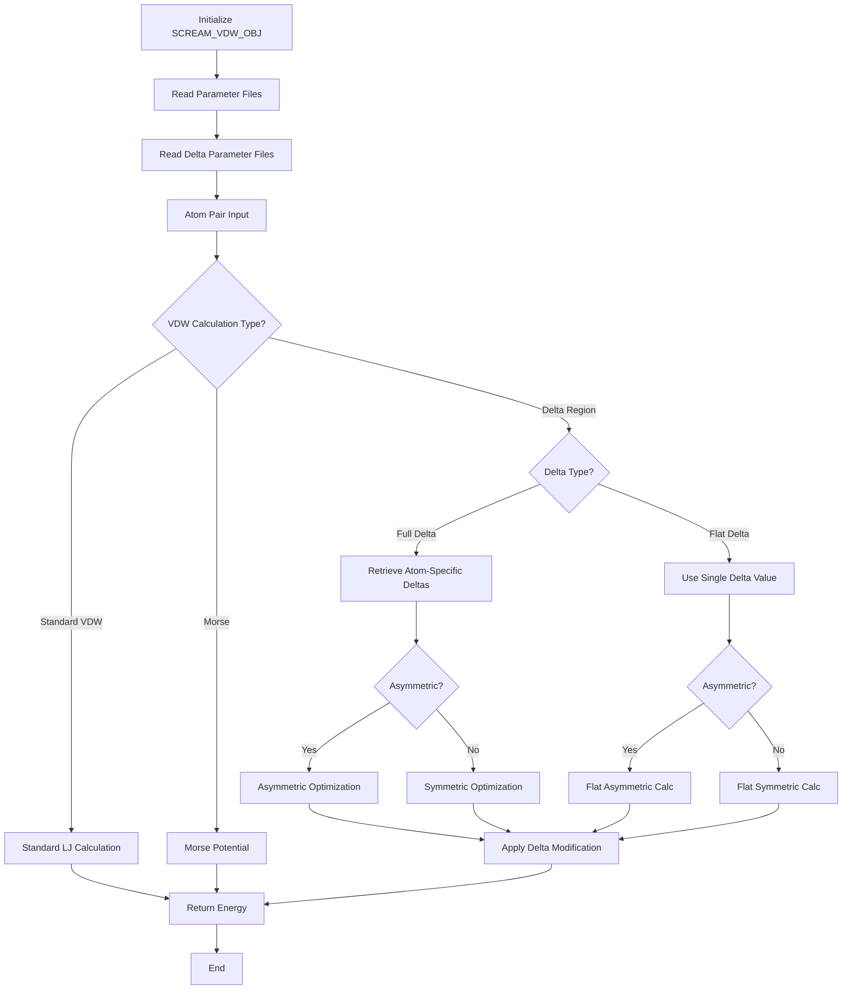

# `scream_E_functionals_vdw.hpp` File Analysis

## File Purpose and Primary Role

This header file implements the van der Waals (VDW) energy calculation subsystem for the SCREAM molecular modeling software. It provides a comprehensive framework for computing VDW interactions between atoms using various potential functions, including standard Lennard-Jones variants (6-8, 6-9, 6-10, 6-12), exponential (X6), and Morse potentials. The file implements the "flat-bottom strategy" methodology described in the 2008 JCTC paper, which uses delta regions to improve accuracy in protein side-chain placements by modifying traditional VDW potentials with asymmetric and flat-bottom modifications.

## Key Classes, Structs, and Functions (if any)

### Core Data Classes

- **`VDW_fields`**: Stores basic VDW parameters (RNB, DENB, SCALE) for force field types
- **`VDW_delta_fields`**: Stores delta region parameters (mu, sigma) for the flat-bottom strategy

### Main VDW Engine

- **`SCREAM_VDW_OBJ`**: Central class managing VDW calculations, parameter reading, and various potential implementations
  - Handles parameter file reading and atom type lookups
  - Implements multiple VDW potential variants (6-8 through 6-12, X6, Morse)
  - Provides both symmetric and asymmetric delta region calculations
  - Contains helper functions for geometric, arithmetic, and harmonic means

### Specialized VDW Implementations

- **`Morse_VDW`**: Derived class specifically for Morse potential calculations
- **`SCREAM_VDW_BASE_FUNCTIONAL_OBJ`**: Abstract base class for functional object pattern implementation

### Functional Object Classes (Strategy Pattern)

Multiple classes implementing specific VDW calculation strategies:

- **Full Delta Classes**: `SCREAM_calc_full_delta_*` - use complete delta region calculations
- **Flat Delta Classes**: `SCREAM_calc_flat_delta_*` - use simplified flat delta values
- **Asymmetric Variants**: `*_asym_*` - implement asymmetric flat-bottom modifications
- Covers potential types: 6-7, 6-8, 6-9, 6-10, 6-11, 6-12, and X6

## Inputs

### Data Structures/Objects

- **`SCREAM_ATOM*`**: Pointers to atom objects containing atomic coordinates, types, and properties
- **`AtomResInfo`**: Atom residue information objects used for parameter lookups
- **`string ff_type`**: Force field type identifiers for parameter retrieval
- **`double`** values: Various parameters including distances, scaling factors, delta values, and n_sigma multipliers

### File-Based Inputs

- **MPSIM-style parameter files**: Read via `read_param_file()` containing VDW force field parameters
- **SCREAM delta files**: Read via `read_Scream_delta_file()` containing neighborhood delta parameters for the flat-bottom strategy
- **Single parameter lines**: Processed via `read_param_line()` for individual parameter entries

### Parameters/Configuration

- **RNB**: Van der Waals radius parameters
- **DENB**: Depth/energy parameters for VDW wells
- **SCALE**: Scaling factors for VDW interactions
- **mu, sigma**: Delta region parameters for flat-bottom modifications
- **n_sigma**: Multiplier for sigma values in full delta calculations
- **delta**: Flat delta values for simplified calculations

## Outputs

### Data Structures/Objects

- **`double`**: Energy values from VDW calculations (primary output)
- **`VDW_fields*`**: Pointers to VDW parameter structures
- **`VDW_delta_fields*`**: Pointers to delta parameter structures
- Modified `SCREAM_ATOM` objects with computed interaction energies

### File-Based Outputs

- No direct file output from this header (implementation files may write debug/log information)

### Console Output (stdout/stderr)

- Not explicitly defined in header (implementation likely includes error messages for parameter reading failures)

### Side Effects

- Modifies internal parameter dictionaries (`vdw_dict`, `vdw_delta_library_dict`)
- Potentially modifies atom objects during energy calculations
- Initializes VDW and delta fields for atoms during calculations

## External Code Dependencies

### Standard C++ Library

- **`<math.h>`**: Mathematical functions (sqrt, pow) for energy calculations
- **`<vector>`**: Standard vector containers
- **`<string>`**: String handling for parameter parsing and atom type identification
- **`<map>`**: For parameter dictionaries and lookups

### Internal SCREAM Project Headers

- **`"scream_atom.hpp"`**: Defines `SCREAM_ATOM` class with atomic properties
- **`"AtomResInfo.hpp"`**: Defines atom residue information structures

### External Compiled Libraries

- None explicitly referenced (uses standard C++ library only)

## Core Logic/Algorithm Flowchart

## Potential Areas for Modernization/Refactoring in SCREAM++

### 1. **Memory Management and Smart Pointers**

The code uses raw pointers extensively (`VDW_fields*`, `VDW_delta_fields*`) with manual memory management. Modern C++ should use `std::unique_ptr` or `std::shared_ptr` to prevent memory leaks and improve safety. The map structures storing pointers should be redesigned to use smart pointers or value semantics.

### 2. **Strategy Pattern Refactoring with std::function**

The numerous functional object classes (`SCREAM_calc_*`) implementing similar interfaces could be consolidated using `std::function` or lambdas, reducing code duplication. The current inheritance-heavy approach could be replaced with a more flexible template-based or functional approach using modern C++ features.

### 3. **Enhanced Type Safety and Error Handling**

Replace C-style includes (`<math.h>`) with C++ equivalents (`<cmath>`), add proper exception handling for file I/O operations, and consider using `std::optional` for functions that might fail to find parameters. The string-based lookups could benefit from stronger typing using enums or custom types to prevent runtime errors from typos in force field type names.
