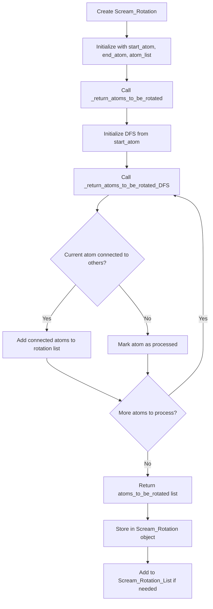

# `scream_Rotation.hpp` File Analysis

## File Purpose and Primary Role

This header file defines classes for managing molecular rotations in the SCREAM protein modeling software. The primary purpose is to represent and manage rotatable bonds in molecular structures, specifically handling which atoms should be rotated when a particular bond is rotated. This is crucial for protein side-chain placement algorithms where rotating around specific bonds affects the positions of downstream atoms in the molecular chain.

## Key Classes, Structs, and Functions (if any)

### `Scream_Rotation` Class

- **Purpose**: Represents a single rotatable bond defined by two atoms (start and end) and maintains a list of atoms that should be rotated when this bond is rotated.
- **Key Methods**:
  - Default and parameterized constructors
  - `get_start_atom()`: Returns the starting atom of the rotatable bond
  - `get_end_atom()`: Returns the ending atom of the rotatable bond
  - `get_atoms_to_be_rotated()`: Returns the vector of atoms affected by this rotation

### `Scream_Rotation_List` Class

- **Purpose**: Container class to manage multiple `Scream_Rotation` objects, likely representing all rotatable bonds in a molecular system.
- **Key Members**:
  - `sc_rot_v`: Vector storing multiple `Scream_Rotation` instances

### Private Helper Functions in `Scream_Rotation`

- `_return_atoms_to_be_rotated()`: Determines which atoms are affected by a rotation
- `_return_atoms_to_be_rotated_DFS()`: Implements depth-first search algorithm to traverse molecular connectivity and identify rotatable atoms

## Inputs

### Data Structures/Objects

- **`SCREAM_ATOM*`**: Pointers to atom objects representing the start and end atoms of rotatable bonds
- **`ScreamAtomV&`**: Reference to a vector/container of atoms (custom atom vector type)

### File-Based Inputs

- No direct file I/O operations are evident in this header file. File inputs would likely be handled by other modules that create the atom structures passed to these classes.

### Environment Variables

- No direct environment variable usage is apparent in this header file.

### Parameters/Configuration

- The rotation behavior is configured through the atom connectivity and the specific start/end atom pairs provided during construction.

## Outputs

### Data Structures/Objects

- **`SCREAM_ATOM*`**: Returns pointers to start and end atoms of rotations
- **`ScreamAtomV`**: Returns vectors of atoms that should be rotated
- **Modified atom positions**: Indirectly, when rotations are applied, the positions of atoms in `atoms_to_be_rotated` would be modified

### File-Based Outputs

- No direct file output operations are present in this header file.

### Console Output

- No console output is evident in this header file.

### Side Effects

- The classes maintain internal state about which atoms are affected by rotations, but the header doesn't show direct modification of external atom positions.

## External Code Dependencies

### Standard C++ Library

- **`<vector>`**: For the `vector` container used in `Scream_Rotation_List`

### Internal SCREAM Project Headers

- **`defs.hpp`**: Project-wide definitions and constants
- **`scream_atom.hpp`**: Atom class definitions and related structures
- **`scream_matrix.hpp`**: Custom matrix operations (likely for rotation transformations)
- **`scream_vector.hpp`**: Custom vector operations and the `ScreamAtomV` type

### External Compiled Libraries

- **`using namespace std`**: Indicates reliance on C++ Standard Library
- No external third-party libraries are apparent from this header.

## Core Logic/Algorithm Flowchart

## Potential Areas for Modernization/Refactoring in SCREAM++

### 1. **Smart Pointer Usage**

Replace raw `SCREAM_ATOM*` pointers with `std::shared_ptr<SCREAM_ATOM>` or `std::unique_ptr<SCREAM_ATOM>` to improve memory safety and automatic resource management. This would eliminate potential memory leaks and dangling pointer issues.

### 2. **Modern Container and Algorithm Usage**

- Replace custom `ScreamAtomV` with standard `std::vector<std::shared_ptr<SCREAM_ATOM>>`
- Use STL algorithms like `std::find_if`, `std::transform`, and range-based for loops instead of manual iteration
- Consider `std::unordered_set` for faster atom lookup during DFS traversal

### 3. **Interface Design and Const-Correctness**

- Make getter methods const: `const SCREAM_ATOM* get_start_atom() const`
- Use const references for return values where appropriate: `const ScreamAtomV& get_atoms_to_be_rotated() const`
- Add proper copy/move constructors and assignment operators following the Rule of Five
- Consider using `std::optional` for cases where atoms might not exist
