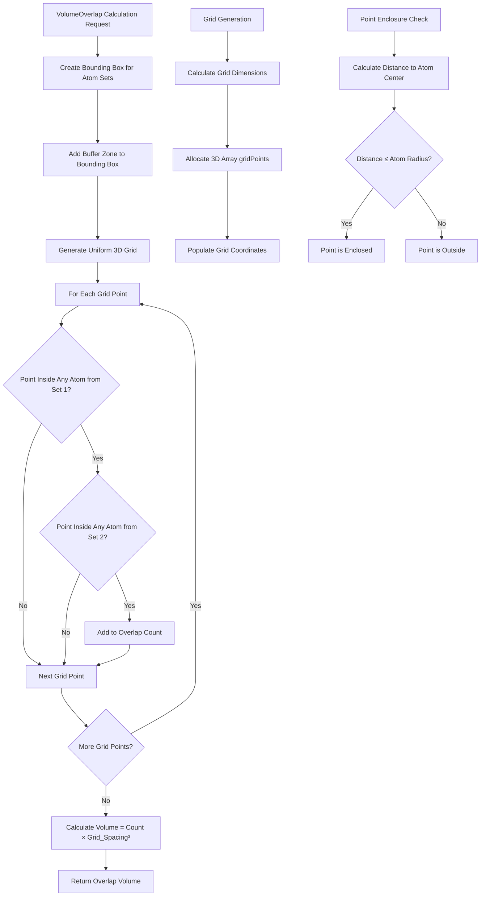

# `scream_VolumeOverlap.hpp` File Analysis

## File Purpose and Primary Role

This file defines classes for calculating volume overlaps between atoms in molecular modeling simulations. The primary purpose is to provide computational geometry utilities for determining how much space atoms occupy in overlapping regions. This is likely used in the SCREAM protein side-chain placement algorithm to evaluate steric clashes and calculate energy penalties when atoms are too close together. The file implements a grid-based approach for efficient spatial calculations using bounding boxes and discrete point sampling.

## Key Classes, Structs, and Functions (if any)

### **Box Class**

- **Purpose**: Represents a 3D rectangular bounding box with grid generation capabilities
- **Key Responsibilities**:
  - Defines spatial boundaries with min/max coordinates in X, Y, Z dimensions
  - Generates uniform 3D grids within the box boundaries
  - Identifies grid points enclosed by spherical atoms or sets of atoms
  - Provides coordinate system transformation capabilities

### **VolumeOverlap Class**

- **Purpose**: Main interface for volume overlap calculations between sets of atoms
- **Key Responsibilities**:
  - Calculates overlap volumes between two sets of atoms (`ScreamAtomV`)
  - Provides both simple (two sets) and general (one set vs. multiple sets) calculation interfaces
  - Manages bounding box creation and buffer zones for calculations

## Inputs

### **Data Structures/Objects:**

- `SCREAM_ATOM*`: Individual atom objects with position and radius information
- `ScreamAtomV&`: Vectors/collections of SCREAM_ATOM objects representing molecular structures
- `vector<ScreamAtomV>&`: Multiple sets of atom collections for batch calculations
- `ScreamVector`: 3D coordinate vectors for positions and directions
- Coordinate parameters: `double` values for min/max boundaries (minX, minY, minZ, maxX, maxY, maxZ)
- Grid spacing: `double` value defining the resolution of the computational grid
- Sphere parameters: `ScreamVector` center position and `double` radius

### **File-Based Inputs:**

- No direct file I/O operations are present in this header file

### **Environment Variables:**

- No environment variables are directly referenced in this file

### **Parameters/Configuration:**

- Grid spacing parameter controlling computational accuracy vs. performance trade-off
- Buffer distance for extending bounding boxes beyond atom boundaries
- Coordinate system vectors (default to standard Cartesian axes [1,0,0], [0,1,0], [0,0,1])

## Outputs

### **Data Structures/Objects:**

- `std::set<ScreamVector>`: Collections of 3D grid points that fall within atomic volumes
- `double`: Volume overlap values between atom sets
- `vector<double>`: Multiple overlap calculations for batch operations
- `Box`: Bounding box objects that encompass specified atomic regions

### **File-Based Outputs:**

- No direct file output operations are defined in this header

### **Console Output (stdout/stderr):**

- No console output operations are present in this header file

### **Side Effects:**

- Modifies internal grid state (`gridPoints` 3D array) when `generateGrid()` is called
- Allocates dynamic memory for 3D grid storage (`ScreamVector***`)

## External Code Dependencies (Libraries/Headers)

### **Standard C++ Library:**

- `<set>`: For storing collections of unique grid points
- `<vector>` (implied): For atom collections and result arrays

### **Internal SCREAM Project Headers:**

- `"defs.hpp"`: Project-wide definitions and constants
- `"scream_vector.hpp"`: Custom 3D vector implementation
- `"scream_matrix.hpp"`: Custom matrix operations
- `"scream_atom.hpp"`: Atom data structures and related functionality

### **External Compiled Libraries:**

- No external third-party libraries are referenced

## Core Logic/Algorithm Flowchart (Mermaid JS Format)

## Potential Areas for Modernization/Refactoring in SCREAM++

### **1. Memory Management and Smart Pointers**

- Replace raw 3D pointer array (`ScreamVector*** gridPoints`) with modern alternatives like `std::vector<std::vector<std::vector<ScreamVector>>>` or flattened `std::vector<ScreamVector>` with index calculation
- Eliminate manual memory management risks and improve exception safety
- Consider using `std::unique_ptr` or `std::shared_ptr` for complex object ownership

### **2. STL Container Integration and API Design**

- Replace custom `ScreamVector` and `ScreamAtomV` types with standard library equivalents or template-based designs
- Use `std::array<double, 3>` or `std::vector<double>` for coordinates instead of custom vector classes
- Implement iterator-based interfaces and range-based for loop compatibility
- Consider using `std::span` (C++20) for function parameters instead of raw pointers

### **3. Performance and Algorithm Optimization**

- Implement spatial data structures (octrees, KD-trees) for more efficient nearest-neighbor queries instead of brute-force grid enumeration
- Add parallel processing support using `std::execution` policies or threading libraries
- Consider template-based design for compile-time optimization of grid dimensions and coordinate types
- Implement RAII principles for automatic resource cleanup and better exception safety
