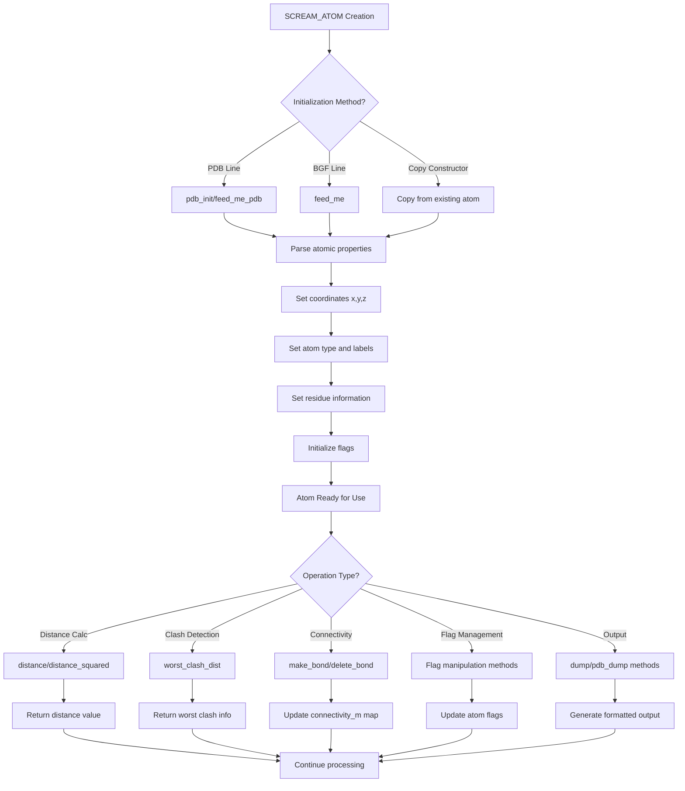

# `scream_atom.hpp` File Analysis

## File Purpose and Primary Role

The `scream_atom.hpp` file defines the core `SCREAM_ATOM` class, which represents individual atoms in the SCREAM molecular modeling software. This class serves as the fundamental building block for molecular structures, storing both standard atomic properties (coordinates, charges, atom types) and SCREAM-specific attributes for side-chain placement algorithms. The class handles atom initialization from PDB/BGF file formats, connectivity information, energy calculation flags, and provides the foundation for distance calculations and clash detection that are essential for the flat-bottom strategy described in the associated research paper.

## Key Classes, Structs, and Functions (if any)

### Primary Class: `SCREAM_ATOM`

- **Purpose**: Represents a single atom with all necessary properties for molecular modeling and side-chain placement
- **Key Constructors**:
  - `SCREAM_ATOM()`: Default constructor
  - `SCREAM_ATOM(const string)`: Constructor from string (likely PDB/BGF line)
  - `SCREAM_ATOM(SCREAM_ATOM*)`: Copy constructor from pointer
- **Key Methods**:
  - `pdb_init(string)`: Initialize atom from PDB line
  - `feed_me(const string)`: Populate atom from BGF line
  - `feed_me_pdb(const string)`: Populate atom from PDB line
  - `distance(SCREAM_ATOM*)`: Calculate Euclidean distance between atoms
  - `distance_squared(SCREAM_ATOM*)`: Calculate squared distance (optimization)
  - `worst_clash_dist(vector<SCREAM_ATOM*>&, SCREAM_ATOM**)`: Find worst clash distance in atom list
  - `make_bond(SCREAM_ATOM*, int)`: Create bond connectivity
  - Flag manipulation methods: `make_atom_moveable()`, `make_atom_fixed()`, `make_atom_visible()`, etc.

## Inputs

### Data Structures/Objects:

- **String inputs**: PDB lines, BGF lines for atom initialization
- **SCREAM_ATOM pointers**: For distance calculations, connectivity, and copying operations
- **Vector of SCREAM_ATOM pointers**: For clash detection algorithms
- **Basic data types**: doubles for coordinates/charges, ints for flags/residue numbers, strings for labels/types

### File-Based Inputs:

- **PDB files**: Standard Protein Data Bank format files containing atomic coordinates and properties
- **BGF files**: BIOGRAF format files (appears to be the primary format for SCREAM)
- The class doesn't directly read files but processes individual lines from these formats

### Environment Variables:

- No direct environment variable dependencies are evident in this header file

### Parameters/Configuration:

- **Atom flags**: Control energy calculation participation and visibility (bits 0x1, 0x2, 0x4, 0x8)
- **Force field parameters**: VDW radii, well depths, charges stored per atom
- **Residue information**: Chain IDs, residue numbers, residue names for proper molecular context

## Outputs

### Data Structures/Objects:

- **SCREAM_ATOM instances**: Fully populated atom objects with coordinates, types, and connectivity
- **Distance values**: Double precision distances and squared distances between atoms
- **Bond connectivity**: Map-based storage of atom-to-atom connections with bond types
- **Clash information**: Worst clash distances and problematic atom pairs

### File-Based Outputs:

- **BGF format output**: Via `return_bgf_line()`, `dump()`, and `append_to_filehandle()` methods
- **PDB format output**: Via `return_pdb_line()`, `pdb_dump()`, and `pdb_append_to_filehandle()` methods
- **Connectivity output**: Bond information output via `append_to_ostream_connect_info()` methods

### Console Output (stdout/stderr):

- **Debug information**: Through `dump()` and `pdb_dump()` methods for atom properties
- **Formatted atom data**: BGF and PDB formatted output to standard streams

### Side Effects:

- **Connectivity modification**: Bond creation/deletion modifies internal connectivity maps
- **Flag state changes**: Methods modify atom calculation flags affecting energy expression participation
- **Coordinate updates**: Setter methods modify atomic positions

## External Code Dependencies (Libraries/Headers)

### Standard C++ Library:

- `<string>`: String manipulation for atom labels, types, and file format handling
- `<stdio.h>`: C-style I/O operations
- `<iostream>`: Stream-based I/O for output operations
- `<fstream>`: File stream operations
- `<iomanip>`: I/O manipulators for formatted output
- `<map>`: STL map for connectivity storage (`map<SCREAM_ATOM*, int> connectivity_m`)
- `<vector>`: STL vector for atom collections in clash detection

### Internal SCREAM Project Headers:

- No other SCREAM headers are directly included in this file, making it a foundational header
- Uses `using namespace std;` (not recommended in modern C++)

### External Compiled Libraries:

- No external third-party libraries are used

## Core Logic/Algorithm Flowchart (Mermaid JS Format)

## Potential Areas for Modernization/Refactoring in SCREAM++

### 1. **Replace Raw Pointers with Smart Pointers**

The current code uses raw pointers extensively (e.g., `SCREAM_ATOM*` in connectivity maps and function parameters). Modern C++ should use `std::shared_ptr<SCREAM_ATOM>` or `std::unique_ptr<SCREAM_ATOM>` to provide automatic memory management, prevent memory leaks, and make ownership semantics explicit. The connectivity map could become `std::map<std::shared_ptr<SCREAM_ATOM>, int>`.

### 2. **Eliminate "using namespace std" and Improve Const-Correctness**

The blanket `using namespace std;` directive is considered bad practice in modern C++. Instead, use specific `using` declarations or qualify STL types explicitly. Additionally, many getter methods should be marked `const`, and the class should follow the Rule of Five with proper copy/move constructors and assignment operators. The current manual memory management approach should be replaced with RAII principles.

### 3. **Modernize Data Members and API Design**

Replace C-style arrays (`double x[3]`, `double q[2]`) with more expressive types like `std::array<double, 3>` or custom Vector3D classes. The public data members should be made private with proper accessor methods. The flag manipulation system using bit operations could be replaced with a more type-safe enum class system. Additionally, the string-based initialization methods could be replaced with structured parsing using modern C++ techniques, potentially with factory methods that return `std::optional<SCREAM_ATOM>` to handle parsing failures gracefully.
