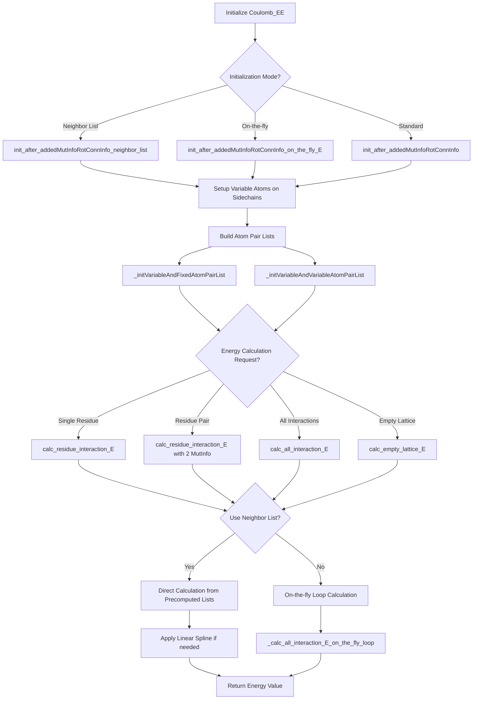

# `scream_coulomb_EE.hpp` File Analysis

## File Purpose and Primary Role

This file defines the `Coulomb_EE` class, which is responsible for calculating electrostatic (Coulomb) interactions between atoms in protein structures within the SCREAM molecular modeling framework. The class handles both fixed-variable atom interactions (e.g., sidechain-backbone) and variable-variable atom interactions (e.g., sidechain-sidechain). It supports both pre-computed neighbor lists and on-the-fly energy calculations, providing flexibility for different computational scenarios. The "EE" likely stands for "Electrostatic Energy" or "Energy Evaluation".

## Key Classes, Structs, and Functions (if any)

### Primary Class

- **`Coulomb_EE`**: Main class for electrostatic energy calculations
  - Manages electrostatic interactions between protein atoms
  - Supports multiple initialization modes (neighbor lists vs. on-the-fly)
  - Handles both intra-residue and inter-residue energy calculations

### Key Public Methods

- **Constructors**: Default, parameterized constructor with Protein, MutInfo vector, and SCREAM_Coulomb_OBJ
- **`init_after_addedMutInfoRotConnInfo()`**: Standard initialization after mutation info setup
- **`init_after_addedMutInfoRotConnInfo_on_the_fly_E()`**: Initialization for on-the-fly energy calculations
- **`init_after_addedMutInfoRotConnInfo_neighbor_list()`**: Initialization using precomputed neighbor lists
- **`calc_empty_lattice_E()`**: Calculates energy of a residue in isolation
- **`calc_residue_interaction_E()`**: Calculates single or pairwise residue interaction energies
- **`calc_all_interaction_E()`**: Computes total interaction energy between all variable atoms
- **Energy component methods**: `calc_EL_rot_selfBB()`, `calc_EL_rot_otherBB()`, etc. for specific interaction types

### Key Private Methods

- **`_calc_empty_lattice_E_on_the_fly_loop()`**: On-the-fly version of empty lattice calculation
- **`_calc_all_interaction_E_on_the_fly_loop()`**: On-the-fly total interaction energy calculation
- **`_linearSpline()`**: Mathematical utility for spline interpolation
- **Initialization helpers**: `_initVariableAndFixedAtomPairList()`, `_initVariableAndVariableAtomPairList()`

## Inputs

### Data Structures/Objects

- **`Protein*`**: Main protein structure containing atomic coordinates and connectivity
- **`vector<MutInfo>`**: List of mutation information specifying which residues to analyze
- **`SCREAM_Coulomb_OBJ*`**: Object containing Coulomb interaction parameters and methods
- **`RotamerNeighborList*`**: Precomputed neighbor list for optimization
- **`RotConnInfo*`**: Rotamer connectivity information for each mutation site
- **`MutInfo`**: Individual mutation/residue specification objects
- **`ScreamAtomV`**: Vectors of atom objects (custom SCREAM atom container)

### File-Based Inputs

- Not directly read by this class, but depends on files processed by `SCREAM_Coulomb_OBJ` (likely parameter files for electrostatic calculations)

### Environment Variables

- No direct environment variable usage apparent in this header file

### Parameters/Configuration

- **Spline parameters**: Used in `_linearSpline()` for distance-dependent calculations
- **Distance cutoffs**: Implicit in neighbor list and on-the-fly calculations
- **Electrostatic parameters**: Stored in `SCREAM_Coulomb_OBJ`

## Outputs

### Data Structures/Objects

- **`double`**: Energy values returned by various calculation methods
- **Modified internal maps**: `mutInfo_rotConnInfo_map`, `variable_and_fixed`, `variable_and_variable`
- **Atom pair lists**: Populated during initialization for efficient energy calculations

### File-Based Outputs

- No direct file output from this class

### Console Output (stdout/stderr)

- No explicit console output visible in this header file

### Side Effects

- **Modifies internal state**: Populates various maps and vectors during initialization
- **Updates protein object references**: Stores pointers to protein atoms in internal data structures

## External Code Dependencies

### Standard C++ Library

- **`<vector>`**: For dynamic arrays of objects
- **`<map>`**: For associative containers storing atom pairs and mutation info

### Internal SCREAM Project Headers

- **`defs.hpp`**: Basic definitions and types for the SCREAM project
- **`MutInfo.hpp`**: Mutation information data structures
- **`scream_E_functionals_coulomb.hpp`**: Coulomb energy functional implementations
- **`sc_Protein.hpp`**: Protein class definition
- **`RotamerNeighborList.hpp`**: Neighbor list management for rotamers

### External Compiled Libraries

- None apparent from this header file

## Core Logic/Algorithm Flowchart (Mermaid JS Format)

## Potential Areas for Modernization/Refactoring in SCREAM++

### 1. Smart Pointer Management

Replace raw pointers (`Protein*`, `SCREAM_Coulomb_OBJ*`, `RotConnInfo*`) with smart pointers (`std::shared_ptr`, `std::unique_ptr`) to improve memory safety and automatic resource management. The current design relies heavily on manual memory management which can lead to memory leaks and dangling pointers.

### 2. Modern Container Usage and Type Safety

Replace custom containers like `ScreamAtomV` with standard STL containers (`std::vector`, `std::array`) and use strongly-typed aliases or wrapper classes. Consider using `std::unordered_map` instead of `std::map` for better performance in hash-table lookups, and implement proper const-correctness throughout the interface.

### 3. Interface Design and Error Handling

Redesign the initialization pattern to use RAII (Resource Acquisition Is Initialization) instead of the current multi-step initialization approach (`init_after_*` methods). Implement proper exception handling and return `std::optional<double>` or similar for energy calculations that might fail, rather than potentially returning invalid values. Consider using builder pattern or factory methods for cleaner object construction.
