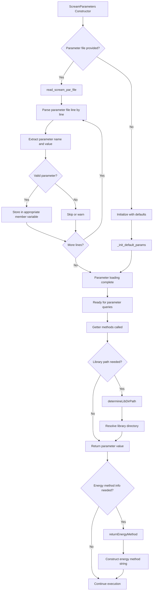

# `scream_ctl_reader.hpp` File Analysis

## File Purpose and Primary Role

The `scream_ctl_reader.hpp` file defines the `ScreamParameters` class, which serves as the central configuration management system for the SCREAM molecular modeling software. This class is responsible for storing, parsing, and providing access to all runtime parameters that control SCREAM's behavior, including energy calculation methods, rotamer placement strategies, library paths, design parameters, and various algorithmic options. It acts as a comprehensive parameter container that bridges user-specified control files with the internal SCREAM algorithms.

## Key Classes, Structs, and Functions (if any)

### `ScreamParameters` Class

- **Purpose**: Central repository for all SCREAM configuration parameters
- **Key Responsibilities**:
  - Parse SCREAM parameter (.par) files via `read_scream_par_file(string)`
  - Store configuration for energy calculations, rotamer placement, and protein design
  - Provide getter methods for all parameters (40+ getter functions)
  - Handle library path resolution and energy method determination
  - Manage binding site mode parameters and design position specifications

### Key Public Methods

- **`read_scream_par_file(string)`**: Parses the main parameter file
- **`print_to_output(ostream*)`**: Outputs current parameter settings
- **`determineLibDirPath()`**: Resolves rotamer library directory paths
- **`returnEnergyMethod()`**: Returns string describing the energy calculation method
- **Multiple getter functions**: Provide access to specific parameter values

## Inputs

### Data Structures/Objects

- **`MutInfo`**: Custom object type for storing mutation information (from `MutInfo.hpp`)
- **`std::string`**: Parameter file path for constructor
- **`std::vector<string>`**: Lists of residues, library info, and design specifications
- **Primitive types**: `double`, `int` for numerical parameters

### File-Based Inputs

- **SCREAM Parameter File (.par)**: Main configuration file containing all runtime parameters
- **Force Field Parameter Files**:
  - `OneEnergyFFParFile`: Force field parameters for energy calculations
  - `DeltaParFile`: Delta atom parameters
  - `EachAtomDeltaFile`: Per-atom delta parameters with surface area data
- **Polar Optimization Exclusions File**: List of residues excluded from polar optimization
- **Rotamer Library Files**: Referenced through `Library` and `LibPath` parameters

### Environment Variables

- Not directly used in this header, but library path resolution may depend on system paths

### Parameters/Configuration

- **Energy Calculation**: Delta method type, LJ potential options (12-6, 11-6, etc.), dielectric values
- **Rotamer Placement**: Placement method, CB atom creation parameters, clash cutoffs
- **Library Settings**: Library name, resolution, path specifications
- **Design Parameters**: Design positions, amino acid class definitions, sequence output options
- **Binding Site Mode**: Distance definitions, fixed residues, target atoms/residues/chains

## Outputs

### Data Structures/Objects

- **Configured `ScreamParameters` object**: Fully populated parameter container
- **`std::vector` collections**: Lists of design positions, amino acid classes, residue specifications
- **Processed parameter values**: Resolved library paths, energy method strings

### File-Based Outputs

- **Via `print_to_output()`**: Parameter summary to specified output stream
- **Sequence files**: When `JustOutputSequence` is enabled

### Console Output (stdout/stderr)

- Parameter validation messages and warnings (implementation-dependent)
- Configuration summary output through `print_to_output()`

### Side Effects

- Modifies internal parameter storage during file parsing
- No apparent global state modifications

## External Code Dependencies

### Standard C++ Library

- **`<string>`**: String handling for parameter values and file paths
- **`<vector>`**: Container for lists of parameters and specifications
- **`<iostream>`**: Input/output operations (implied by `ostream*` usage)

### Internal SCREAM Project Headers

- **`"MutInfo.hpp"`**: Mutation information data structure

### External Compiled Libraries

- None identified - uses only standard C++ library components

## Core Logic/Algorithm Flowchart (Mermaid JS Format)

## Potential Areas for Modernization/Refactoring in SCREAM++

### 1. **Replace Raw Pointers with Smart Pointers**

The current code uses raw pointers (e.g., `ostream*` in `print_to_output`) which could lead to memory management issues. Modern C++ should use `std::unique_ptr`, `std::shared_ptr`, or references where appropriate.

### 2. **Implement RAII and Exception Safety**

The current parameter parsing likely uses C-style error handling. Modern C++ should use exceptions for error conditions and RAII principles for resource management. The `read_scream_par_file` method should throw meaningful exceptions for invalid files or parameters.

### 3. **Use Modern C++ Configuration Patterns**

The current design with 40+ individual getter methods could be replaced with:

- Template-based parameter access using `std::variant` or similar
- Configuration builder pattern with method chaining
- JSON/YAML configuration files with modern parsing libraries
- Type-safe parameter access using `std::optional` for optional parameters
- Validation framework to ensure parameter consistency and ranges

The excessive number of string-based boolean parameters (`"YES"/"NO"`) should be replaced with actual `bool` types or enums for better type safety.
