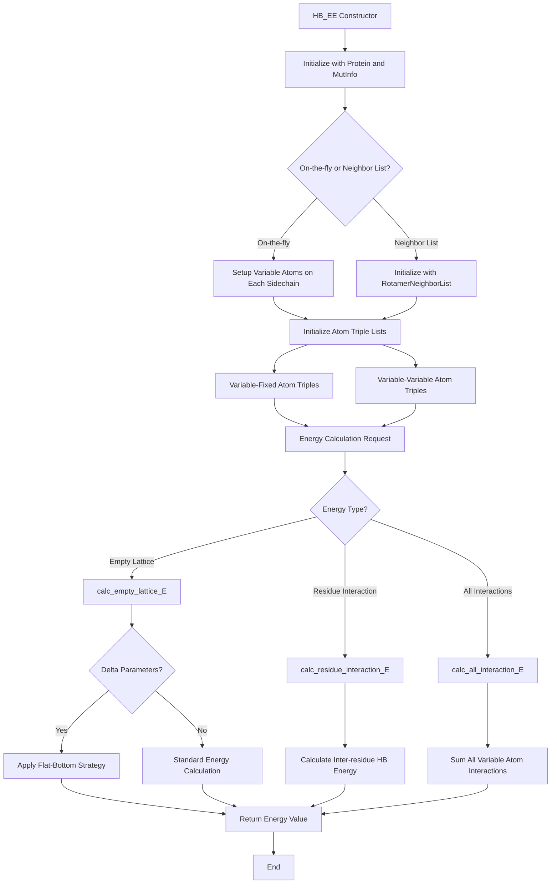

# `scream_hb_EE.hpp` File Analysis

## File Purpose and Primary Role

The `HB_EE` (Hydrogen Bond Energy Evaluator) class is responsible for calculating hydrogen bonding energies in the SCREAM molecular modeling software. This class specifically handles electrostatic interactions and hydrogen bonding energies between protein atoms, particularly focusing on side-chain interactions during rotamer optimization. It supports both fixed-backbone scenarios and variable side-chain conformations, implementing the flat-bottom energy strategy described in the associated research paper for improved accuracy in protein side-chain placements.

## Key Classes, Structs, and Functions (if any)

### Primary Class: `HB_EE`

- **Purpose**: Main class for hydrogen bond and electrostatic energy calculations
- **Key Responsibilities**:
  - Calculate empty lattice energies for individual residues
  - Compute inter-residue interaction energies
  - Handle both on-the-fly and neighbor-list-based energy evaluations
  - Manage atom triple lists for hydrogen bonding calculations

### Key Public Methods:

- **Constructors**: Default constructor and parameterized constructor with `Protein*`, `vector<MutInfo>`, and `SCREAM_HB_OBJ*`
- **`calc_empty_lattice_E()`**: Calculates the energy of a residue in isolation
- **`calc_empty_lattice_E_delta()`**: Calculates energy changes with delta parameters (flat-bottom strategy)
- **`calc_residue_interaction_E()`**: Computes interaction energies between residues
- **`calc_all_interaction_E()`**: Calculates total interaction energy between all variable atoms
- **Energy component methods**: `calc_EL_rot_selfBB()`, `calc_EL_rot_otherBB()`, etc. for specific energy components

### Key Private Methods:

- **`_initVariableAndFixedAtomTripleList()`**: Initializes atom triples for hydrogen bonding calculations
- **`_calc_empty_lattice_E_on_the_fly_loop()`**: On-the-fly energy calculation loops
- **`_figureOutHBPotentialMethods()`**: Helper for determining hydrogen bonding potential methods

## Inputs

### Data Structures/Objects:

- **`Protein*`**: Main protein structure containing atomic coordinates and connectivity
- **`vector<MutInfo>`**: Information about mutable residues/rotamers to be optimized
- **`SCREAM_HB_OBJ*`**: Hydrogen bonding parameter and functional object
- **`RotamerNeighborList*`**: Optional neighbor list for efficient energy calculations
- **`RotConnInfo*`**: Rotamer connection information for specific residues

### File-Based Inputs:

Based on the dependencies, this file likely relies on:

- **Parameter files**: Read through `SCREAM_HB_OBJ` (likely `.par` files for hydrogen bonding parameters)
- **Topology files**: Protein structure information (likely `.rtf` or similar topology files)
- **Energy functional definitions**: Through `scream_E_functionals_hb.hpp`

### Environment Variables:

Not directly evident from this header file, but likely inherits environment variable dependencies from included headers like `defs.hpp`.

### Parameters/Configuration:

- **Flat-bottom delta parameters**: Used in `calc_empty_lattice_E_delta()` and related methods
- **Energy calculation modes**: String parameters like "FLAT" for specifying calculation methods
- **On-the-fly vs. neighbor list modes**: Controlled by `ON_THE_FLY` private variable

## Outputs

### Data Structures/Objects:

- **`double`**: Energy values returned by various calculation methods
- **Modified internal maps**: Updates to `mutInfo_rotConnInfo_map`, `_variable_atoms_on_each_sidechain`
- **Atom triple vectors**: Populated `variable_and_fixed` and `variable_and_variable` structures

### File-Based Outputs:

No direct file output evident from this header file.

### Console Output (stdout/stderr):

Not explicitly shown in header file, but likely includes energy calculation results and debugging information.

### Side Effects:

- **Modifies protein atom states**: Through energy calculations that may update coordinates or energies
- **Updates internal caching structures**: Various maps and vectors for efficient repeated calculations
- **Memory management**: Handles pointers to rotamer and atom data structures

## External Code Dependencies (Libraries/Headers)

### Standard C++ Library:

- **`<vector>`**: For dynamic arrays of objects
- **`<map>`**: For associative containers storing atom and residue information
- **`<string>`**: For parameter and method specification

### Internal SCREAM Project Headers:

- **`defs.hpp`**: Core definitions and typedefs
- **`MutInfo.hpp`**: Mutable residue information structures
- **`scream_E_functionals_hb.hpp`**: Hydrogen bonding energy functional implementations
- **`sc_Protein.hpp`**: Main protein class and atom structures
- **`RotamerNeighborList.hpp`**: Neighbor list optimization for rotamer calculations

### External Compiled Libraries:

None evident from this header file - appears to use only standard C++ and internal SCREAM components.

## Core Logic/Algorithm Flowchart (Mermaid JS Format)

## Potential Areas for Modernization/Refactoring in SCREAM++

### 1. **Smart Pointer Management**

The current code uses raw pointers extensively (`Protein*`, `SCREAM_HB_OBJ*`, `RotConnInfo*`). Modern C++ should employ smart pointers (`std::unique_ptr`, `std::shared_ptr`) to ensure automatic memory management and prevent memory leaks. This is particularly important for the complex object relationships in molecular modeling.

### 2. **Type Safety and Modern Container Usage**

Replace C-style arrays and custom vector types with modern STL containers and consider using `std::array` for fixed-size collections. The extensive use of `map<MutInfo, ...>` structures could benefit from `std::unordered_map` for better performance, and the use of structured bindings (C++17) would improve code readability in map iterations.

### 3. **API Design and Error Handling**

The current API relies heavily on default parameters and string-based method selection (e.g., "FLAT" mode specification). A more modern approach would use strongly-typed enums for method selection, RAII principles for resource management, and comprehensive exception handling rather than relying on implicit error states. The initialization process could be simplified using builder patterns or designated initializers to reduce the complexity of the multi-step setup process.
