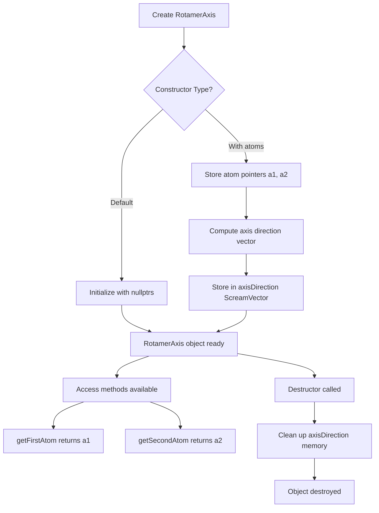

# `scream_helper_classes.hpp` File Analysis

## File Purpose and Primary Role

This header file defines helper classes for the SCREAM molecular modeling software, specifically focused on rotamer manipulation. Currently, it contains only the `RotamerAxis` class, which represents a rotational axis defined by two atoms. This class is likely used in protein side-chain placement algorithms to define and manage rotational degrees of freedom (chi angles) around specific bonds in amino acid side chains.

## Key Classes, Structs, and Functions (if any)

### RotamerAxis Class

- **Purpose**: Represents a rotational axis defined by two atoms, typically used for defining rotamer angles in protein side chains
- **Key Members**:
  - `a1, a2`: Pointers to the two atoms that define the rotational axis
  - `axisDirection`: A ScreamVector pointer that likely stores the normalized direction vector of the rotation axis
- **Key Methods**:
  - Default constructor and parameterized constructor taking two `SCREAM_ATOM*` pointers
  - Destructor for cleanup
  - `getFirstAtom()` and `getSecondAtom()`: Accessor methods returning const pointers to the defining atoms

## Inputs

### Data Structures/Objects

- **`SCREAM_ATOM*`**: Two atom pointers that define the rotational axis (typically backbone atoms like N-CA or CA-CB bonds)
- The constructor takes these atoms as input parameters

### File-Based Inputs

- This header file does not directly read from any external data files
- Input data would come through the `SCREAM_ATOM` objects passed to the constructor

### Environment Variables

- No direct usage of environment variables is evident from this header file

### Parameters/Configuration

- No explicit configuration parameters are defined in this header
- Behavior would be determined by the properties of the input atoms

## Outputs

### Data Structures/Objects

- **`RotamerAxis` objects**: Instances that encapsulate a rotational axis definition
- **`SCREAM_ATOM* const`**: Const pointers to the defining atoms via getter methods
- **`ScreamVector*`**: Direction vector of the axis (private member, likely computed internally)

### File-Based Outputs

- This header file does not directly write to any output files

### Console Output (stdout/stderr)

- No console output operations are defined in this header file

### Side Effects

- The class manages memory for the `axisDirection` ScreamVector pointer
- Potential modification of internal state through constructor and destructor

## External Code Dependencies (Libraries/Headers)

### Standard C++ Library

- **`<vector>`**: Included for STL vector usage
- Note: Uses `using namespace std;` which is generally discouraged in headers

### Internal SCREAM Project Headers

- **`scream_atom.hpp`**: Defines the `SCREAM_ATOM` class used for the axis endpoints
- **`scream_vector.hpp`**: Defines the `ScreamVector` class used for axis direction

### External Compiled Libraries

- No external compiled libraries are referenced in this header file

## Core Logic/Algorithm Flowchart (Mermaid JS Format)

## Potential Areas for Modernization/Refactoring in SCREAM++

### 1. Smart Pointer Usage

- Replace raw pointers (`SCREAM_ATOM *a1, *a2` and `ScreamVector* axisDirection`) with smart pointers like `std::shared_ptr` or `std::unique_ptr`
- This would eliminate manual memory management and reduce risk of memory leaks
- The current design requires careful destructor implementation to avoid memory leaks

### 2. Modern C++ Initialization and Const-Correctness

- Use member initializer lists in constructors instead of assignment
- Consider making the atom pointers `const` members since they define the axis identity
- Replace C-style member initialization with modern brace initialization
- Remove `using namespace std;` from header and use explicit `std::` prefixes

### 3. Enhanced API Design and Resource Management

- Implement copy constructor and assignment operator (Rule of Three/Five) or explicitly delete them
- Consider using RAII principles more thoroughly
- Add validation in constructor to ensure non-null atom pointers
- Consider returning references instead of pointers in getter methods where appropriate
- Add move semantics for better performance with C++11+ features
