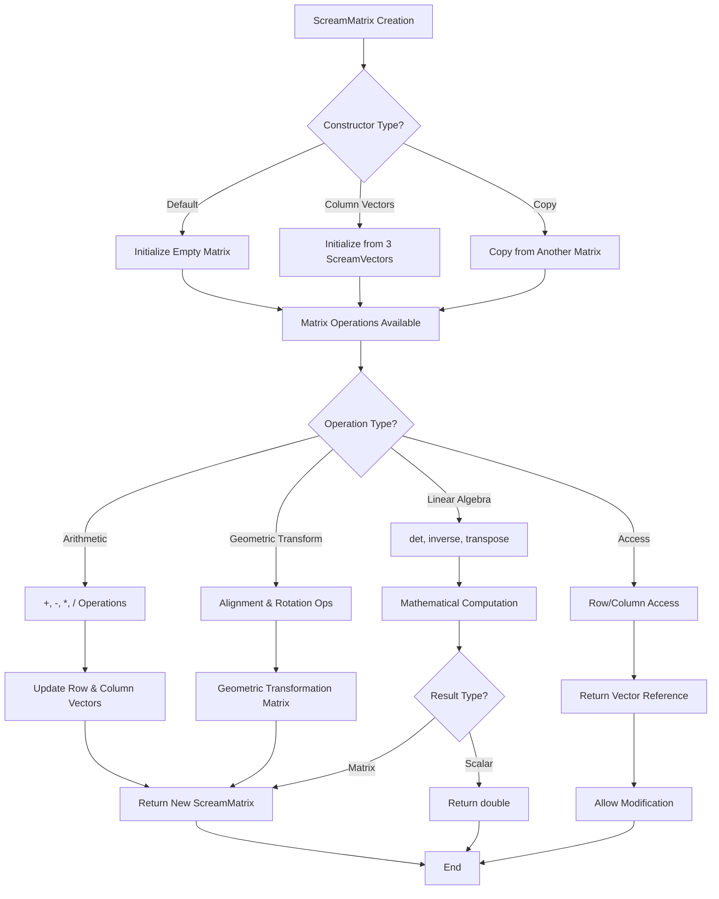

# `scream_matrix.hpp` File Analysis

## File Purpose and Primary Role

The `scream_matrix.hpp` file defines the `ScreamMatrix` class, which provides 3D matrix operations specifically designed for the SCREAM molecular modeling software. This class serves as a fundamental mathematical component for handling 3x3 matrix operations commonly used in backbone matching and molecular transformations. The class is designed to work closely with the `ScreamVector` class and provides essential linear algebra operations including matrix multiplication, determinant calculation, matrix inversion, and specialized rotation/alignment operations for molecular coordinate transformations.

## Key Classes, Structs, and Functions (if any)

### ScreamMatrix Class

- **Purpose**: Core 3x3 matrix class for molecular modeling operations
- **Key Features**:
  - Basic arithmetic operations (addition, subtraction, scalar multiplication/division)
  - Matrix-vector and matrix-matrix multiplication
  - Linear algebra operations (determinant, inverse, transpose)
  - Specialized molecular geometry operations (vector alignment, rotations)

### Key Member Functions:

- **Constructors**: Default, column vector initialization, copy constructor
- **Operators**: `[]` (row access), `+`, `-`, `*`, `/`, `=`
- **Linear Algebra**: `det()`, `inverse()`, `transpose()`
- **Molecular Geometry**: `alignTwoVectors()`, `alignWithZ()`, `rotAboutZ()`, `rotAboutV()`
- **Utility**: `getCol()`, `printMe()`

## Inputs

### Data Structures/Objects:

- **ScreamVector objects**: Used in constructors, operators, and geometric transformation methods
- **ScreamMatrix objects**: For copy operations and matrix arithmetic
- **double values**: For scalar operations and rotation angles
- **int values**: For indexing operations (row/column access)

### File-Based Inputs:

- **None directly**: This header file does not perform any direct file I/O operations

### Environment Variables:

- **None identified**: No direct environment variable dependencies are present in this header

### Parameters/Configuration:

- **Rotation angles**: Double precision values for rotation operations
- **Vector coordinates**: 3D coordinates from ScreamVector objects for alignment and transformation operations

## Outputs

### Data Structures/Objects:

- **ScreamMatrix objects**: Returned by arithmetic operations, inverse, transpose, and rotation methods
- **ScreamVector objects**: Returned by matrix-vector multiplication and column/row access
- **double values**: Returned by determinant calculation
- **ScreamMatrix& references**: For operator[] and assignment operations

### File-Based Outputs:

- **None directly**: No direct file output operations in this header

### Console Output (stdout/stderr):

- **Debug/Display output**: `printMe()` method suggests console output capability for matrix display

### Side Effects:

- **Member variable updates**: Operations update both `rowVectors` and `colVectors` internal representations
- **Reference returns**: `operator[]` and `getCol()` return references that could modify internal state

## External Code Dependencies (Libraries/Headers)

### Standard C++ Library:

- **`<iostream>`**: For input/output operations (likely used in `printMe()`)

### Internal SCREAM Project Headers:

- **`scream_vector.hpp`**: Required dependency for ScreamVector class integration

### External Compiled Libraries:

- **None identified**: No third-party library dependencies are present

## Core Logic/Algorithm Flowchart (Mermaid JS Format)

## Potential Areas for Modernization/Refactoring in SCREAM++

### 1. Memory Management and RAII

**Current Issue**: The class uses raw pointers (`ScreamVector* rowVectors`, `ScreamVector* colVectors`) which requires manual memory management and increases risk of memory leaks.
**Modernization**: Replace with `std::array<ScreamVector, 3>` or `std::vector<ScreamVector>` for automatic memory management and exception safety.

### 2. Standard Library Integration

**Current Issue**: Custom matrix implementation instead of leveraging established linear algebra libraries.
**Modernization**: Consider integration with Eigen library or at minimum, use STL containers and algorithms. Implement proper iterators and make the class compatible with STL algorithms.

### 3. API Design and const-correctness

**Current Issue**: Some methods like `alignTwoVectors()` and rotation methods are not marked as `const` despite not modifying the object state, and the return of non-const references in `operator[]` could lead to unintended modifications.
**Modernization**: Improve const-correctness, consider returning `std::optional` for operations that might fail (like inverse of singular matrices), and implement proper move semantics for better performance with C++11+ features.
