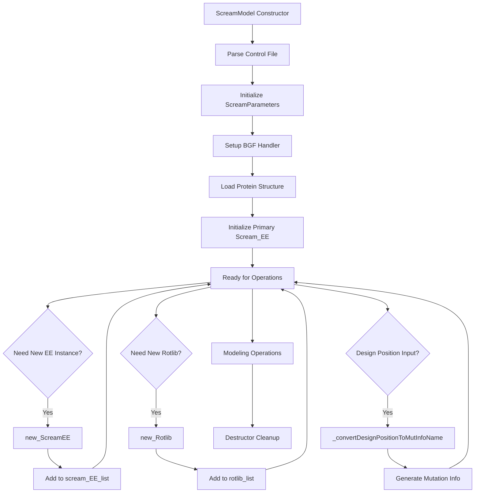

# `scream_model.hpp` File Analysis

## File Purpose and Primary Role

The `ScreamModel` class serves as the central orchestrator and factory for the SCREAM molecular modeling system. It acts as the main entry point that coordinates multiple subsystems including protein structures, energy evaluation engines, rotamer libraries, and BGF file handling. This class appears to implement a factory pattern for creating and managing multiple `Scream_EE` (Energy Evaluation) instances and rotamer libraries, suggesting it's designed to handle complex multi-component molecular modeling scenarios.

## Key Classes, Structs, and Functions (if any)

### Primary Class: `ScreamModel`

- **Constructor**: `ScreamModel(std::string)` - Takes a scream control file path for initialization
- **Destructor**: `~ScreamModel()` - Handles cleanup of dynamically allocated resources
- **Factory Methods**:
  - `new_ScreamEE()` - Creates and manages new energy evaluation instances
  - `new_Rotlib()` - Creates and manages new rotamer library instances
- **Member Objects**:
  - `ScreamParameters scream_parameters` - Configuration and parameter storage
  - `bgf_handler HANDLER` - BGF file format handler
  - `Protein ptn` - Main protein structure representation
  - `Scream_EE scream_EE` - Primary energy evaluation engine
- **Container Management**:
  - `vector<Scream_EE*> scream_EE_list` - Collection of energy evaluation instances
  - `vector<Rotlib*> rotlib_list` - Collection of rotamer library instances

### Private Helper Methods

- `_initScreamEE()` - Incomplete initialization method for energy evaluation setup
- `_convertDesignPositionToMutInfoName(string)` - Converts design position notation (e.g., "A32") to mutation information format (e.g., "A32_A")

## Inputs

### Data Structures/Objects

- **Primary Input**: `std::string` - Path to scream control file (.ctl format)
- **Design Position Strings**: Format like "A32" (chain A, position 32) for mutation specification
- **Indirect Inputs**: The class likely receives protein structure data, force field parameters, and rotamer library data through its member objects during initialization

### File-Based Inputs

- **Scream Control File (.ctl)**: Primary configuration file specified in constructor - contains modeling parameters, file paths, and execution directives
- **BGF Files**: Protein structure files handled by the `bgf_handler` component
- **Rotamer Library Files**: Accessed through `Rotlib` instances for side-chain conformations
- **Force Field Parameters**: Likely accessed through `Scream_EE` for energy calculations

### Environment Variables

- Cannot be determined from this header file alone - likely handled in implementation or dependent classes

### Parameters/Configuration

- **ScreamParameters**: Centralized configuration object containing modeling parameters
- **Design Positions**: Specification of which residue positions are mutable
- **Energy Evaluation Settings**: Parameters controlling the flat-bottom energy strategy
- **Rotamer Library Selection**: Configuration for which rotamer sets to use

## Outputs

### Data Structures/Objects

- **Scream_EE Instances**: Multiple energy evaluation engines for different modeling scenarios
- **Rotlib Instances**: Multiple rotamer library objects for conformational sampling
- **Modified Protein Structures**: Updated protein conformations after side-chain placement
- **Mutation Information**: Formatted strings for mutation specification

### File-Based Outputs

- Cannot be determined from this header file - likely handled by member objects for structure output and results logging

### Console Output (stdout/stderr)

- Cannot be determined from this header file - likely includes progress reporting, energy values, and error messages

### Side Effects

- **Memory Management**: Creates and manages multiple dynamically allocated objects
- **Global State**: Modifies protein structure and energy evaluation state
- **Resource Allocation**: Manages collections of energy evaluators and rotamer libraries

## External Code Dependencies (Libraries/Headers)

### Standard C++ Library

- `<string>` - String manipulation and file path handling
- `<vector>` - Dynamic array containers for object collections
- `using namespace std` - Standard namespace usage (not recommended in modern C++)

### Internal SCREAM Project Headers

- `"sc_Protein.hpp"` - Protein structure representation and manipulation
- `"scream_EE.hpp"` - Energy evaluation engine for molecular interactions
- `"Rotlib.hpp"` - Rotamer library handling for side-chain conformations
- `"scream_ctl_reader.hpp"` - Control file parsing and parameter management
- `"sc_bgf_handler.hpp"` - BGF file format input/output operations

### External Compiled Libraries

- None apparent from this header file - SCREAM appears to be self-contained

## Core Logic/Algorithm Flowchart (Mermaid JS Format)

## Potential Areas for Modernization/Refactoring in SCREAM++

### 1. **Memory Management and Smart Pointers**

The current design uses raw pointers in `vector<Scream_EE*>` and `vector<Rotlib*>`, requiring manual memory management. Modern C++ should employ:

- `std::vector<std::unique_ptr<Scream_EE>>` for automatic memory management
- `std::shared_ptr` if shared ownership is needed
- RAII principles to eliminate potential memory leaks

### 2. **Factory Pattern Modernization**

The factory methods `new_ScreamEE()` and `new_Rotlib()` could be enhanced with:

- Template-based factory functions for type safety
- `std::make_unique` or `std::make_shared` for consistent object creation
- Builder pattern for complex object initialization with multiple parameters
- Factory registration system for extensibility

### 3. **Interface Design and Const-Correctness**

Current design lacks modern C++ best practices:

- Remove `using namespace std` and use explicit `std::` prefixes
- Add const-correctness to methods that don't modify state
- Implement move semantics for efficient object transfers
- Use `string_view` for read-only string parameters instead of `std::string`
- Consider abstract interfaces for `Scream_EE` and `Rotlib` to enable polymorphism and testing
