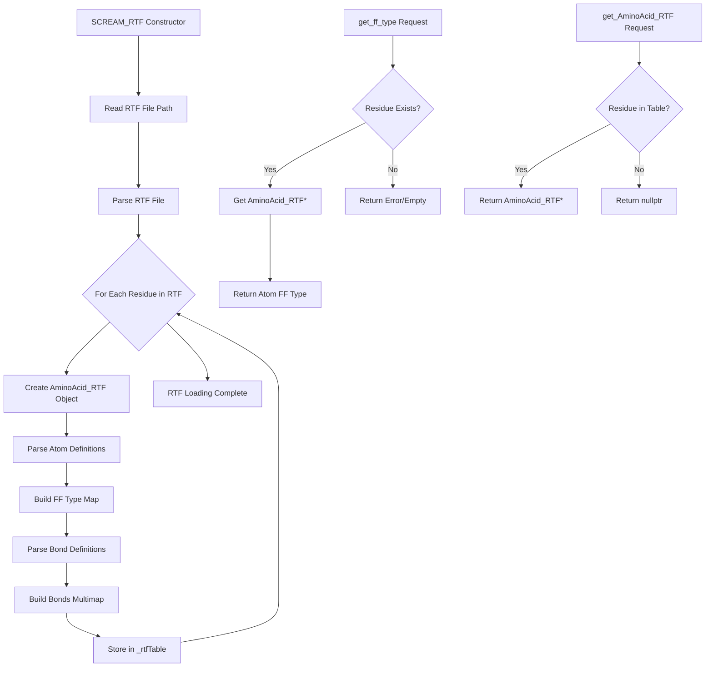

# `scream_rtf.hpp` File Analysis

## File Purpose and Primary Role

This file defines classes for parsing and managing CHARMM RTF (Residue Topology File) data within the SCREAM molecular modeling software. The primary responsibility is to read RTF files containing amino acid residue definitions and provide access to forcefield atom types and bonding information for protein side-chain placement calculations. RTF files are standard CHARMM format files that define the topology (atom types, bonds, angles, etc.) of molecular residues.

## Key Classes, Structs, and Functions (if any)

### `AminoAcid_RTF` Class

- **Purpose**: Represents a single amino acid residue's topology information from an RTF file
- **Key Functionality**:
  - Stores forcefield atom types for each atom in the residue
  - Maintains bond connectivity information between atoms
  - Provides access to atom type mappings via `get_ff_type()`

### `SCREAM_RTF` Class

- **Purpose**: Main container and manager for all amino acid RTF data
- **Key Functionality**:
  - Reads and parses RTF files containing multiple residue definitions
  - Provides lookup access to individual `AminoAcid_RTF` objects by residue name
  - Acts as a centralized repository for all topology information

## Inputs

### Data Structures/Objects

- **`stringV&`**: Custom string vector type passed to `AminoAcid_RTF` constructor for initialization
- **`string`**: Residue names and atom labels for lookup operations
- **RTF file path**: String path to CHARMM RTF file for parsing

### File-Based Inputs

- **RTF Files (.rtf)**: CHARMM format residue topology files containing:
  - Atom definitions with forcefield types
  - Bond connectivity between atoms
  - Residue-specific topology information
  - Standard amino acid residue definitions

### Environment Variables

- Not directly evident from this header file - likely handled by calling code

### Parameters/Configuration

- **Residue names**: Standard amino acid three-letter codes (e.g., "ALA", "GLY", "VAL")
- **Atom labels**: PDB-style atom names within residues (e.g., "CA", "CB", "N", "C")

## Outputs

### Data Structures/Objects

- **`AminoAcid_RTF*`**: Pointers to amino acid topology objects
- **`string`**: Forcefield atom types for specific atoms
- **`multimap<string, string>`**: Bond connectivity tables with atom label pairs
- **`map<string, string>`**: Atom label to forcefield type mappings

### File-Based Outputs

- No direct file output evident from this header

### Console Output (stdout/stderr)

- No direct console output evident from this header

### Side Effects

- Manages dynamic memory allocation for `AminoAcid_RTF` objects in the `_rtfTable` map

## External Code Dependencies (Libraries/Headers)

### Standard C++ Library

- **`<map>`**: For storing residue tables and atom type mappings
- **`<string>`**: String handling (implied from usage)

### Internal SCREAM Project Headers

- **`"defs.hpp"`**: Contains custom type definitions including `stringV` (likely a custom string vector type)

### External Compiled Libraries

- None evident from this header file

## Core Logic/Algorithm Flowchart (Mermaid JS Format)

## Potential Areas for Modernization/Refactoring in SCREAM++

### 1. **Smart Pointer Usage**

Replace raw pointers (`AminoAcid_RTF*`) with `std::unique_ptr<AminoAcid_RTF>` or `std::shared_ptr<AminoAcid_RTF>` to ensure automatic memory management and prevent memory leaks. The current design requires manual memory management in the destructor.

### 2. **Modern Container and Error Handling**

- Replace custom `stringV` type with standard `std::vector<std::string>`
- Add proper error handling with exceptions or `std::optional` return types instead of returning raw pointers that could be `nullptr`
- Consider using `std::unordered_map` instead of `std::map` for potentially better lookup performance

### 3. **API Design and Const-Correctness**

- Make getter methods consistently `const` (some are missing const qualification)
- Use `std::string_view` for string parameters to avoid unnecessary copying
- Consider returning const references instead of copies where appropriate for better performance
- Add move semantics support for construction and assignment operations
