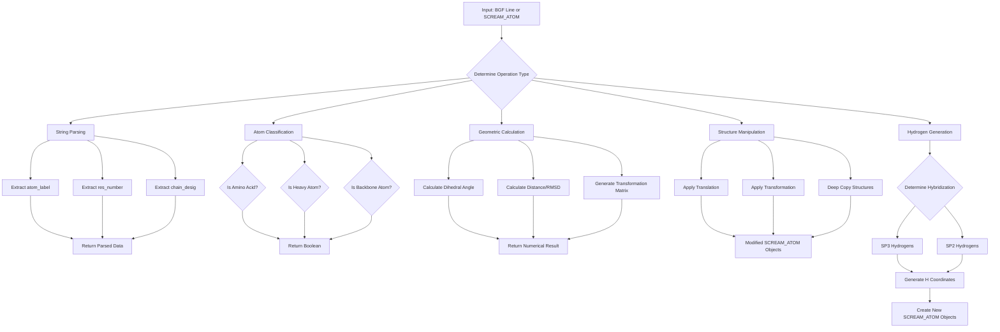

# `scream_tools.hpp` File Analysis

## File Purpose and Primary Role

The `scream_tools.hpp` file serves as a comprehensive utility library for the SCREAM molecular modeling software. It provides a collection of helper functions organized within the `scream_tools` namespace that handle various molecular structure operations including:

- Parsing and processing BGF (Biograf) file format data
- Atom and residue type identification and classification
- Geometric calculations (dihedral angles, transformations, distances)
- Protein structure manipulation (translations, rotations, hydrogen generation)
- String processing and data conversion utilities
- Memory management for SCREAM_ATOM objects

This is essentially the "Swiss Army knife" of the SCREAM project, containing low-level utility functions used throughout the codebase.

## Key Classes, Structs, and Functions (if any)

### **Exception Class:**

- **`AtomNotFoundException`**: A custom exception class for handling cases where expected atoms cannot be found, containing a `what` string member for error description.

### **Key Function Categories:**

#### **String/Data Parsing Functions:**

- `atom_label()`, `res_number()`, `res_type()`, `chain_desig()`: Extract specific information from BGF file lines
- `strip_whitespace()`, `split()`: String manipulation utilities
- `char_double_star_to_str_of_vector()`, `mut_list_string_to_str_of_vector()`: Data conversion utilities

#### **File Format Recognition Functions:**

- `is_bgf_header_line()`, `is_bgf_atom_line()`, `is_format_connect_line()`, `is_connectivity_info()`: BGF file parsing helpers

#### **Atom/Residue Classification Functions:**

- `is_AA()`, `is_natural_AA()`: Amino acid identification
- `is_metal_atom()`, `is_SC_atom()`, `is_BB_atom()`, `is_heavy_atom()`: Atom type classification
- `is_N_term_hydrogen()`, `is_C_term_atom()`, `is_HCA_atom()`: Specific atom identification

#### **Geometric Calculation Functions:**

- `calc_dihedral()`: Calculates dihedral angles (overloaded for ScreamVector and SCREAM_ATOM inputs)
- `distance()`: CRMS distance calculations
- `getTransformationPairFromAtoms()`: Calculates transformation matrices for atom alignment

#### **Structural Manipulation Functions:**

- `translation()`: Translates atom positions (overloaded for single atoms, vectors, and multimaps)
- `calc_new_HN_atom_coords()`: Calculates coordinates for new hydrogen atoms during mutations

#### **Memory Management Functions:**

- `deep_copy_str_SCREAM_ATOM_mm()`, `deep_copy_ScreamAtomV()`: Deep copying utilities for SCREAM_ATOM objects

#### **Hydrogen Generation Functions:**

- `generateHydrogenCoords()`, `createHydrogens()`: Generate hydrogen atom coordinates
- Various specialized hydrogen generation functions for different hybridization states (SP2, SP3)

## Inputs

### **Data Structures/Objects:**

- `SCREAM_ATOM*`: Primary atom objects containing coordinates, connectivity, and properties
- `ScreamAtomV` (vector<SCREAM_ATOM\*>): Collections of atoms
- `ScreamVector`: 3D coordinate vectors
- `ScreamMatrix`: Transformation matrices
- `multimap<string, SCREAM_ATOM*>`: Atom collections indexed by labels
- `map<string, SCREAM_ATOM*>`: Atom mappings
- `map<int, vector<int>>`: Connectivity information
- Standard C++ strings for BGF file lines and various identifiers

### **File-Based Inputs:**

- **BGF (Biograf) files**: The primary input format containing molecular structure data including atom coordinates, connectivity, and residue information
- The file does not directly read files but provides parsing utilities for BGF format lines

### **Environment Variables:**

- No direct environment variable dependencies are evident in this header file

### **Parameters/Configuration:**

- Geometric parameters for hydrogen placement (bond lengths, angles)
- Dihedral angle calculation parameters
- Transformation and alignment tolerances
- Various string matching patterns for atom and residue type identification

## Outputs

### **Data Structures/Objects:**

- Modified `SCREAM_ATOM*` objects with updated coordinates
- New `SCREAM_ATOM*` objects (especially for hydrogen generation)
- `ScreamVector` objects containing calculated coordinates
- `ScreamMatrix` and `ScreamVector` pairs for transformations
- Parsed strings and identifiers from BGF data
- Boolean classification results
- Numerical results (distances, angles)

### **File-Based Outputs:**

- No direct file output functionality in this header file

### **Console Output (stdout/stderr):**

- No explicit console output in the header file, though implementations may include debug output

### **Side Effects:**

- Modifies SCREAM_ATOM coordinates through non-const pointer/reference parameters
- Creates new SCREAM_ATOM objects that require manual memory management
- Updates connectivity information in atom objects
- May throw `AtomNotFoundException` exceptions

## External Code Dependencies (Libraries/Headers)

### **Standard C++ Library:**

- `<math.h>`: Mathematical functions for geometric calculations
- `<vector>`: STL vector containers
- `<map>`: STL map containers for key-value storage
- `<string>`: String manipulation and storage

### **Internal SCREAM Project Headers:**

- `"defs.hpp"`: Project-wide definitions and constants
- `"scream_atom.hpp"`: SCREAM_ATOM class definition
- `"scream_vector.hpp"`: ScreamVector class for 3D coordinates
- `"scream_matrix.hpp"`: ScreamMatrix class for transformations

### **External Compiled Libraries:**

- None identified - SCREAM appears to be self-contained without external library dependencies

## Core Logic/Algorithm Flowchart (Mermaid JS Format)

## Potential Areas for Modernization/Refactoring in SCREAM++

### **1. Memory Management and Smart Pointers**

The extensive use of raw pointers (`SCREAM_ATOM*`) and manual memory management through functions like `deep_copy_str_SCREAM_ATOM_mm()` could be modernized using:

- `std::unique_ptr<SCREAM_ATOM>` or `std::shared_ptr<SCREAM_ATOM>` to prevent memory leaks
- RAII principles to ensure automatic cleanup
- Move semantics for efficient object transfers

### **2. Function Organization and Namespace Design**

The current approach of cramming all utility functions into a single namespace could be improved by:

- Creating separate namespaces or classes for different functional areas (e.g., `scream::geometry`, `scream::parsing`, `scream::hydrogen_generation`)
- Converting related functions into proper classes with member functions
- Using modern C++ features like `constexpr` for compile-time calculations where applicable

### **3. Error Handling and Type Safety**

The current error handling could be modernized with:

- `std::optional<T>` return types instead of throwing exceptions for "not found" cases
- `std::variant` for functions that can return different types
- Stronger type safety using enum classes instead of string-based atom type identification
- More comprehensive error messages and error codes
- Consider using `std::expected` (C++23) for better error propagation
