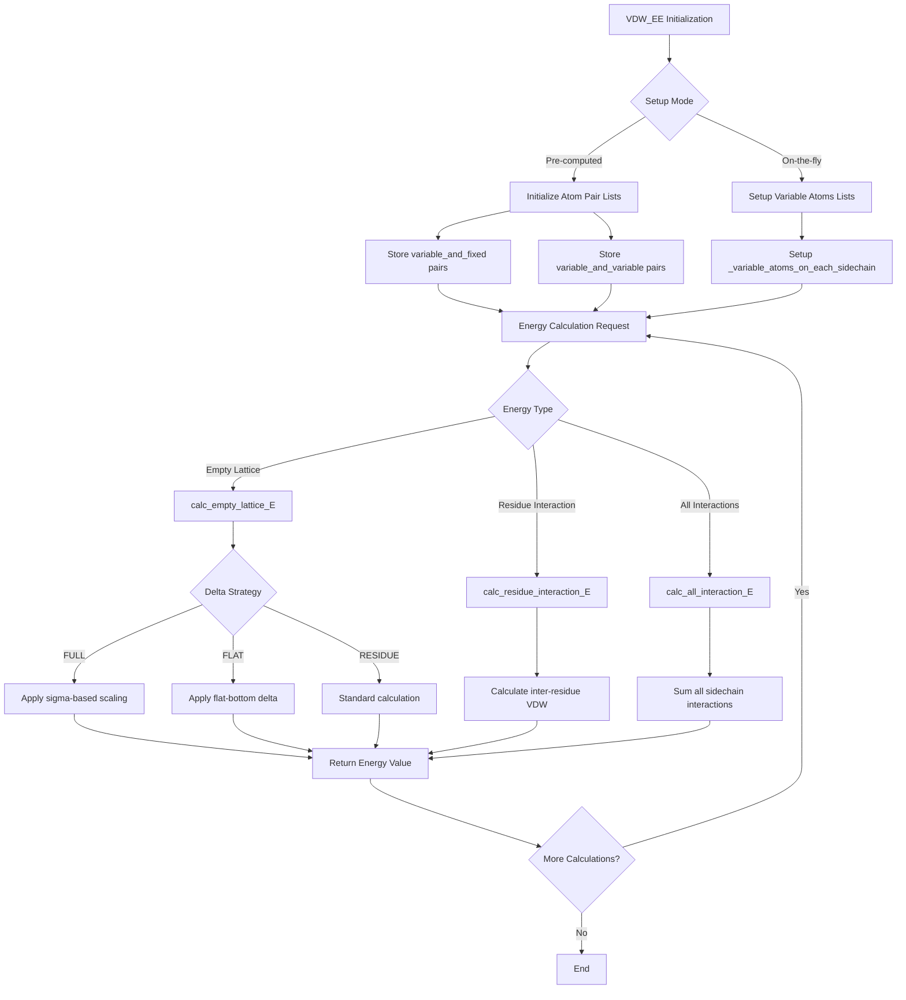

# `scream_vdw_EE.hpp` File Analysis

## File Purpose and Primary Role

This file defines the `VDW_EE` class, which is responsible for calculating van der Waals (VDW) interaction energies in the SCREAM molecular modeling software. The class implements an "excluded energy" approach for VDW calculations, specifically handling excluded VDW interactions such as intra-sidechain VDW contacts and backbone-backbone contacts. It serves as a core energy evaluation component for protein side-chain placement optimization, supporting both pre-computed and on-the-fly energy calculations with various energy functionals and delta strategies (including the flat-bottom approach mentioned in the research paper).

## Key Classes, Structs, and Functions (if any)

### Primary Class:

- **`VDW_EE`**: Main class for VDW energy calculations with exclusions
  - Handles both single residue and inter-residue VDW energy calculations
  - Supports multiple energy calculation modes (FULL, FLAT, RESIDUE)
  - Implements delta energy calculations for flat-bottom strategies
  - Manages atom pair lists and neighbor lists for optimization

### Key Public Methods:

- **Constructors/Initialization**:

  - `VDW_EE()`: Default constructor
  - `VDW_EE(Protein*, vector<MutInfo>, SCREAM_VDW_OBJ*)`: Main constructor
  - Various `init_after_addedMutInfoRotConnInfo*()` methods for SWIG compatibility

- **Energy Calculation Methods**:

  - `calc_empty_lattice_E()`: Calculates single residue energy in empty lattice
  - `calc_empty_lattice_E_delta()`: Delta energy calculations with flat-bottom strategy
  - `calc_residue_interaction_E()`: Inter-residue VDW interaction energies
  - `calc_all_interaction_E()`: Overall interaction energy between all variable atoms

- **Component-Specific Energy Methods**:
  - `calc_EL_rot_selfBB()`: Rotamer-self backbone interactions
  - `calc_EL_rot_otherBB()`: Rotamer-other backbone interactions
  - `calc_EL_rot_fixedSC()`: Rotamer-fixed sidechain interactions
  - `calc_EL_rot_fixedHET()`: Rotamer-fixed heteroatom interactions
  - `calc_EL_rot_moveableHET()`: Rotamer-moveable heteroatom interactions

## Inputs

### Data Structures/Objects:

- **`Protein*`**: Main protein structure containing atomic coordinates and topology
- **`vector<MutInfo>`**: List of mutation/residue information specifying which residues to optimize
- **`SCREAM_VDW_OBJ*`**: VDW potential object containing energy parameters and functionals
- **`RotConnInfo*`**: Rotamer connectivity information for each residue
- **`ClashCollection*`**: Information about rotamer clashes
- **`RotamerNeighborList*`**: Neighbor list data for optimization
- **`ScreamAtomV`**: Custom vector of atoms (fixed_atoms, variable_atoms)
- **`AASideChain*`**: Sidechain objects to be optimized

### File-Based Inputs:

Based on the code structure, this class doesn't directly read files but relies on data passed through its dependencies (`SCREAM_VDW_OBJ*`, `Protein*`, etc.) which likely read:

- VDW parameter files (through `SCREAM_VDW_OBJ`)
- Protein structure files (through `Protein*`)
- Rotamer library files (through `RotConnInfo*`)

### Environment Variables:

Not directly evident from this header file, but likely inherited through dependency classes.

### Parameters/Configuration:

- **Energy calculation modes**: "FULL", "FLAT", "RESIDUE" (string parameters)
- **Delta values**: Double parameters for flat-bottom energy calculations
- **Sigma values**: For FULL mode energy calculations
- **ON_THE_FLY flag**: Controls whether to use pre-computed lists or on-the-fly calculations

## Outputs

### Data Structures/Objects:

- **`double`**: Energy values returned by various calculation methods
- **`map<MutInfo, RotConnInfo*>`**: Mapping of mutation info to rotamer connectivity (via `returnMutInfoRotConnInfoMap()`)
- **Modified internal data structures**: Various private maps and vectors are populated during initialization

### File-Based Outputs:

No direct file output evident from this header file.

### Console Output (stdout/stderr):

Not evident from the header file, but likely includes energy values and debug information through the implementation.

### Side Effects:

- Modifies internal atom lists (`fixed_atoms`, `variable_atoms`)
- Updates private mapping structures (`mutInfo_rotConnInfo_map`, `variable_and_fixed`, etc.)
- May modify clash collection and neighbor list data

## External Code Dependencies (Libraries/Headers)

### Standard C++ Library:

- `<vector>`: For dynamic arrays
- `<map>`: For associative containers
- `<string>`: For string handling

### Internal SCREAM Project Headers:

- **`"scream_E_functionals_vdw.hpp"`**: VDW energy functional definitions
- **`"sc_Protein.hpp"`**: Main protein class
- **`"MutInfo.hpp"`**: Mutation/residue information structures
- **`"RotConnInfo.hpp"`**: Rotamer connectivity information
- **`"ClashCollection.hpp"`**: Clash detection and management
- **`"RotamerNeighborList.hpp"`**: Neighbor list optimization

### External Compiled Libraries:

None evident from this header file.

## Core Logic/Algorithm Flowchart (Mermaid JS Format)

## Potential Areas for Modernization/Refactoring in SCREAM++

1. **Smart Pointer Management**: Replace raw pointers (`Protein*`, `SCREAM_VDW_OBJ*`, `RotConnInfo*`, `ClashCollection*`) with smart pointers (`std::unique_ptr`, `std::shared_ptr`) to improve memory safety and automatic resource management. The current code relies heavily on manual pointer management which is error-prone.

2. **Modern Container and Algorithm Usage**: Replace custom map structures and manual loops with modern C++ algorithms and containers. For example, use `std::unordered_map` for better performance where appropriate, and leverage STL algorithms (`std::for_each`, `std::transform`) for cleaner, more maintainable code in energy calculation loops.

3. **Type Safety and API Design**: Implement stronger type safety by replacing string-based mode parameters ("FULL", "FLAT", "RESIDUE") with enum classes, and consolidate the multiple similar methods (e.g., various `init_after_addedMutInfoRotConnInfo*` methods) into a more cohesive, parameterized API that reduces code duplication and improves maintainability.
