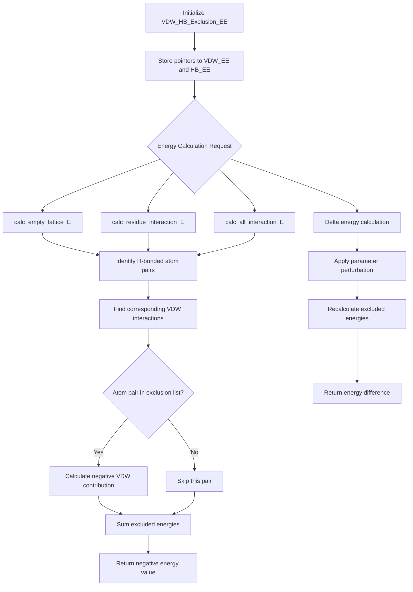

# `scream_vdw_hb_exclusion_EE.hpp` File Analysis

## File Purpose and Primary Role

This file defines the `VDW_HB_Exclusion_EE` class, which is responsible for handling Van der Waals (VDW) energy exclusions that occur when hydrogen bonds are formed between atoms. In molecular modeling, when a hydrogen bond is present between two atoms, the VDW interaction between those same atoms should be excluded or reduced to avoid double-counting energetic contributions. This class appears to calculate the negative contribution of VDW energy that should be subtracted from the total energy when hydrogen bonds are present, ensuring accurate energy calculations in the SCREAM protein side-chain placement algorithm.

## Key Classes, Structs, and Functions (if any)

### Classes:

- **`VDW_HB_Exclusion_EE`**: The main class that manages VDW energy exclusions due to hydrogen bonding
  - **Constructor**: Default constructor and parameterized constructor taking pointers to `VDW_EE` and `HB_EE` objects
  - **Destructor**: Cleanup for the class
  - **`calc_empty_lattice_E`**: Calculates the negative VDW energy contribution that should be excluded due to hydrogen bonding for a given mutation
  - **`calc_empty_lattice_E_delta`**: Calculates the change in excluded VDW energy for a specific delta parameter modification
  - **`calc_residue_interaction_E`**: Calculates excluded VDW energy for residue-residue interactions (single residue and pairwise versions)
  - **`calc_all_interaction_E`**: Calculates total excluded VDW energy for all interactions
  - **`calc_all_interaction_E_delta`**: Calculates change in total excluded VDW energy for delta parameter modifications
  - **`find_atompair_in_list`**: Private utility function to search for specific atom pairs in a list

## Inputs

### Data Structures/Objects:

- **`VDW_EE*`**: Pointer to Van der Waals energy evaluator object
- **`HB_EE*`**: Pointer to Hydrogen bond energy evaluator object
- **`MutInfo`**: Mutation information objects containing details about protein modifications
- **`AtomPair`**: Atom pair objects for tracking specific atomic interactions
- **`vector<AtomPair>`**: Collections of atom pairs for exclusion list management
- **`string`**: Parameter names for delta energy calculations
- **`double`**: Delta parameter values for energy perturbations

### File-Based Inputs:

This header file does not directly indicate file-based inputs, but the underlying `VDW_EE` and `HB_EE` objects likely read from parameter files such as `.par` files for VDW parameters and hydrogen bonding parameters.

### Environment Variables:

Not directly evident from this header file.

### Parameters/Configuration:

- **`ON_THE_FLY`**: Integer flag controlling calculation mode (likely determines whether calculations are performed immediately or cached)
- Delta parameter values passed to the delta energy calculation methods

## Outputs

### Data Structures/Objects:

- **`double`**: Energy values representing the negative VDW energy contributions that should be excluded due to hydrogen bonding
- Modified internal state of the exclusion tracking system

### File-Based Outputs:

Not evident from this header file.

### Console Output (stdout/stderr):

Not evident from this header file, though the implementation might include debug or progress output.

### Side Effects:

- Modifies internal state related to exclusion calculations
- Potentially updates exclusion lists and energy tracking data structures

## External Code Dependencies (Libraries/Headers)

### Standard C++ Library:

- **`<vector>`**: For managing collections of atom pairs and other data structures

### Internal SCREAM Project Headers:

- **`"sc_Protein.hpp"`**: Core protein representation classes
- **`"MutInfo.hpp"`**: Mutation information data structures
- **`"RotConnInfo.hpp"`**: Rotamer connection information
- **`"scream_vdw_EE.hpp"`**: Van der Waals energy evaluator
- **`"scream_hb_EE.hpp"`**: Hydrogen bond energy evaluator

### External Compiled Libraries:

None evident from this header file.

## Core Logic/Algorithm Flowchart (Mermaid JS Format)

## Potential Areas for Modernization/Refactoring in SCREAM++

1. **Smart Pointer Usage**: Replace raw pointers (`VDW_EE*`, `HB_EE*`) with smart pointers (`std::unique_ptr` or `std::shared_ptr`) to improve memory safety and automatic resource management. This would eliminate potential memory leaks and dangling pointer issues.

2. **Modern Container and Algorithm Usage**: The `find_atompair_in_list` function could be replaced with standard library algorithms like `std::find` or `std::binary_search` (if the container is sorted), or better yet, use `std::unordered_set<AtomPair>` for O(1) lookup performance instead of linear search through vectors.

3. **Type Safety and API Design**: The use of `string` parameters for delta calculations suggests a stringly-typed interface that could be improved with an enum class or strongly-typed parameter system. Additionally, the mix of single and pairwise `calc_residue_interaction_E` methods could be unified using function overloading or template metaprogramming for cleaner API design.
