# `scream_vector.hpp` File Analysis

## File Purpose and Primary Role

This file defines the `ScreamVector` class, which implements a 3D Cartesian vector for use throughout the SCREAM molecular modeling software. It serves as a fundamental mathematical building block for representing positions, displacements, forces, and other vector quantities in 3D space. The class encapsulates basic vector operations including arithmetic, normalization, cross/dot products, and angle calculations that are essential for molecular geometry computations.

## Key Classes, Structs, and Functions (if any)

### ScreamVector Class

- **Purpose**: Represents a 3D Cartesian vector with complete mathematical operations
- **Key Features**:
  - Dynamic memory allocation for 3D coordinates
  - Comprehensive operator overloading for vector arithmetic
  - Geometric operations (normalization, cross product, dot product, angle calculations)
  - Multiple constructors for different initialization scenarios
  - Comparison operators for vector ordering and equality

## Inputs

### Data Structures/Objects:

- **`SCREAM_ATOM*`**: Used in constructor to create vector from atom coordinates
- **`ScreamVector&`**: Used in copy constructor, assignment operator, and mathematical operations
- **`double`**: Used for scalar values in constructors and mathematical operations (scaling, division)
- **`int`**: Used as index in array access operator

### File-Based Inputs:

- No direct file I/O operations are present in this header file

### Environment Variables:

- No environment variables are directly referenced in this header file

### Parameters/Configuration:

- No configuration parameters are directly used in this header file

## Outputs

### Data Structures/Objects:

- **`ScreamVector`**: Returned by mathematical operations (+, -, \*, /), cross product, and normalization functions
- **`double&`**: Returned by array access operator for coordinate modification
- **`const double&`**: Returned by const array access operator for coordinate reading
- **`double`**: Returned by magnitude(), dot(), and angleBtwn() functions
- **`bool`**: Returned by comparison operators (==, <)

### File-Based Outputs:

- No direct file output operations in this header file

### Console Output (stdout/stderr):

- **`printMe()`**: Likely outputs vector coordinates to console for debugging

### Side Effects:

- **`normalize()`**: Modifies the vector in-place to unit length
- **`operator+=()`**: Modifies the vector by adding another vector
- **Array access operators**: Allow direct modification of coordinate values

## External Code Dependencies (Libraries/Headers)

### Standard C++ Library:

- **`<iostream>`**: For potential I/O operations (likely used in implementation)

### Internal SCREAM Project Headers:

- **`"scream_atom.hpp"`**: Required for `SCREAM_ATOM` type used in constructor

### External Compiled Libraries:

- None identified in this header file

## Core Logic/Algorithm Flowchart (Mermaid JS Format)

```mermaid
graph TD
    A[ScreamVector Creation] --> B{Construction Type?}
    B --> C[Default: Initialize to 0,0,0]
    B --> D[3 doubles: Initialize with x,y,z]
    B --> E[SCREAM_ATOM: Extract coordinates from atom]
    B --> F[Copy: Copy from existing vector]

    G[Vector Operations] --> H{Operation Type?}
    H --> I[Arithmetic: Create new vector with result]
    H --> J[Assignment: Modify current vector]
    H --> K[Access: Return coordinate reference]

    L[Geometric Operations] --> M{Operation Type?}
    M --> N[magnitude: Calculate sqrt of sum of squares]
    M --> O[normalize: Divide by magnitude in-place]
    M --> P[normalizedVector: Return new unit vector]
    M --> Q[cross product: Calculate v1 × v2]
    M --> R[dot product: Calculate v1 · v2]
    M --> S[angleBtwn: Calculate angle using dot product]

    T[Comparison] --> U{Comparison Type?}
    U --> V[Equality: Check all coordinates equal]
    U --> W[Ordering: Lexicographic comparison]
```

## Potential Areas for Modernization/Refactoring in SCREAM++

1. **Memory Management Modernization**

   - Replace raw pointer `double* coords` with `std::array<double, 3>` or `std::vector<double>`
   - This eliminates manual memory management, reduces risk of memory leaks, and provides better performance
   - Constructor/destructor logic would be simplified significantly

2. **Enhanced Type Safety and Interface**

   - Add bounds checking to the array access operator or use `at()` method
   - Consider making the class a template to support different numeric types (float, double, long double)
   - Add `constexpr` and `noexcept` specifications where appropriate for better optimization
   - Implement move semantics (move constructor and move assignment operator)

3. **Integration with Modern C++ Mathematical Libraries**
   - Consider using or providing compatibility with standard libraries like Eigen or GLM
   - Add support for range-based iteration and standard algorithms
   - Implement comparison operators using the spaceship operator (`<=>`) in C++20
   - Add static factory methods for common vectors (unit vectors, zero vector)
