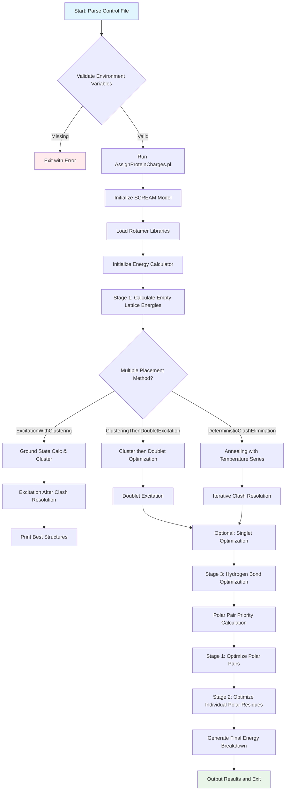

# `scream.py` File Analysis

## File Purpose and Primary Role

This is the main entry point and orchestrator for the SCREAM (protein side-chain placement) algorithm. The file implements a Python wrapper/driver that coordinates the entire SCREAM workflow, from initial setup through various optimization stages. It manages rotamer library initialization, empty lattice energy calculations, clash resolution through clustering, hydrogen bond network optimization, and final structure output. The script serves as the primary executable that users invoke with a control file to perform protein side-chain placement calculations.

## Key Classes, Structs, and Functions (if any)

### Primary Functions:

- **`main()`**: Entry point that parses command line arguments, validates environment variables, and orchestrates the entire SCREAM pipeline
- **`usage()`**: Prints usage information and exits

### Rotamer Library and Energy Calculation Functions:

- **`initRotlibs(SCREAM_PARAMS, ptn)`**: Initializes natural amino acid and arbitrary rotamer libraries
- **`Calc_EL_Energies()`**: Calculates empty lattice energies for all rotamers using SCREAM energy functions
- **`Calc_This_Interaction_Energy()`**: Computes VDW, hydrogen bond, and Coulomb interaction energies

### Clash Resolution and Optimization Functions:

- **`ground_state_calc_and_cluster()`**: Performs iterative clash elimination through rotamer clustering
- **`deterministicClashEliminationWithSnapshotField()`**: Implements annealing-based clash resolution with temperature series
- **`doublet_excitation()`**: Optimizes pairs of clashing residues through combinatorial search
- **`excitation_after_clash_resolution()`**: Final combinatorial optimization after clash elimination

### Hydrogen Bond Network Optimization:

- **`HBNetworkOptimization()`**: Two-stage polar residue optimization (pairs then singles)
- **`polar_res_pair_priority()`**: Identifies and prioritizes polar residue pairs for optimization

### Structure Placement and Analysis:

- **`placeMultipleConformers()`**: Places rotamer conformations on protein structure
- **`placeSingleConformer()`**: Places individual rotamer with mutation handling
- **`printBestStructures()`**: Outputs top N structures with energy analysis

### Utility and Helper Functions:

- **`RotlibCollectionPy`**: Python wrapper class extending C++ RotlibCollection with convenience methods
- **`MutInfoEnergies()`**: Calculates detailed energy breakdown for individual residues
- **`Print_Final_Residue_Energy_Breakdown()`**: Generates per-residue energy analysis files

## Inputs

### Data Structures/Objects:

- **SCREAM control file (.ctl)**: Main configuration file specifying input PDB, parameters, and calculation settings
- **ScreamModel**: Primary data structure containing protein structure, parameters, and energy calculator
- **BGF_HANDLER**: Structure file handler for reading/writing molecular structures
- **Libraries_Dict**: Dictionary mapping residue identifiers to rotamer libraries
- **mutInfo_rotConnInfo_Dict**: Mapping of mutation information to rotamer connection data

### File-Based Inputs:

- **Input PDB/BGF file**: Protein structure specified in control file via `InputFileName`
- **Rotamer library files**: `.lib` files containing pre-calculated rotamer conformations
- **CNN files**: `.cnn` files with rotamer connectivity information
- **Parameter files**: Force field parameters, delta parameters for energy calculations
- **Residue reach file**: `Residue_Reach.par` defining polar residue interaction distances
- **Polar optimization exclusions file**: Lists residues to exclude from hydrogen bond optimization

### Environment Variables:

- **SCREAM_NEW**: Base directory for SCREAM installation
- **SCREAM_NEW_LIB**: Directory containing rotamer libraries
- **SCREAM_NEW_CNN**: Directory containing connectivity files
- **SCREAM_NEW_RTF**: Directory containing residue topology files
- **SCREAM_NEW_CHG**: Charge assignment method specification

### Parameters/Configuration:

- **Multiple placement methods**: ExcitationWithClustering, ClusteringThenDoubletExcitation, etc.
- **Energy cutoffs**: StericClashCutoffEnergy, AbsStericClashCutoffEL
- **Temperature series**: For annealing-based optimization
- **Library resolution**: Rotamer library detail level
- **Search limits**: MaxSearchNumber, MaxFinalStepRunTime

## Outputs

### Data Structures/Objects:

- **Modified protein structure**: Updated with optimized side-chain conformations
- **RotlibCollection**: Final collection of evaluated rotamer combinations with energies
- **Energy dictionaries**: Detailed energy breakdowns for analysis

### File-Based Outputs:

- **best_N.bgf**: Top N optimized protein structures with energy annotations
- **Residue-E.txt, Residue-E-best_N.txt**: Per-residue energy breakdowns
- **timing.txt**: Performance timing information for each calculation stage
- **HBOptimization.txt**: Hydrogen bond optimization progress and results
- **Anneal-Energies.txt**: Energy evolution during annealing process
- **Evolution.dat**: Energy progression during combinatorial search
- **Sequences.txt**: Sequence information for design calculations

### Console Output (stdout/stderr):

- Environment variable validation messages
- Progress indicators for each optimization stage
- Clash identification and resolution status
- Energy values and optimization statistics
- Timing information for performance analysis

### Side Effects:

- Modifies protein structure coordinates through rotamer placement
- Updates energy states in ScreamModel and associated objects
- Manages temporary files and intermediate calculation states

## External Code Dependencies (Libraries/Headers)

### Python Standard Library:

- `sys`, `os`: System operations and command line handling
- `random`: Stochastic optimization algorithms
- `math`: Mathematical operations for energy calculations
- `re`: Regular expression parsing for control files

### Custom SCREAM Modules:

- `packages.timing`: Performance timing utilities
- `packages.py_scream_ee`: Core energy evaluation engine bindings

### External Tools/Processes:

- **AssignProteinCharges.pl**: Perl script for protein charge assignment
- **bgf_handler**: Molecular structure file I/O

## Core Logic/Algorithm Flowchart (Mermaid JS Format)

## Potential Areas for Modernization/Refactoring in SCREAM++

### 1. **Replace String-Based Function Dispatch with Modern Design Patterns**

The current code uses string comparisons to determine which optimization method to execute (`if SCREAM_PARAMS.multiplePlacementMethod() == 'ExcitationWithClustering':`). This should be refactored using a strategy pattern or factory pattern with polymorphic method dispatch, making the code more extensible and type-safe.

### 2. **Implement Proper Error Handling and Logging**

The code extensively uses `sys.exit()` for error conditions and prints directly to stdout/stderr for progress reporting. Modern Python should use structured logging (`logging` module) with appropriate log levels, and raise specific exception types rather than calling `sys.exit()`. This would make the code more testable and allow for better integration with other tools.

### 3. **Extract Large Functions into Focused Classes**

Several functions like `main()`, `HBNetworkOptimization()`, and `deterministicClashEliminationWithSnapshotField()` are extremely long (100+ lines) and handle multiple responsibilities. These should be broken down into focused classes with single responsibilities, such as `ClashResolver`, `HydrogenBondOptimizer`, and `EnergyCalculator`, following SOLID principles and making the code more maintainable and testable.
