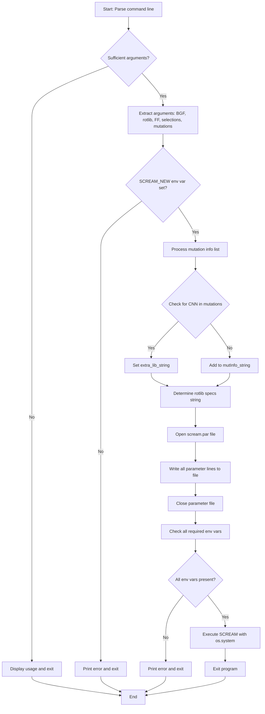

# `scream_multi.py` File Analysis

## File Purpose and Primary Role

This file serves as a **command-line wrapper script** for the SCREAM protein side-chain placement software. Its primary responsibility is to:

- Parse command-line arguments for BGF structure files, rotamer library specifications, force field files, and residue mutation information
- Generate a SCREAM parameter file (`scream.par`) with all necessary configuration settings
- Validate required environment variables for SCREAM execution
- Execute the main SCREAM program (`scream.py`) with the generated parameter file

This is essentially a convenience script that simplifies running SCREAM by automatically generating the complex parameter file required by the main SCREAM engine.

## Key Classes, Structs, and Functions (if any)

### Functions:

- **`usage()`**: Displays help information and command-line syntax for the script
- **`main()`**: Core function that handles argument parsing, parameter file generation, and SCREAM execution
- **`unpackMutInfo(mutInfo)`**: Utility function to parse mutation information strings (format: `C123_X`) into tuple format `(amino_acid, position, chain)`

### Key Variables/Data Structures:

- **`mutInfo_list`**: List of residue mutation specifications from command line
- **`SCREAM_PAR_FILE`**: File handle for writing the generated parameter file
- **Configuration dictionaries**: Various parameter mappings written to the parameter file

## Inputs

### Data Structures/Objects:

- **Command-line arguments** (`sys.argv`):
  - `bgf_file`: BGF structure file path
  - `rotlib_specs`: Rotamer library specification (e.g., "05", "10", or "SCWRL")
  - `ff_file`: Force field parameter file path
  - `selections`: Number of rotamer conformations to output
  - `mutInfo_list`: List of residue mutation specifications

### File-Based Inputs:

- **BGF structure file**: Protein structure input (specified via command line)
- **Force field file**: Energy parameters (e.g., `dreiding-0.3.par`)
- **Delta parameter files** (referenced but not directly read by this script):
  - `SCREAM_delta_Total_Min.par`
  - `SCREAM_EachAtomDeltaFileStub.par`
  - `SCREAM_PolarOptimizationExclusionsStub.par`

### Environment Variables:

- **`SCREAM_NEW`**: Main SCREAM installation directory (required)
- **`SCREAM_NEW_LIB`**: Library directory (required)
- **`SCREAM_NEW_CNN`**: CNN-related files directory (required)
- **`SCREAM_NEW_RTF`**: RTF files directory (required)
- **`SCREAM_NEW_CHG`**: Charge files directory (required)
- **Commented out variables**: `SCREAM_NEW_SCALE_COU`, `SCREAM_NEW_SCALE_HB`, `SCREAM_NEW_SCALE_VDW`

### Parameters/Configuration:

- **Rotamer library type**: Controls resolution (0.5Å vs 1.0Å vs SCWRL)
- **Energy function settings**: Delta method, dielectric constant, LJ parameters
- **Placement method**: Fixed to 'CreateCB' and 'ExcitationWithClustering'
- **Steric clash parameters**: Cutoff energies and distances

## Outputs

### Data Structures/Objects:

- **Parsed mutation information**: Tuples containing amino acid, position, and chain information

### File-Based Outputs:

- **`scream.par`**: Generated parameter file containing all SCREAM configuration settings
- **`scream.out`**: Output from the SCREAM execution (redirected stdout)

### Console Output (stdout/stderr):

- **Usage information**: Help text showing command syntax and examples
- **Error messages**: Missing environment variables or insufficient arguments
- **No progress indicators**: Script runs silently on successful execution

### Side Effects:

- **File system**: Creates `scream.par` in current directory
- **Process execution**: Launches external SCREAM process via `os.system()`
- **Program termination**: Calls `sys.exit()` on completion or error

## External Code Dependencies (Libraries/Headers)

### Standard Python Libraries:

- **`sys`**: Command-line argument handling and program exit
- **`os`**: Environment variable access and system command execution
- **`re`**: Regular expression matching for CNN detection

### External Programs:

- **SCREAM main executable**: `${SCREAM_NEW}/python/scream.py`

## Core Logic/Algorithm Flowchart (Mermaid JS Format)

## Potential Areas for Modernization/Refactoring in SCREAM++

### 1. **Replace `os.system()` with `subprocess` module**

The current use of `os.system()` for executing SCREAM is outdated and unsafe. Modern Python should use `subprocess.run()` or `subprocess.Popen()` for better error handling, security, and process management.

### 2. **Implement proper argument parsing with `argparse`**

The manual parsing of `sys.argv` should be replaced with the `argparse` module to provide better help messages, type validation, optional arguments, and more robust command-line interface design.

### 3. **Use context managers and pathlib for file operations**

- Replace manual file opening/closing with context managers (`with` statements)
- Use `pathlib.Path` instead of string concatenation for file path operations
- Add proper error handling for file I/O operations

### 4. **Configuration management improvements**

- Replace hardcoded parameter writing with a configuration class or dataclass
- Use templating (Jinja2) or configuration file formats (YAML/TOML) instead of manual string formatting
- Implement validation for parameter values and file existence checks
