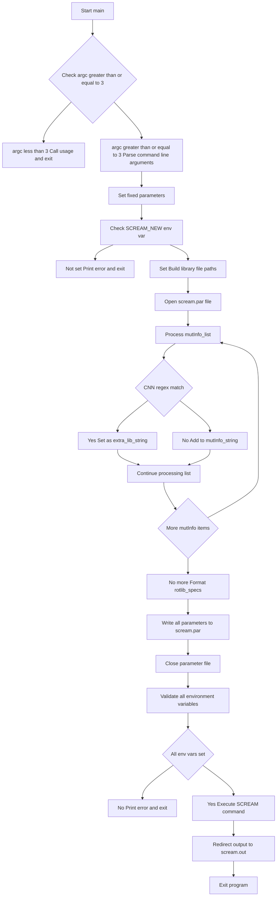

# `scream_wrap.py` File Analysis

## File Purpose and Primary Role

This file serves as a **command-line wrapper** for the SCREAM molecular modeling software. Its primary responsibility is to:

- Parse command-line arguments for SCREAM execution
- Generate a SCREAM parameter file (`scream.par`) with all necessary configuration settings
- Set up the runtime environment by validating required environment variables
- Execute the main SCREAM program (`scream.py`) with the generated parameter file

The wrapper abstracts away the complexity of creating SCREAM parameter files, allowing users to run SCREAM with a simplified command-line interface focused on the most common use case: protein side-chain placement for specified residues.

## Key Classes, Structs, and Functions (if any)

### Functions:

- **`usage()`**: Displays help information about command-line usage, including parameter explanations and examples
- **`main()`**: Primary entry point that handles argument parsing, parameter file generation, environment validation, and SCREAM execution
- **`unpackMutInfo(mutInfo)`**: Utility function to parse mutation information strings (format: `C123_X`) into component parts (amino acid, position, chain)

### Key Variables/Data Structures:

- **`mutInfo_list`**: List of residue specifications for mutation/optimization
- **`scream_par_filename`**: Generated parameter file name (`scream.par`)
- **Environment variable mappings**: Dictionary-like access to required SCREAM environment variables

## Inputs

### Data Structures/Objects:

- **Command-line arguments** (`sys.argv`):
  - `bgf_file`: Input structure file in BGF format
  - `rotlib_specs`: Rotamer library specification (e.g., "05", "10", or "SCWRL")
  - `ff_file`: Force field parameter file path
  - `mutInfo_list`: List of residue specifications (format: `RESTYPE###_CHAIN`)

### File-Based Inputs:

- **BGF structure file**: Input molecular structure
- **Force field parameter file**: Typically dreiding-0.3.par format
- **SCREAM library files** (referenced but not directly read):
  - Delta parameter files (`SCREAM_delta_Total_Min.par`)
  - Each-atom delta file (`SCREAM_EachAtomDeltaFileStub.par`)
  - Polar optimization exclusions (`SCREAM_PolarOptimizationExclusionsStub.par`)

### Environment Variables:

- **`SCREAM_NEW`**: Main SCREAM installation directory
- **`SCREAM_NEW_LIB`**: SCREAM library directory
- **`SCREAM_NEW_CNN`**: CNN-related files directory
- **`SCREAM_NEW_RTF`**: RTF (residue topology file) directory
- **`SCREAM_NEW_CHG`**: Charge parameter directory
- **Commented out variables**: `SCREAM_NEW_SCALE_COU`, `SCREAM_NEW_SCALE_HB`, `SCREAM_NEW_SCALE_VDW`

### Parameters/Configuration:

- **Fixed parameters** (hard-coded):
  - Delta method: `'FULL'`
  - Final delta value: `0.0`
  - Placement method: `'CreateCB'`
  - Multiple placement method: `'ClusteringThenDoubletsThenSinglets'`
  - Dielectric constant: `'2.5'`
  - LJ option: `'12-6'`
  - Steric clash parameters

## Outputs

### Data Structures/Objects:

- **Parameter file content**: Structured configuration written to `scream.par`
- **Parsed mutation information**: Extracted from command-line arguments

### File-Based Outputs:

- **`scream.par`**: Complete SCREAM parameter file with 20+ configuration parameters
- **`scream.out`**: SCREAM execution output (redirected from stdout)

### Console Output (stdout/stderr):

- **Usage information**: Detailed help text with examples and parameter suggestions
- **Error messages**: Environment variable validation failures
- **No direct progress output**: Output is redirected to `scream.out`

### Side Effects:

- **Parameter file creation**: Writes configuration file to current directory
- **SCREAM execution**: Launches external SCREAM process via `os.system()`
- **Process termination**: Calls `sys.exit()` after execution

## External Code Dependencies (Libraries/Headers)

### Standard Python Libraries:

- **`sys`**: Command-line argument handling and program exit
- **`os`**: Environment variable access and system command execution
- **`re`**: Regular expression matching for CNN detection in mutation info

### External Dependencies:

- **SCREAM main program**: `${SCREAM_NEW}/python/scream.py`
- **SCREAM library files**: Various parameter and configuration files in SCREAM installation

## Core Logic/Algorithm Flowchart (Mermaid JS Format)

## Potential Areas for Modernization/Refactoring in SCREAM++

### 1. **Command-Line Interface Modernization**

- **Current**: Manual `sys.argv` parsing with basic error checking
- **Modern Approach**: Use `argparse` library for robust argument parsing with automatic help generation, type validation, and better error messages
- **Benefits**: More maintainable, better user experience, automatic validation

### 2. **Configuration Management**

- **Current**: Hard-coded parameters scattered throughout the code with manual file writing
- **Modern Approach**: Use configuration classes or dataclasses with YAML/JSON configuration files, and templating systems (like Jinja2) for parameter file generation
- **Benefits**: Easier to modify defaults, better separation of concerns, more flexible configuration

### 3. **Environment and Dependency Management**

- **Current**: Manual environment variable checking and `os.system()` calls
- **Modern Approach**: Use `subprocess` module for safer process execution, environment validation through configuration classes, and proper error handling with custom exceptions
- **Benefits**: Better security, more robust error handling, easier testing and debugging
